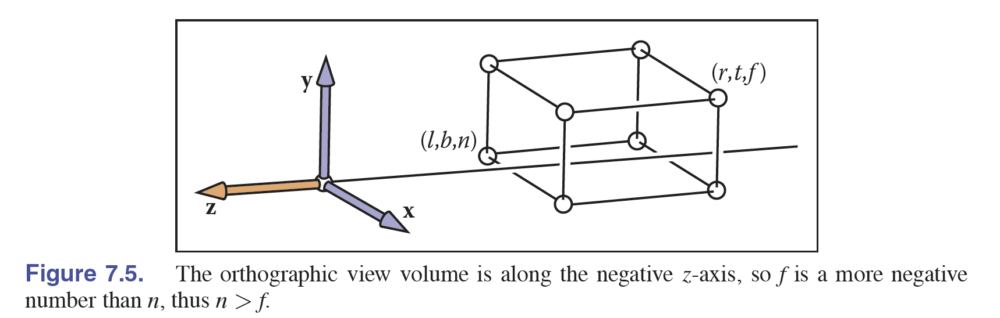

# Computer Graphics

Every desktop computer today has a powerful 3D graphics pipeline. The basic operations in the pipeline map the 3D vertex locations to 2D screen positions and shade the triangles so that they both look realistic and appear in proper back-to-front order.

It turns out that the geometric manipulation used in the graphics pipeline can be accomplished almost entirely in a 4D coordinate space composed of three traditional geometric coordinates and a fourth homogeneous coordinate 齐次坐标 that helps with perspective viewing. These 4D coordinates are manipulated using 4 × 4 matrices and 4-vectors.

A key part of any graphics program is to have good classes or routines for geometric entities such as vectors and matrices, as well as graphics entities such as RGB colors and images. This implies that some basic classes to be written include:

* vector2: A 2D vector class that stores an x- and y-component. It should store these components in a length-2 array so that an indexing operator can be well supported.
* vector3: A 3D vector class analogous to vector2.
* hvector: A homogeneous vector with four components
* rgb: An RGB color that stores three components.
* transform: A 4 × 4 matrix for transformations.
* image: A 2D array of RGB pixels with an output operation.

Modern architecture suggests that keeping memory use down and maintaining coherent memory access are the keys to efficiency. For the foreseeable future, a good heuristic is that programmers should pay more attention to memory access patterns than to operation counts because the speed of memory has not kept pace with the speed of processors.

Much of graphics is just translating **math** directly into code. The cleaner the math, the cleaner the resulting code.

## Raster Images

Current displays 显示设备, can be separated into emissive displays, which use pixels that directly emit controllable amounts of light \(light-emitting diode \(LED\) display\), and transmissive displays, in which the pixels themselves don’t emit light but instead vary the amount of light that they allow to pass through them \(liquid crystal display \(LCD\)\).

The pixels in a color LED display are divided into three independently controlled subpixels—one red, one green, and one blue—each with its own LED made using different materials so that they emit light of different colors. When the display is viewed from a distance, the eye can’t separate the individual subpixels, and the perceived color is a mixture of red, green, and blue.

Liquid crystal displays \(LCDs\) are an example of the transmissive type. A liquid crystal is a material whose molecular 分子 structure enables it to rotate the polarization 偏振 of light that passes through it, and the degree of rotation can be adjusted by an applied voltage 电压. Like color LED displays, color LCDs have red, green, and blue subpixels within each pixel.

A raster input device 输入设备 has to make a light measurement for each pixel, and \(like output devices\) they are usually based on arrays of sensors.

A raster image is a big array of **pixels**, each of which stores information about the color of the image at its grid point.

All modern monitors take digital input for the “value” of a pixel and convert this to an intensity 强度 level. There are two key issues that must be understood to produce correct images on monitors. The first is that monitors are nonlinear with respect to input. As an approximate characterization of this nonlinearity, monitors are commonly characterized by a γ \(“gamma”\) value.

```text
displayed intensity = (maximum intensity)a^γ
```

Another important characteristic of real displays is that they take quantized input values. So while we can manipulate intensities in the floating point range \[0, 1\], the detailed input to a monitor is a fixed-size integer. The most common range for this integer is 0–255 which can be held in 8 bits of storage.

The basic idea of RGB color space is that the color is displayed by mixing three primary lights: one red, one green, and one blue. The lights mix in an _additive manner_.

The _α_ values for all the pixels in an image might be stored in a separate grayscale image, which is then known as an alpha mask or transparency mask. Or the information can be stored as a fourth channel in an RGB image, in which case it is called the **alpha channel**, and the image can be called an RGBA image.

To reduce the storage requirement, most image formats allow for some kind of compression. At a high level, such compression is either lossless or lossy.

* jpeg. This lossy format compresses image blocks based on thresholds in the human visual system. This format works well for natural images.
* tiff. This format is most commonly used to hold binary images or losslessly compressed 8- or 16-bit RGB although many other options exist.
* ppm. This very simple lossless, uncompressed format is most often used for 8-bit RGB images although many options exist.
* png. This is a set of lossless formats with a good set of open source management tools.

## Ray Tracing

In **object-order** rendering, each object is considered in turn, and for each object all the pixels that it influences are found and updated. In **image-order** rendering, each pixel is considered in turn, and for each pixel all the objects that influence it are found and the pixel value is computed.

Broadly speaking, image-order rendering is simpler to get working and more flexible in the effects that can be produced, and usually \(though not always\) takes much more execution time to produce a comparable image than **object-order** rendering.

Ray tracing is an image-order algorithm for making renderings of 3D scenes. A ray tracer works by computing one pixel at a time, and for each pixel the basic task is to find the object that is seen at that pixel’s position in the image. A basic ray tracer therefore has three parts: 

1. Ray generation, which computes the origin and direction of each pixel’s **viewing ray** based on the camera geometry;
2. Ray intersection, which finds the closest object intersecting the viewing ray;
3. Shading, which computes the pixel color based on the results of ray intersection.

The standard approach of representing a 3D object or **scene** with a 2D drawing or painting is linear **perspective** 线性透视, in which 3D objects are projected onto an image plane in such a way that straight lines in the scene become straight lines in the image. （相对于鱼眼相机等非常规方式）

The simplest type of projection is **parallel projection** 平行投影, in which 3D points are mapped to 2D by moving them along a projection direction until they hit the image plane.

We can produce natural looking views using **perspective projection** 透视投影/中心投影: we simply project along lines that pass through a single point, the **viewpoint**, rather than along parallel lines.

The basic tools of ray generation are the viewpoint \(or view direction, for parallel views\) and the image plane. In order to generate rays, we first need a mathematical representation for a ray.

A ray is really just an origin point and a propagation direction. The 3D parametric line from the eye _e_ to a point _s_ on the image plane \(Figure 4.6\) is given by $$p(t) = e + t(s − e).$$ 

All of our ray-generation methods start from an orthonormal coordinate frame known as the **camera frame**. For an orthographic view 正视图, all the rays will have the direction −w. For a perspective view 透视图, all the rays have the same origin, at the viewpoint; it is the directions that are different for each pixel.


Once we’ve generated a ray $$e+td$$ , we next need to find the first intersection with any object where t &gt; 0. _\(Ray-Object Intersection\)_

Once the visible surface for a pixel is known, the pixel value is computed by evaluating a shading model. In this chapter we describe the two most basic shading models.

Simple shading models are defined in terms of illumination from a point light source 点光源. The important variables in light reflection are the light direction _l_, which is a unit vector pointing toward the light source; the view direction _v_, which is a unit vector pointing toward the eye or camera; the surface normal _n_, which is a unit vector perpendicular to the surface at the point where reflection is taking place; and the characteristics of the surface—color, shininess, or other properties depending on the particular model.


The simplest shading model is based on an observation made by Lambert in the 18th century: the amount of energy from a light source that falls on an area of surface depends on the angle of the surface to the light. This leads to the Lambertian shading model:

 $$L = k_d I max(0, n · l)$$ where L is the pixel color; $$k_d$$ is the diffuse coefficient 扩散系数, or the surface color; and I is the intensity of the light source.

Many real surfaces show some degree of shininess, producing highlights, or specular reflections 镜面反射, that appear to move around as the viewpoint changes. Many shading models add a _specular component_ to Lambertian shading; the Lambertian part is then the _diffuse component_.

The Blinn-Phong Shading idea is to produce reflection that is at its brightest when v and l are symmetrically positioned across the surface normal.

In the real world, surfaces that are not illuminated by light sources are illuminated by indirect reflections from other surfaces. Surfaces that receive no illumination at all will be rendered as completely black, which is often not desirable. A crude but useful heuristic to avoid black shadows In the real world is known as **ambient shading**—it is as if surfaces were illuminated by “ambient” light that comes equally from everywhere.

A very useful property of light is _superposition_—the effect caused by multiple light source is simply the sum of the effects of the light sources individually.

We now know how to generate a viewing ray for a given pixel, how to find the closest intersection with an object, and how to shade the resulting intersection. These are all the parts required for a program that produces shaded images with hidden surfaces removed.

Once you have a basic ray tracing program, shadows can be added very easily. The rays that determine in or out of shadow are called **shadow rays** to distinguish them from viewing rays.


## Viewing

The **viewing transformation** has the job of mapping 3D locations, represented as \(x, y, z\) coordinates in the canonical coordinate system, to coordinates in the image, expressed in units of pixels. Most graphics systems do this by using a sequence of three transformations:

* A camera transformation or eye transformation, which is a rigid body transformation that places the camera at the origin in a convenient orientation.
* A projection transformation, which projects points from camera space so that all visible points fall in the range −1 to 1 in x and y.
* A viewport transformation or windowing transformation, which maps this unit image rectangle to the desired rectangle in pixel coordinates.


The canonical view volume（规则观察体） is also “**clip space**” or “normalized device coordinates".

We assume that the geometry we want to view is in the canonical view volume, and we wish to view it with an orthographic camera looking in the −z direction. Our first step in generalizing the view will keep the view direction and orientation fixed looking along −z with +y up.





