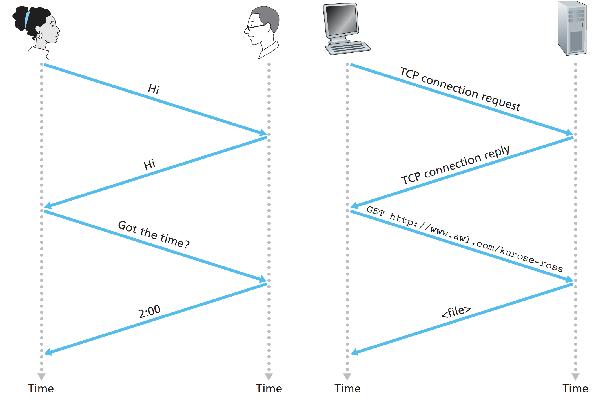
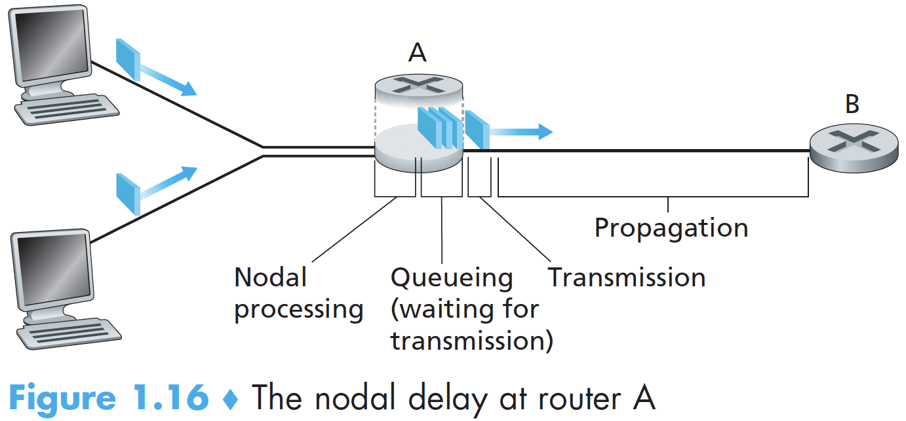
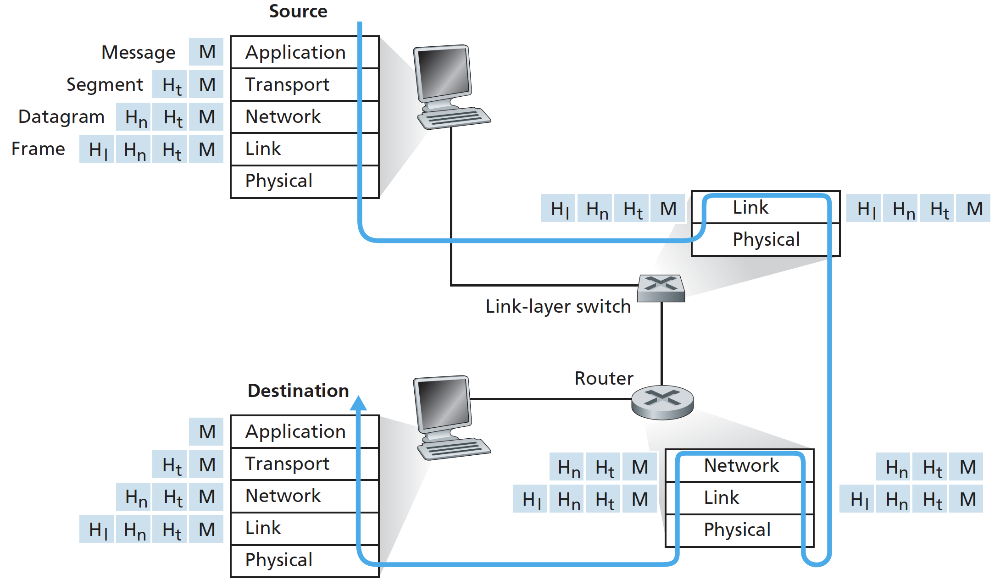

# 1. Introduction

## What's Internet?

### A Nuts-and-Bolts Description

Devices that are being hooked up to the Internet are called **hosts** or **end systems**. End systems are connected together by a network of **communication links** and **packet switches**.

Communication links are made up of different types of physical media, including coaxial cable 同轴电缆, copper wire 铜线, optical fiber 光纤, and radio spectrum 无线电.

Package switches are **routers** 路由器 and **link-layer switches** 链路层交换机.

The Internet is all about connecting end systems to each other, end systems access the Internet through **Internet Service Providers** \(ISPs\).

The Internet’s principal protocols are collectively known as **TCP/IP**.

It’s important that everyone agree on what each and every protocol does. **Internet standards** are developed by the Internet Engineering Task Force \(IETF\) and those documents are called requests for comments \(**RFCs**\).

### A Services Description

We can also describe the Internet from an entirely different angle—namely, as an **infrastructure that provides services to applications**. The applications are said to be distributed applications, include email, instant messaging, Voiceover-IP \(VoIP\), etc.

The Internet **API** is a set of rules that the sending program must follow so that the Internet can deliver the data to the destination program.

## What's protocol?

Human analogies: One first offer a greeting “**Hi**” to initiate communication with someone else. One then takes a cordial “Hi” response as an indication that one can proceed and ask for the time of day.

A protocol defines the format and the order of messages exchanged between two or more communicating entities, as well as the actions taken on the transmission and/or receipt of a message or other event.

## Network Edge

End systems are also referred to as hosts because they host \(that is, run\) application programs. Hosts are sometimes further divided into two categories: **clients** and **servers**.

Applications and end systems are considered at the “edge of the network". Let’s next consider the access network. The **access network**—the network that physically connects an end system to the first router \(also known as the “**edge router**”\). 

Home Access: DSL, Cable, FTTH, Dial-Up, and Satellite. 

* A residence typically obtains digital subscriber line \(**DSL**\) Internet access from the same local telephone company \(telco\) that provides its wired local phone access. \(less than 5Mbps\)
* **Cable** Internet access makes use of the cable television company’s existing cable television infrastructure. Because both fiber cable\(光纤\) and coaxial cable\(同轴电缆\) are employed in this system, it is often referred to as hybrid fiber coax \(HFC\). \(13Mbps\)
* **FTTH**: fiber to the home, provide an optical fiber path from the Central Office\(CO\) directly to the home. \(greater than 20Mbps\)

Enterprise/University/Home access: Ethernet and WiFi.

* A local area network \(**LAN**\) is used to connect an end system to the edge router. Ethernet users use twisted-pair copper wire to connect to an Ethernet switch, or a network of such interconnected switches, is then in turn connected into the larger Internet.
* Wireless LAN access based on IEEE 802.11 technology, more colloquially known as WiFi. In a wireless LAN setting, users transmit/receive packets to/from an **access point** that is connected into the enterprise’s network, which in turn is connected to the wired Internet.

Wide-Area Wireless Access: 4G and LTE, 5G.

* Unlike WiFi, a user need only be within a few tens of kilometers \(as opposed to a few tens of meters\) of the base station.

## Network Core

Network core: packet switches and links that interconnects the Internet’s end systems.

Most packet switches use **store-and-forward transmission**, means that the packet switch must receive the entire packet before it can begin to transmit the first bit of the packet onto the outbound link.

Each packet switch has multiple links attached to it. If an arriving packet needs to be transmitted onto a link but finds the link busy with the transmission of another packet, the arriving packet must wait in the output buffer. Thus, in addition to the store-and-forward delays, packets suffer output buffer queuing delays. **Packet loss** will occur if the buffer is completely full with other packets waiting for transmission.

When a source end system wants to send a packet to a destination end system, the source includes the destination’s IP address in the packet’s header. Each router has a **forwarding table** that maps destination addresses \(or portions of the destination addresses\) to that router’s outbound links. Internet has a number of special **routing protocols** that are used to automatically set the forwarding tables.

## A Network of Networks

In today’s Internet network structure, that the goal is to interconnect the access ISPs so that all end systems can send packets to each other, in any given region, there may be a **regional ISP** to which the access ISPs in the region connect. Each regional ISP then connects to **tier-1** ISPs. We refer to this ecosystem—consisting of access ISPs, regional ISPs, tier-1 ISPs, PoPs, multi-homing, peering, and IXPs—as Network Structure 4.

* A **PoP**\(points of presence\) is simply a group of one or more routers \(at the same location\) in the provider’s network where customer ISPs can connect into the provider ISP.
* Any ISP \(except for tier-1 ISPs\) may choose to **multi-home**, that is, to connect to two or more provider ISPs.
* To reduce these costs that a customer ISP pays a provider ISP for the traffic, a pair of nearby ISPs at the same level of the hierarchy can **peer**, directly connect their networks together. When two ISPs peer, it is typically settlement-free.
* a third-party company can create an Internet Exchange Point \(**IXP**\), which is a meeting point where multiple ISPs can peer together.

The Internet of 2012, builds on top of Network Structure 4 by adding **content provider networks**. Google is currently one of the leading examples. The Google data centers are all interconnected via Google’s _**private**_ TCP/IP network, which spans the entire globe, only carries traffic to/from Google servers.

## Performance Measure

As a packet travels from one node \(host or router\) to the subsequent node along this path, the packet suffers from several types of delays at _each_ node along the path. The most important of these delays are the processing delay, queuing delay, transmission delay, and propagation delay; together, a total **nodal delay**.

The time required to examine the packet’s header and determine where to direct the packet is part of the **processing delay**. After this processing, the router directs the packet to the queue that precedes the link to router B.

At the queue, the packet experiences a **queuing delay** as it waits to be transmitted onto the link.

Denote the length of the packet by L bits, and denote the transmission rate of the link from router A to router B by R bits/sec, the **transmission delay** is `L/R`.

The time required to propagate from the beginning of the link to router B is the **propagation delay**.

In addition to delay and packet loss, another critical performance measure in computer networks is end-to-end **throughput**. Many applications display the instantaneous throughput during downloads in the user interface.

For some applications, such as Internet telephony, it is desirable to have a low delay and an instantaneous throughput consistently above some threshold. For other applications, including those involving file transfers, delay is not critical, but it is desirable to have the highest possible throughput.

## Protocol Layering

To provide structure to the design of network protocols, network designers organize protocols—and the network hardware and software that implement the protocols— in layers. We are again interested in the **services** that a layer offers to the layer above—the so-called **service model** of a layer.

The protocols of the various layers are called the protocol stack: 

* Application Layer: HTTP, SMTP, FTP, DNS.
* Transport Layer: TCP and UDP. TCP is connection-oriented, with guaranteed delivery, flow control and congestion control.
* Network Layer: IP protocol, routing protocols.
* Link Layer: Ethernet, WiFi, PPP, etc.
* Physical Layer: While the job of the link layer is to move entire frames from one network element to an adjacent network element, the job of the physical layer is to move the individual _bits_ within the frame from one node to the next.

Routers and link-layer switches do not implement _all_ of the layers in the protocol stack; they typically implement only the bottom layers.

## Security

The bad guys can put **malware** into your host via the Internet. **Viruses** are malware that require some form of user interaction to infect the user’s device. **Worms** are malware that can enter a device without any explicit user interaction.

Another broad class of security threats are known as denial-of-service \(**DoS**\) attacks, rendering a network, host, or other piece of infrastructure unusable by legitimate users. In a distributed DoS \(**DDoS**\) attack, the attacker controls multiple sources and has each source blast traffic at the target.

By placing a passive receiver in the vicinity of the wireless transmitter, that receiver can obtain a copy of every packet that is transmitted, called **packet sniffer**. Sniffers can be deployed in wired environments as well.

The ability to inject packets into the Internet with a false source address is known as **IP spoofing**, and is but one of many ways in which one user can masquerade as another user.

