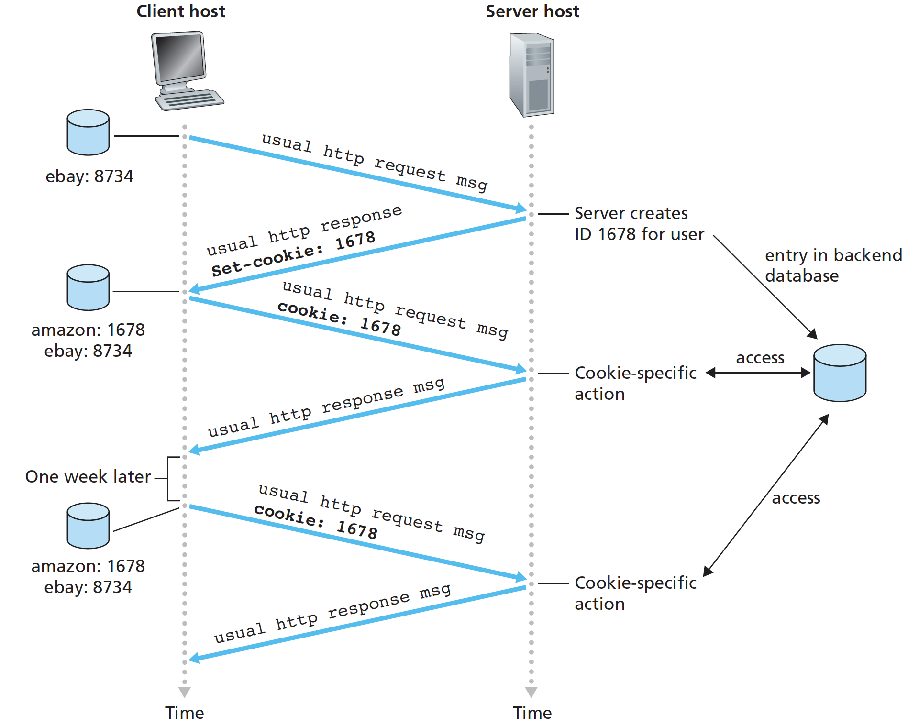

# 2. Application Layer

The application architecture used in modern network applications: the **client-server** architecture or the **peer-to-peer** \(P2P\) architecture.

In a client-server architecture, there is an always-on host, called the server, which services requests from many other hosts, called clients. In a P2P architecture, there is minimal \(or no\) reliance on dedicated servers in data centers. One of the most compelling features of P2P architectures is their **self-scalability**. 

We mention that some applications have hybrid architectures, combining both client-server and P2P elements. 

A **process** can be thought of as a program that is running within an end system. Processes on the same host communicate using inter-process communication \(defined by OS\). Processes on two different end systems communicate with each other by exchanging messages across the computer network.

For each pair of communicating processes, we typically label one of the two processes as the client and the other process as the server. In P2P file sharing, a process can be both a client and a server.

A process sends messages into, and receives messages from, the network through a software interface called a **socket**. The host is identified by its **IP address**, the **port number** serves to identify process.

What are the services that a transport-layer protocol can offer to applications invoking it? We can broadly classify the possible services along four dimensions: reliable data transfer, throughput, timing, and security. The Internet makes two transport protocols available to applications, UDP and TCP.

TCP has the client and server exchange transport layer control information with each other before the application-level messages begin to flow. This is called **handshaking**. After the handshaking phase, a TCP connection is said to exist between the sockets of the two processes. The connection is a full-duplex connection in that the two processes can send messages to each other over the connection at the same time. When the application finishes sending messages, it must tear down the connection.

Neither TCP nor UDP provide any encryption. The Internet community has developed an enhancement for TCP, called **Secure Sockets Layer** \(SSL\), provides critical process-to-process security services, including encryption, data integrity, and end-point authentication. SSL is not a third transport protocol, but instead is an enhancement of TCP, with the enhancements being implemented in the application layer. SSL has its own socket API.

In summary, today’s Internet can often provide satisfactory service to reliable data transfer, security \(and time-sensitive applications\), but it cannot provide any timing or throughput guarantees.

## HTTP

The HTTP client first initiates a TCP connection with the server. Once the connection is established, the browser and the server processes access TCP through their socket interfaces. On the client side the socket interface is the **door** between the client process and the TCP connection.

Here we see one of the great advantages of a layered architecture—HTTP need not worry about lost data or the details of how TCP recovers from loss or reordering of data within the network. That is the job of TCP and the protocols in the lower layers of the protocol stack.

HTTP server maintains no information about the clients, HTTP is said to be a **stateless** protocol.

HTTP uses **persistent** connections in its default mode, that is, all of the requests and responses be sent over the same TCP connection, but can be configured to use non-persistent connections instead.

We define the round-trip time \(**RTT**\), which is the time it takes for a small packet to travel from client to server and then back to the client.

HTTP Request **Message**: request line \(1st line\), header lines, entity body \(POST method\).

```http
GET /somedir/page.html HTTP/1.1
Host: www.someschool.edu
Connection: close
User-agent: Mozilla/5.0
Accept-language: fr
```

HTTP Response Message: status line \(1st line\), header lines, entity body \(requested object\).

```http
HTTP/1.1 200 OK
Connection: close
Date: Tue, 09 Aug 2011 15:44:04 GMT
Server: Apache/2.2.3 (CentOS)
Last-Modified: Tue, 09 Aug 2011 15:11:03 GMT
Content-Length: 6821
Content-Type: text/html
```

## HTTP uses cookies

Cookie technology has four components: \(1\) a cookie header line in the HTTP response message; \(2\) a cookie header line in the HTTP request message; \(3\) a cookie file kept on the user’s end system and managed by the user’s browser; and \(4\) a back-end database at the Website.



When initial HTTP requests arrives at site, site creates an unique ID and an entry in backend database for ID. Cookies can thus be used to create a user **session** layer on top of stateless HTTP. Session data is simply an array associated with a particular session ID \(cookie\). When a page is loaded, the session class will check to see if valid session cookie is sent by the user’s browser.

## Web Caching

A **Web cache**—also called a **proxy server**—is a network entity that satisfies HTTP requests on the behalf of an origin Web server. The Web cache has its own disk storage and keeps copies of recently requested objects in this storage.

A user’s browser can be configured so that all of the user’s HTTP requests are first directed to the Web cache. A cache is both a server and a client at the same time.

Typically a Web cache is purchased and installed by an ISP. For example, a university might install a cache on its campus network and configure all of the campus browsers to point to the cache.

Web caching has seen deployment in the Internet for two reasons. First, a Web cache can substantially reduce the response time for a client request. Second, Web caches can substantially reduce traffic on an institution’s access link to the Internet. By reducing traffic, the institution \(for example, a company or a university\) does not have to upgrade bandwidth as quickly, thereby reducing costs. Furthermore, Web caches can substantially reduce Web traffic in the Internet as a whole, thereby improving performance for all applications.

Through the use of Content Distribution Networks \(**CDNs**\), Web caches are increasingly playing an important role in the Internet. A CDN company installs many geographically distributed caches throughout the Internet, thereby localizing much of the traffic.

HTTP has a mechanism that allows a cache to verify that its objects are up to date called the **conditional GET**.

## DNS

The main task of the Internet’s **domain name system** \(DNS\) is to translates hostnames to IP addresses. The DNS is \(1\) a distributed database implemented in a hierarchy of DNS servers, and \(2\) an application-layer protocol that allows hosts to query the distributed database.

As an example, consider what happens when a browser requests a web page. The browser extracts the hostname from the URL and passes the hostname to the client side of the DNS application. The DNS client sends a query containing the hostname to a DNS server. The DNS protocol runs over UDP and uses port 53. Once the browser receives the IP address from DNS, it can initiate a TCP connection to the HTTP server at that IP address.

## Socket Programming

There are two types of network applications. One is "open" whose operation is specified in a protocol standard such as RFC, one is proprietary that employ an application-layer protocol that has not been openly published.

Recall also that when a client or server program implements a protocol defined by an RFC, it should use the well-known port number associated with the protocol; conversely, when developing a proprietary application, avoid using such port numbers.

A host may be running many network application processes, each with one or more sockets. When a socket is created, a **port number** is assigned to it.

UDPClient.py

```python
from socket import *
serverName = ‘hostname’
serverPort = 12000
clientSocket = socket(socket.AF_INET, socket.SOCK_DGRAM) //IPV4, UDP
Socketmessage = raw_input(’Input lowercase sentence:’)
clientSocket.sendto(message,(serverName, serverPort))// Sending a client-to-server message via a UDP socket is that simple!
modifiedMessage, serverAddress = clientSocket.recvfrom(2048) //buffer size 2048 works for most purposes
print modifiedMessage
clientSocket.close() //closes the socket. The process then terminates
```

UDPServer.py

```python
from socket import *
serverPort = 12000
serverSocket = socket(AF_INET, SOCK_DGRAM) 
serverSocket.bind((’’, serverPort))
print ”The server is ready to receive” 
while 1:        
        message, clientAddress = serverSocket.recvfrom(2048)
        modifiedMessage = message.upper() //our example task, to capitalize message
        serverSocket.sendto(modifiedMessage, clientAddress)
```


