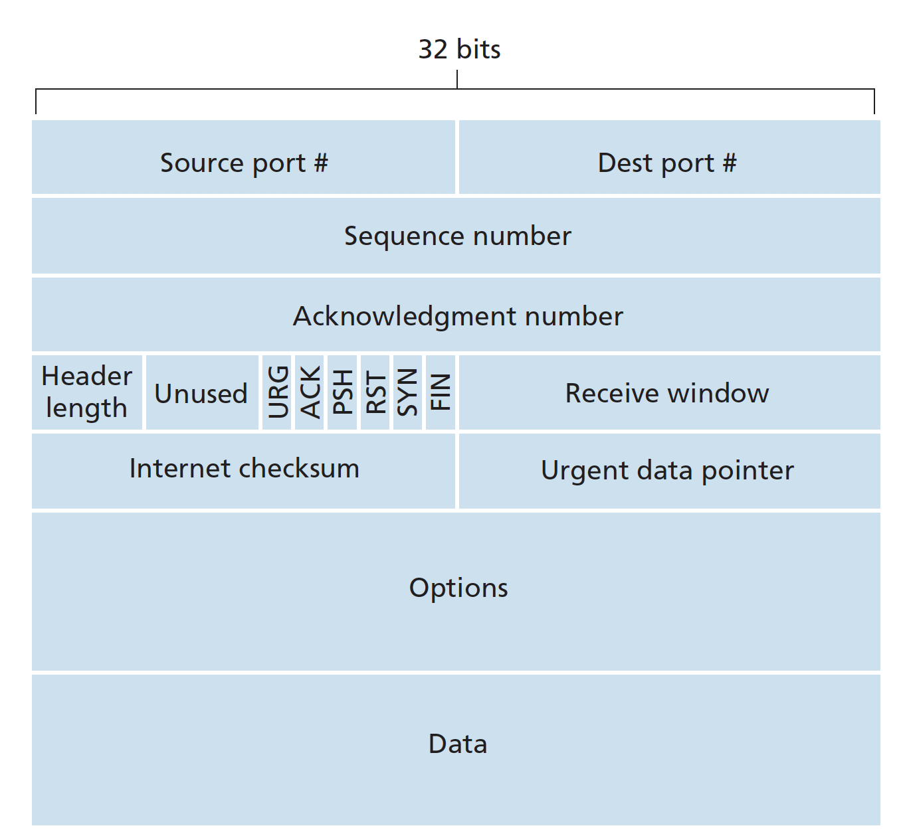
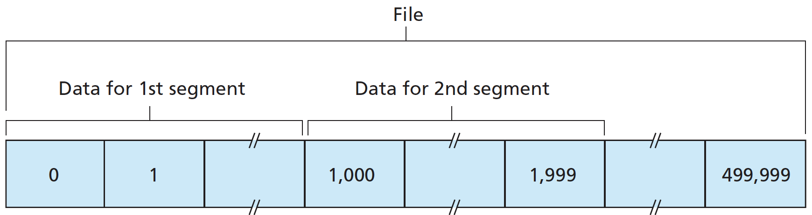
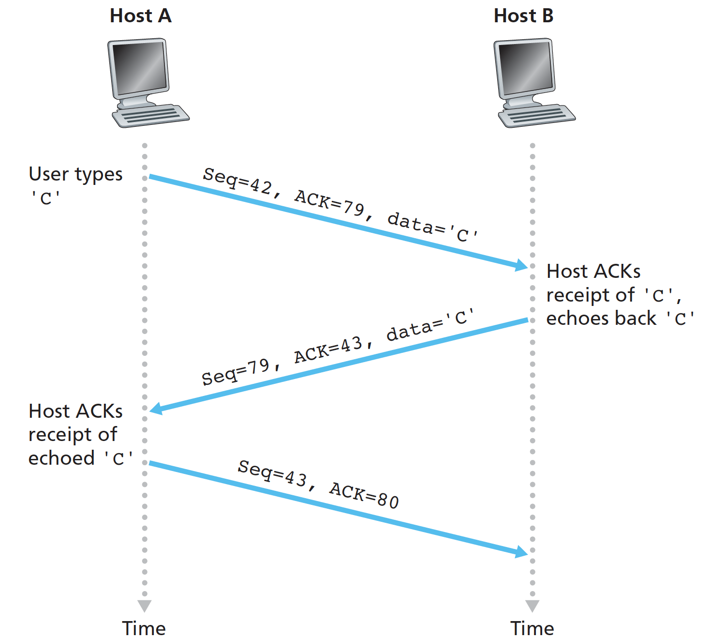
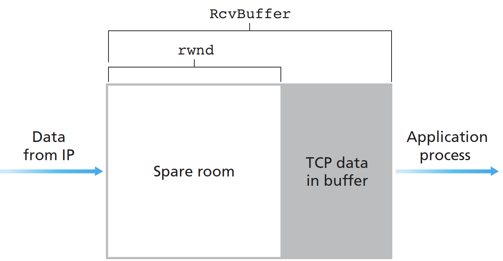
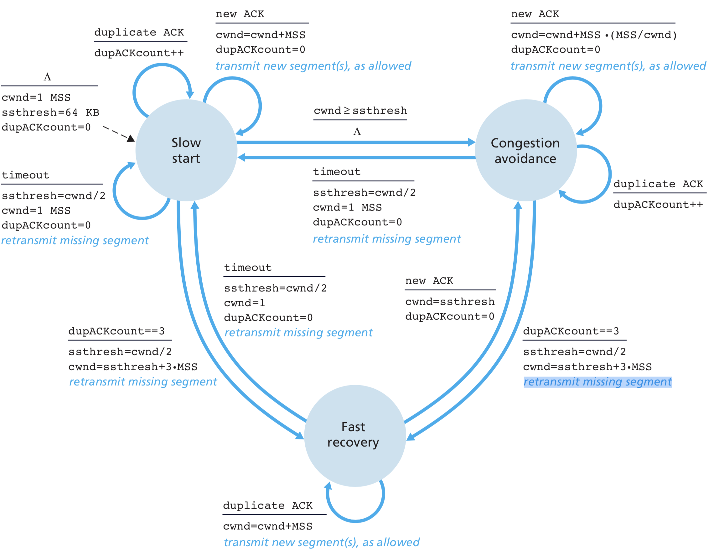

# 3. Transport Layer

## Overview

A transport-layer protocol provides for **logical communication** between application processes running on different hosts. The transport layer converts the application-layer messages it receives from a sending application process into transport-layer packets, known as transport-layer **segments**. Application processes use the logical communication provided by the transport layer to send messages to each other, free from the worry of the details of the physical infrastructure used to carry these messages.

Transport-layer protocols are implemented in the end systems but not in network routers. Whereas a transport-layer protocol provides logical communication between **processes** running on different hosts, a network-layer protocol provides logical communication between **hosts**. This distinction is subtle but important: 

* application messages = 快递
* processes = 收件人
* hosts = 收件地址（房屋）
* transport-layer protocol = 快递员
* network-layer protocol = 快递服务

Recall that the Internet, and more generally a **TCP/IP** network, makes two distinct transport-layer protocols: TCP \(Transmission Control Protocol\) and UDP \(User Datagram Protocol\).

Before introduce UDP and TCP, it will be useful to say a few words about the network layer. The Internet’s network-layer protocol has a name—IP, for **Internet Protocol**. The IP service model is a **best-effort** delivery service.

Extending host-to-host delivery to process-to-process delivery is called transport-layer **multiplexing** and **demultiplexing**, by using source and destination port-number fields in a transport-layer segment. Each port number is a 16-bit number, ranging from 0 to 65535. The port numbers ranging from 0 to 1023 are called well-known port numbers and are restricted for use by well-known application protocols.

UDP uses **connectionless** demultiplexing: IP datagrams with same destination port number, but different source IP addresses and/or source port numbers will be directed to same socket at destination.

TCP uses **connection-oriented** demultiplexing: each socket identified by its own 4-tuple \(source IP address, source port number, dest IP address, dest port number\). The server host may support many simultaneous TCP connection sockets, with each socket identified by its own four-tuple. When a TCP segment arrives at the host, all four fields are used to direct \(demultiplex\) the segment to the appropriate socket.

In fact, today’s high-performing Web servers often use only one process, and create a new **thread** with a new connection socket for each new client connection. For such a server, at any given time there may be many connection sockets \(with different identifiers\) attached to the same process.

## UDP

UDP does just about as little as a transport protocol can do. Aside from the multiplexing/demultiplexing function and some light error checking, it adds nothing to IP.

UDP has no congestion control. If everyone were to start streaming high-bitrate video without using any congestion control, there would be so much packet overflow at routers that very few UDP packets would successfully traverse the source-to-destination path. Moreover, the high loss rates induced by the uncontrolled UDP senders would cause the TCP senders to dramatically decrease their sending rates. Some organizations blocking UDP traffic for security reasons.

Nevertheless, many important applications run over UDP rather than TCP.

## Reliable Data Transfer

This task is made difficult by the fact that the layer below the reliable data transfer protocol may be unreliable. We now step through a series of protocols, each one becoming more complex, arriving at a flawless, reliable data transfer protocol.

We use the **finite-state machine** \(FSM\) to indicate the transition of the protocol from one state to another.

**rdt 1.0**: the simplest case, the underlying channel is completely reliable.

**rdt 2.0**: channel with bit errors.

* **checksum** is needed to detect bit errors in a transmitted packet.
* acknowledgements \(**ACK**s\): receiver explicitly tells sender that packet received OK. 
* negative acknowledgements \(NAKs\): receiver explicitly tells sender that packet had errors.

Sender retransmits packet on receipt of NAK.

**rdt 2.1**: what happens if ACK/ NAK corrupted? the sender put a **sequence number** into the packet.

**rdt 2.2**: same functionality as rdt2.1, using ACKs only.

A sender that receives two ACKs for the same packet \(that is, receives **duplicate ACKs**\) knows that the receiver did not correctly receive the packet following the packet that is being ACKed twice.

**rdt 3.0**: channels with errors and loss.

The sender waits reasonable amount of **time** for ACK. If an ACK is not received within this time, the packet is retransmitted. 

The sender is allowed to send multiple packets without waiting for acknowledgments, called **pipelining**. Two basic approaches toward pipelined error recovery can be identified: Go-Back-N and selective repeat.

In a Go-Back-N \(GBN\) protocol, the sender is constrained to have no more than some maximum allowable number, _N_, of unacknowledged packets in the pipeline. _N_ is often referred to as the **window size** and the GBN protocol itself as a **sliding-window protocol**.

An acknowledgment for a packet with sequence number _n_ will be taken to be a **cumulative acknowledgment**, indicating that all packets with a sequence number up to and including _n_ have been correctly received at the receiver. If a timeout occurs, the sender resends all packets that have been previously sent but that have not yet been acknowledged.

A single packet error can thus cause GBN to retransmit a large number of packets, many unnecessarily. **Selective-repeat** protocols avoid unnecessary retransmissions. The SR receiver will acknowledge a correctly received packet whether or not it is in order. Out-of-order packets are **buffered** until any missing packets are received, at which point a batch of packets can be delivered in order to the upper layer.

We encourage you to review this section again to see how these mechanisms were incrementally added to cover increasingly complex \(and realistic\) models of the channel connecting the sender and receiver, or to improve the performance of the protocols.

## TCP

TCP is said to be **connection-oriented** because before one application process can begin to send data to another, the two processes must first “handshake” with each other. That is, they must send some preliminary segments to each other to establish the **parameters** of the ensuing data transfer.

Because three segments are sent between the two hosts, this connection-establishment procedure is often referred to as a **three-way handshake**. The first two segments carry no **payload**, that is, no application-layer data; the third of these segments may carry a payload.

A TCP connection provides a **full-duplex** service. A TCP connection is also always **point-to-point**, that is, between a single sender and a single receiver.

TCP directs this data to the connection’s **send buffer**, which is one of the buffers that is set aside during the initial three-way handshake.

The maximum amount of data that can be grabbed and placed in a segment is limited by the **maximum segment size** \(**MSS**\). The MSS is typically set by first determining the length of the largest link-layer frame that can be sent by the local sending host \(the so-called **maximum transmission unit**, **MTU**\).

The TCP segment consists of header fields and a data field. The data field contains a chunk of application data. The MSS limits the maximum size of a segment’s data field. When TCP sends a large file, such as an image as part of a Web page, it typically breaks the file into chunks of size MSS.

Each segment includes a sequence number that is the byte-stream number of the **first byte** in the segment.

The acknowledgment number that Host A puts in its segment is the sequence number of the **next** byte Host A is **expecting** from Host B. Because TCP only acknowledges bytes up to the first missing byte in the stream, TCP is said to provide **cumulative acknowledgments**.

TCP creates a reliable data transfer service on top of IP’s unreliable best-effort service.

TCP timer management procedures \[RFC 6298\] use only a **single** retransmission **timer**, even if there are multiple transmitted but not yet acknowledged segments. It is helpful to think of the timer as being associated with the **oldest** **unacknowledged** segment.

### Fast Retransmit

One of the problems with timeout-triggered retransmissions is that the timeout period can be relatively long. If the TCP sender receives **three duplicate ACKs**, the TCP sender performs a **fast retransmit**, retransmitting the missing segment \(unacknowledged segment with smallest sequence number\) before that segment’s timer expires.

TCP’s error-recovery mechanism is probably best categorized as a **hybrid** **of GBN and SR protocols**.

### Flow Control

TCP provides a **flow-control** service to its applications to eliminate the possibility of the sender overflowing the **receiver’s** **buffer**. TCP provides flow control by having the **sender** maintain a variable called the **receive window**, _rwnd_.

UDP does not provide flow control. If the process does not read the segments fast enough from the buffer, the buffer will overflow and segments will get dropped.

### Congestion Control

Even though the actions taken by flow and congestion control are similar \(the throttling of the sender\), they are obviously taken for very different reasons. Congestion control was taken due to congestion within the **IP network**, not the receive window.

There are two broad **approaches** to congestion control that are taken in practice, end-to-end congestion control and network-assisted congestion control. TCP must use **end-to-end congestion control** rather than network-assisted congestion control, since the IP layer provides no explicit feedback to the end systems regarding network congestion.

Let’s **firstly** examine how a TCP sender **limits** the rate at which it sends traffic into its connection. The TCP congestion-control mechanism operating at the **sender** keeps track of an additional variable, the **congestion window**, _cwnd_. \(Together with _rwnd_, the amount of unacknowledged data at a sender may not exceed the minimum of _cwnd_ and _rwnd_.\)

Let's assume that the TCP receive buffer is so large, the connection's loss and transmission delays are negligible, thus the sender’s send rate is roughly `cwnd/RTT` bytes/sec. By adjusting the value of _cwnd_, the sender can therefore adjust the rate at which it sends data into its connection.

Let’s **secondly** consider how a TCP sender perceives congestion. The dropped network layer **datagram** results in a **loss event** at the sender—either a **timeout** or the **receipt of three duplicate ACKs**—which is taken by the sender to be an indication of congestion on the sender-to-receiver path.

If acknowledgments arrive at a relatively slow rate, then the congestion window will be increased at a relatively slow rate. On the other hand, if acknowledgments arrive at a high rate, then the congestion window will be increased more quickly. Because TCP uses acknowledgments to trigger \(or clock\) its increase in congestion window size, TCP is said to be **self-clocking**.

TCP’s strategy for adjusting its transmission rate is to increase its rate in response to arriving ACKs until a loss event occurs, at which point, the transmission rate is decreased. Note that there is no explicit signaling of congestion state by the network—ACKs and loss events serve as implicit **signals**—and that each TCP sender acts on local information asynchronously from other TCP senders.

So, **thirdly**, we’re now to consider the details of the TCP congestion-control algorithm, standardized in \[RFC 5681\], the algorithm has **three major components:** \(1\) **slow start**, \(2\) **congestion avoidance**, and \(3\) **fast recovery**. The first two are mandatory components of TCP, fast recovery is recommended, but not required, for TCP senders.

**Slow Start**: When a TCP connection begins, the value of cwnd is typically initialized to a small value of 1 MSS, and increases by 1 MSS every time **for each of the acknowledged segments**. This process results in a **doubling** of the sending rate every RTT. Thus, the TCP send rate starts slow but grows exponentially during the slow start phase. But when should this exponential growth, the slow start, end?

* First, if there is a loss event indicated by a **timeout**, the TCP sender sets the value of _cwnd_ to 1 and begins the slow start process anew. It also sets the value of a second state variable, _ssthresh_ \(shorthand for “slow start threshold”\) to `cwnd/2`. 
* The second way in which slow start may end is directly tied to the value of _ssthresh_. Thus, when the value of cwnd equals ssthresh, slow start **ends** and TCP transitions into **congestion avoidance** mode.
* The final way in which slow start can end is if **three duplicate ACKs** are detected, in which case TCP set `ssthresh=cwnd/2`, `cwnd=ssthresh+3•MSS` and performs a [fast retransmit](3.-transport-layer.md#fast-retransmit) and enters the **fast recovery** state.

**Congestion Avoidance**: on entry to this state, TCP adopts a more conservative approach and increases the value of _cwnd_ by just a single MSS every RTT. Again, when should the linear increase end?

* First, congestion avoidance **behaves the same** when a **timeout** occurs as in slow start.
* Second, when the **triple duplicate ACKs** were received, `ssthresh=cwnd/2`, `cwnd=ssthresh+3•MSS`and retransmit missing segment. The **fast-recovery** state is then entered.

Fast Recovery: the value of _cwnd_ is increased by 1 MSS for every duplicate ACK received for the **missing segment** that caused TCP to enter the fast-recovery state. Again,

* Eventually, when an ACK arrives for the missing segment, TCP enters the **congestion-avoidance** state after deflating cwnd.
* If a **timeout** event occurs, fast recovery transitions to the **slow-start** state after performing the **same actions** as in slow start and congestion avoidance.

Figure 3.52 presents the complete FSM description of TCP’s congestion control algorithms.

Ignoring the initial slow-start period when a connection begins and assuming that losses are indicated by triple duplicate ACKs rather than timeouts, TCP’s congestion control consists of linear \(additive\) increase in cwnd of 1 MSS per RTT and then a halving \(multiplicative decrease\) of cwnd on a triple duplicate-ACK event. TCP congestion control is often referred to as an **additive-increase**, **multiplicative-decrease** \(AIMD\) form of congestion control.

We have just seen how TCP congestion control regulates an application’s transmission rate via the congestion window mechanism. Many multimedia applications, such as Internet phone and video conferencing, often do not run over TCP for this very reason—they do not want their transmission rate throttled, even if the network is very congested. Instead, these applications prefer to run over **UDP**, at which applications can pump their audio and video into the network at a **constant** **rate** and **occasionally lose packets**, rather than reduce their rates to “fair” levels at times of congestion and not lose any packets.

But even if we could force UDP traffic to behave fairly, the fairness problem would still not be completely solved. This is because there is nothing to stop a TCP-based application from using **multiple parallel connections**. Because Web traffic is so pervasive in the Internet, multiple parallel connections are not uncommon.

