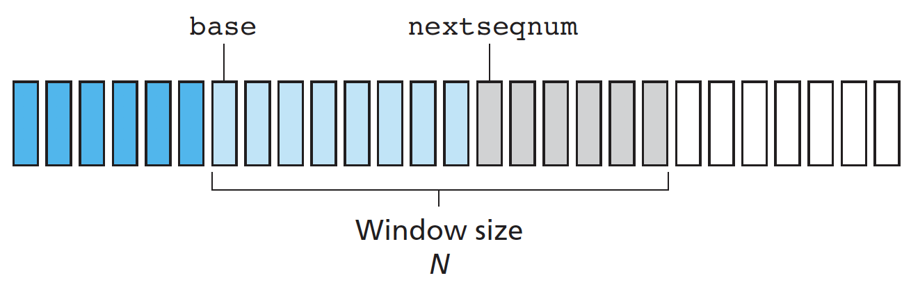

# 3. Transport Layer

## Overview

A transport-layer protocol provides for **logical communication** between application processes running on different hosts. The transport layer converts the application-layer messages it receives from a sending application process into transport-layer packets, known as transport-layer **segments**. Application processes use the logical communication provided by the transport layer to send messages to each other, free from the worry of the details of the physical infrastructure used to carry these messages.

Transport-layer protocols are implemented in the end systems but not in network routers. Whereas a transport-layer protocol provides logical communication between **processes** running on different hosts, a network-layer protocol provides logical communication between **hosts**. This distinction is subtle but important: 

* application messages = 快递
* processes = 收件人
* hosts = 收件地址（房屋）
* transport-layer protocol = 快递员
* network-layer protocol = 快递服务

Recall that the Internet, and more generally a **TCP/IP** network, makes two distinct transport-layer protocols: TCP \(Transmission Control Protocol\) and UDP \(User Datagram Protocol\).

Before introduce UDP and TCP, it will be useful to say a few words about the network layer. The Internet’s network-layer protocol has a name—IP, for **Internet Protocol**. The IP service model is a **best-effort** delivery service.

Extending host-to-host delivery to process-to-process delivery is called transport-layer **multiplexing** and **demultiplexing**, by using source and destination port-number fields in a transport-layer segment. Each port number is a 16-bit number, ranging from 0 to 65535. The port numbers ranging from 0 to 1023 are called well-known port numbers and are restricted for use by well-known application protocols.

UDP uses **connectionless** demultiplexing: IP datagrams with same destination port number, but different source IP addresses and/or source port numbers will be directed to same socket at destination.

TCP uses **connection-oriented** demultiplexing: each socket identified by its own 4-tuple \(source IP address, source port number, dest IP address, dest port number\). The server host may support many simultaneous TCP connection sockets, with each socket attached to a process, and with each socket identified by its own four-tuple. When a TCP segment arrives at the host, all four fields are used to direct \(demultiplex\) the segment to the appropriate socket.

In fact, today’s high-performing Web servers often use only one process, and create a new **thread** with a new connection socket for each new client connection. For such a server, at any given time there may be many connection sockets \(with different identifiers\) attached to the same process.

## UDP

UDP does just about as little as a transport protocol can do. Aside from the multiplexing/demultiplexing function and some light error checking, it adds nothing to IP.

UDP has no congestion control. If everyone were to start streaming high-bitrate video without using any congestion control, there would be so much packet overflow at routers that very few UDP packets would successfully traverse the source-to-destination path. Moreover, the high loss rates induced by the uncontrolled UDP senders would cause the TCP senders \(which, as we’ll see, do decrease their sending rates in the face of congestion\) to dramatically decrease their rates. Some organizations blocking UDP traffic for security reasons.

Nevertheless, many important applications run over UDP rather than TCP.

## Reliable Data Transfer

This task is made difficult by the fact that the layer below the reliable data transfer protocol may be unreliable. We now step through a series of protocols, each one becoming more complex, arriving at a flawless, reliable data transfer protocol.

We use the **finite-state machine** \(FSM\) to indicate the transition of the protocol from one state to another.

**rdt 1.0**: the simplest case, the underlying channel is completely reliable.

**rdt 2.0**: channel with bit errors.

* **checksum** is needed to detect bit errors in a transmitted packet.
* acknowledgements \(**ACK**s\): receiver explicitly tells sender that packet received OK. 
* negative acknowledgements \(NAKs\): receiver explicitly tells sender that packet had errors.

Sender retransmits packet on receipt of NAK.

**rdt 2.1**: what happens if ACK/ NAK corrupted? the sender put a **sequence number** into the packet.

**rdt 2.2**: same functionality as rdt2.1, using ACKs only.

A sender that receives two ACKs for the same packet \(that is, receives **duplicate ACKs**\) knows that the receiver did not correctly receive the packet following the packet that is being ACKed twice.

**rdt 3.0**: channels with errors and loss.

The sender waits reasonable amount of **time** for ACK. If an ACK is not received within this time, the packet is retransmitted. 

The sender is allowed to send multiple packets without waiting for acknowledgments, called **pipelining**. Two basic approaches toward pipelined error recovery can be identified: Go-Back-N and selective repeat.

In a Go-Back-N \(GBN\) protocol, the sender is constrained to have no more than some maximum allowable number, _N_, of unacknowledged packets in the pipeline. _N_ is often referred to as the **window size** and the GBN protocol itself as a **sliding-window protocol**.

An acknowledgment for a packet with sequence number _n_ will be taken to be a **cumulative acknowledgment**, indicating that all packets with a sequence number up to and including _n_ have been correctly received at the receiver. If a timeout occurs, the sender resends all packets that have been previously sent but that have not yet been acknowledged.

A single packet error can thus cause GBN to retransmit a large number of packets, many unnecessarily. **Selective-repeat** protocols avoid unnecessary retransmissions. The SR receiver will acknowledge a correctly received packet whether or not it is in order. Out-of-order packets are buffered until any missing packets are received, at which point a batch of packets can be delivered in order to the upper layer.

We encourage you to review this section again to see how these mechanisms were incrementally added to cover increasingly complex \(and realistic\) models of the channel connecting the sender and receiver, or to improve the performance of the protocols.

## TCP

TCP is said to be **connection-oriented** because before one application process can begin to send data to another, the two processes must first “handshake” with each other. Because three segments are sent between the two hosts, this connection- establishment procedure is often referred to as a **three-way handshake**.

A TCP connection provides a **full-duplex** service. A TCP connection is also always **point-to-point**, that is, between a single sender and a single receiver.

TCP directs this data to the connection’s **send buffer**, which is one of the buffers that is set aside during the initial three-way handshake.

The maximum amount of data that can be grabbed and placed in a segment is limited by the maximum segment size \(**MSS**\). The MSS is typically set by first determining the length of the largest link-layer frame that can be sent by the local sending host \(the so-called maximum transmission unit, **MTU**\).

TCP pairs each chunk of client data with a TCP header, thereby forming TCP **segments**.

TCP creates a reliable data transfer service on top of IP’s unreliable best-effort service.

TCP **fast transmit**: if sender receives 3 ACKs for same data, resend unacknowledged segment with smallest sequence number.

TCP **flow control**: receiver advertises free buffer space by including **rwnd** \(**receive window**\) value in TCP header of receiver-to-sender segments.

TCP **three-way handshake**.

TCP **congestion control**: 

The sender keeps track of the **congestion window**, denoted **cwnd**. The congestion window is maintained by the sender. Note that this is not to be confused with the sliding window size which is maintained by the receiver.

* Slow start
* Congestion avoidance
* Fast recovery

