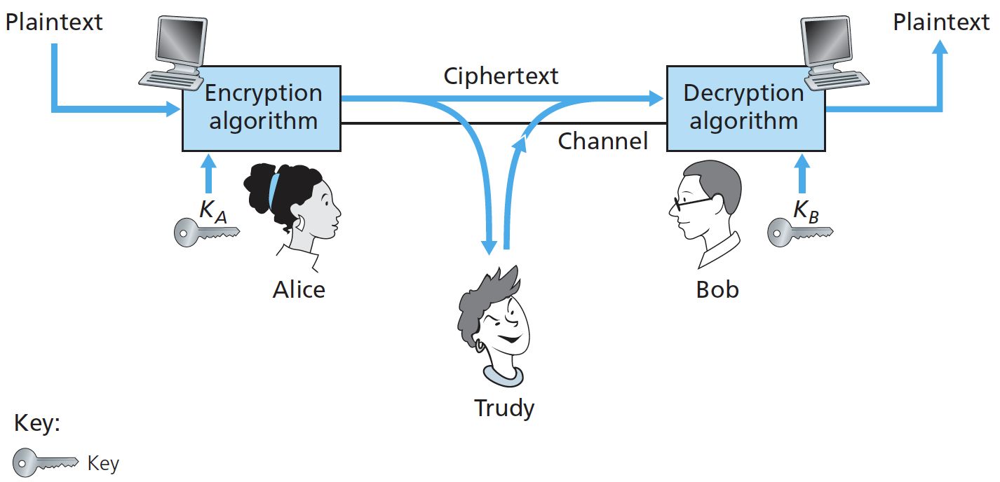
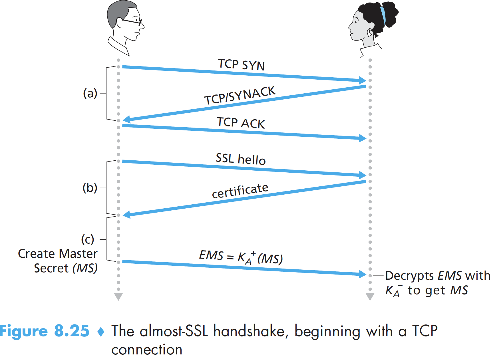

# 8. Network Security

## What is Network Security?

To begin our study of network security, let's say, Alice and Bob, want to communicate “securely.” What precisely does this mean? We can identify the following desirable properties of **secure communication**.

* [Confidentiality](8.-network-security.md#principles-of-cryptography). Only the sender and intended receiver should be able to understand the contents of the transmitted message.
* [Message integrity](8.-network-security.md#cryptographic-hash-functions). The content of the communication is not altered, either maliciously or by accident, in transit.
* [End-point authentication](8.-network-security.md#end-point-authentication). Both the sender and receiver should be able to confirm the identity of the other party, to make sure that is indeed who or what they claim to be.

## Principles of Cryptography

A complete discussion of cryptography itself requires a complete book, so we only touch on the essential aspects, particularly as they are practiced on the Internet.

Suppose now that Alice wants to send a message to Bob: “Bob, I love you. Alice”. Alice uses **encryption** algorithm takes a **key** and the **plaintext** message, as input and produces **ciphertext** as output. Bob uses the **decryption** algorithm that takes the ciphertext and Bob’s key as input and produces the original plaintext as output.

### Symmetric Key Cryptography

Let's begin with a very old, very simple symmetric key algorithm known as the **Caesar**\['si:zə\] **cipher** \(a cipher is a method for encrypting data\): For English text, the Caesar cipher would work by taking each letter in the plaintext message and _substituting_ the letter that is _k_ letters later. Here, the value of _k_ serves as the key.

An improvement on the Caesar cipher is the **monoalphabetic cipher**. Rather than substituting according to a regular pattern \(for example, substitution with an offset of k for all letters\), any letter can be substituted for any other letter. Five hundred years ago,  polyalphabetic encryption, the idea is to use multiple monoalphabetic ciphers, were invented.

When considering how easy it might be for intruder to break an encryption scheme, one can distinguish three different scenarios, depending on what information the intruder has:

* **Ciphertext-only** __attack. The intruder may have access only to the intercepted ciphertext. _Statistical analysis_ can help in such attack.
* **Known-plaintext** attack. When an intruder can somehow knows some of the \(plaintext, ciphertext\) pairings.
* **Chosen-plaintext** attack. The intruder is able to choose the plaintext message and obtain its corresponding ciphertext form.

Today, there are two broad classes of symmetric encryption techniques: **stream ciphers** and **block ciphers**. We’ll briefly examine stream ciphers in Section 8.7 when we investigate security for wireless LANs.

In a block cipher, the message to be encrypted is processed in blocks of _k_ bits. For example, if _k_ = 128, then the message is broken into 128-bit blocks, and each block is encrypted independently. To encode a block, the cipher uses a _one-to-one mapping_ to map the _k_-bit block of cleartext to a _k_-bit block of ciphertext.

Today there are a number of popular block ciphers, including DES \(standing for Data Encryption Standard\), 3DES, and **AES** \(standing for Advanced Encryption Standard\). AES uses 128-bit blocks and can operate with keys that are 128, 192, and **256** bits long.


[How it works](https://www.lastpass.com/how-lastpass-works) at LastPass: We’ve implemented AES-256 bit encryption with PBKDF2 SHA-256 and salted hashes to ensure complete security in the cloud.


Block ciphers typically use a technique called **Cipher Block Chaining** \(CBC\). Before encrypting the message \(or the stream of data\), the sender generates a random k-bit string, called the **Initialization Vector** \(IV\). We’ll need to provide a mechanism within the protocol to distribute the IV from sender to receiver.

### Public Key Encryption

For more than 2,000 years \(since the time of the Caesar cipher and up to the 1970s\), encrypted communication required that the two communicating parties share a common secret—the **symmetric key** used for encryption and decryption. One difficulty with this approach is that the two parties must somehow agree on the shared key; but to do so requires secure communication!

Suppose Alice wants to communicate with Bob. Rather than sharing a single secret key, Bob \(the **recipient**\) instead has two keys—a **public key** that is available to everyone and a **private key** that is known only to Bob. Alice then encrypts her message using Bob’s public key and a known algorithm; Bob uses his private key and a known algorithm to decrypt Alice’s encrypted message.

The **RSA** algorithm has become almost synonymous with public key cryptography. Let’s briefly review modular arithmetic: `19 mod 5 = 4`. There is a fact that `(a mod n)^d mod n = a^d mod n`.

In our discussion of RSA, let’s always keep in mind that a message is nothing but a _bit pattern_, like 1001; and every bit pattern can be uniquely represented by an integer number. Thus, when encrypting a message with RSA, it is equivalent to encrypting the unique integer number that represents the message.

There are two interrelated components of RSA: The choice of the public key and the private key; The encryption and decryption algorithm.

To generate the public and private RSA keys,

1. Choose two large prime numbers, `p` and `q`. \(The larger the values, the more difficult it is to break RSA, but the longer it takes to perform the encoding and decoding\) 
2. Compute `n=pq` and `z=(p–1)(q–1)`. 
3. Choose a number, `e`, less than `n`, that has no common factors \(other than 1\) with `z`.
4. Find a number, d, such that `ed mod z = 1` \(How to choose e and d is beyond the scope of this book\)
5. The public key is the pair of `(n, e)`; the private key is the pair of `(n, d)`. Keep the value of `d` secret.

The encrypted value _c_ of Alice’s plaintext message _m_ is `c = m^e mod n`.

To decrypt the received ciphertext message, computes `m = c^d mod n`.

Then we see the magic of RSA:

We note here that the exponentiation required by RSA is a rather time-consuming process. As a result, RSA is often used in practice in combination with symmetric key cryptography. For example, if Alice wants to send Bob a large amount of encrypted data, first she chooses a key that will be used to encrypt the data itself, referred as **session key**. Alice encrypts the session key using Bob’s public key. Bob receives and decrypts it using his private key. Bob now knows the session key that Alice will use for her encrypted data transfer.

The security of RSA relies on the fact that there are no known algorithms for quickly factoring a number _n_ into the primes _p_ and _q_. If one knew p and q, then given the public value e, one could easily compute the secret key, d.

## Cryptographic Hash Functions

We saw how encryption can be used to provide confidentiality to two communicating entities. In this section we turn to the equally important cryptography topic of providing **message integrity**. But before doing so, we need to cover another important topic in cryptography—cryptographic hash functions.

A **hash function** takes an input, _m_, and computes a fixed-size string `H(m)` known as a hash.

A **cryptographic hash function** is required to have the following additional property: It is computationally infeasible to find any two different messages x and y such that `H(x) = H(y)`. This property means that it is computationally infeasible for an intruder to substitute one message for another message that is protected by the hash function.

Legacy hash algorithm includes MD5, SHA-1, SHA-2, SHA-3, see [Secure Hash Algorithm](https://en.wikipedia.org/wiki/Secure_Hash_Algorithms). RFC 8018, published in 2017, still recommends **PBKDF2** for password hashing. However, newer password hashing functions **Argon2** won the [Password Hashing Competition](https://password-hashing.net/) and has been recommended as the first choice in password hashing.

To perform message integrity, in addition to using cryptographic hash functions, Alice and Bob will need a shared secret **authentication key** _s_. Using this, message integrity can be performed as follows:

* Alice creates message m and calculates the hash _H\(m + s\)_. _H\(m + s\)_ is called the **message authentication code** \(**MAC**\).
* Alice then appends the MAC to the message m, creating an extended message \(m, H\(m + s\)\), and sends the extended message to Bob.
* Bob receives an extended message \(m, h\) and knowing s, calculates the MAC. If H\(m + s\) = h, Bob concludes that everything is fine.

Indeed, in many applications, including the link-state routing algorithm described earlier, communicating entities are only concerned with message integrity and are not concerned with message confidentiality. Using a MAC, the entities can authenticate the messages they send to each other without having to integrate complex encryption algorithms into the integrity process.

A number of different standards for MACs have been proposed over the years. The most popular standard today is **HMAC**.

### Digital Signature

In a digital world, one often wants to indicate the owner or creator of a document, or to signify one’s agreement with a document’s content. A **digital signature** is a cryptographic technique for achieving these goals.

Suppose that Bob wants to digitally sign a document, _m_, Bob simply uses his private key to compute $$K_{B-}(m)$$. Alice takes Bob’s public key, $$K_{B+}$$, and applies it to the digital signature, $$K_{B-}(m)$$ , associated with the document, she produces m, which exactly matches the original document. Alice then argues that only Bob could have signed the document.

It is also important to note that if the original document, _m,_ is ever modified to some alternate form, _m ́_, the signature that Bob created for _m_ will not be valid for _m ́_. Thus we see that digital signatures also provide **message integrity**, allowing the receiver to verify that the message was unaltered as well as the source of the message.

One concern with signing data by encryption is that encryption and decryption are computationally expensive. A more efficient approach is to introduce hash functions into the digital signature. Using a hash function, Bob _signs the hash of a message_ rather than the message itself. Since _H\(m\)_ is generally much smaller than the original message _m_, the computational effort required to create the digital signature is substantially reduced.

An important application of digital signatures is **public key certification**, that is, certifying that a public key belongs to a specific entity \(person, router, browser, and so on\) with whom you want to communicate. Public key certification is used in many popular secure networking protocols, including IPsec and SSL.

Binding a public key to a particular entity is typically done by a **Certification Authority** \(CA\). A CA verifies that an entity is who it says it is and creates a certificate that binds the public key of the entity to the identity. The certificate contains the public key and globally unique identifying information about the owner of the public key \(for example, a human name or an IP address\). The certificate is digitally signed by the CA \(using CA's private key\).

## End-Point Authentication

End-point authentication is the process of one entity proving its identity to another entity over a computer network, for example, a user authenticating himself to an e-mail server.

Typically, an **authentication protocol** would run before the two communicating parties run some other protocol \(for example, a reliable data transfer protocol, a routing information exchange protocol, or an e-mail protocol\).

A **nonce** is a number that a protocol will use only once in a lifetime. Our _ap4.0_ protocol uses a nonce as follows:

* Alice sends the message “I am Alice” to Bob.
* Bob chooses a nonce, R, and sends it to Alice.
* Alice encrypts the nonce using Alice and Bob’s symmetric secret key, The nonce is used to ensure that Alice is "live" instead of a **playback attack**.
* Bob decrypts the received message. If the decrypted nonce equals the nonce he sent Alice, then Alice is authenticated.

## Securing TCP Connections: SSL

**Secure Sockets Layer** \(SSL\) enhances TCP with confidentiality, data integrity, server authentication, and client authentication. A slightly modified version of SSL version 3, called **Transport Layer Security** \(TLS\), has been standardized by the IETF \[RFC 4346\].

SSL provides a simple API with sockets, which is similar and analogous to TCP’s API. When an application wants to employ SSL, the application includes SSL classes/libraries. Although SSL technically resides in the application layer, from the developer’s perspective it is a transport protocol that provides TCP’s services enhanced with security services.

We begin by describing a simplified version of SSL, referred as “almost-SSL.” Almost-SSL \(and SSL\) has three phases: **handshake**, **key derivation**, and **data transfer**. We now describe these three phases for a communication session between a client \(Bob\) and a server \(Alice\), with Alice having a private/public key pair and a certificate that binds her identity to her public key.

The **SSL handshake**: Once the TCP connection is established, Bob sends Alice a hello message, along with a client **nonce**. Alice then responds with her certificate, which contains her public key, and a server **nonce**. Bob then generates a Pre-Master Secret \(PMS\), encrypts the PMS with Alice’s public key and sends to Alice.

The client and server independently compute the Master Secret \(MS\) from the _PMS and nonces_ to generate the four keys. Two encryption keys will be used to encrypt data; the two MAC keys will be used to verify the integrity of the data.

Then, the client sends a MAC of all the handshake messages. The server sends a MAC of all the handshake messages. The last two steps protect the handshake from tampering.

In data transfer, as TCP is a byte-stream protocol, SSL breaks the data stream into **records**, appends a MAC to each record for integrity checking, and then encrypts the record+MAC. The MAC is a hash of the data plus the MAC key plus the current **sequence number**.

