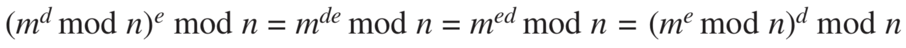

# 8. Network Security

## What is Network Security?

To begin our study of network security, let's say, Alice and Bob, want to communicate “securely.” What precisely does this mean? We can identify the following desirable properties of **secure communication**.

* Confidentiality. Only the sender and intended receiver should be able to understand the contents of the transmitted message.
* Message integrity. The content of the communication is not altered, either maliciously or by accident, in transit.
* End-point authentication. Both the sender and receiver should be able to confirm the identity of the other party, to make sure that is indeed who or what they claim to be.

## Principles of Cryptography

A complete discussion of cryptography itself requires a complete book, so we only touch on the essential aspects, particularly as they are practiced on the Internet.

Suppose now that Alice wants to send a message to Bob: “Bob, I love you. Alice”. Alice uses **encryption** algorithm takes a **key** and the **plaintext** message, as input and produces **ciphertext** as output. Bob uses the **decryption** algorithm that takes the ciphertext and Bob’s key as input and produces the original plaintext as output.

### Symmetric Key Cryptography

Let's begin with a very old, very simple symmetric key algorithm known as the **Caesar cipher** \(a cipher is a method for encrypting data\): For English text, the Caesar cipher would work by taking each letter in the plaintext message and _substituting_ the letter that is _k_ letters later. Here, the value of _k_ serves as the key.

An improvement on the Caesar cipher is the **monoalphabetic** **cipher**. Rather than substituting according to a regular pattern \(for example, substitution with an offset of k for all letters\), any letter can be substituted for any other letter.

When considering how easy it might be for Trudy to break Bob and Alice’s encryption scheme, one can distinguish three different scenarios, depending on what information the intruder has:

* **Ciphertext-only** _attack_. The intruder may have access only to the intercepted ciphertext. We have seen how _statistical analysis_ can help in a ciphertext-only attack on an encryption scheme.
* **Known-plaintext** attack. When an intruder can somehow knows some of the \(plaintext, ciphertext\) pairings.
* **Chosen-plaintext** attack. The intruder is able to choose the plaintext message and obtain its corresponding ciphertext form. If somehow Trudy could get Alice to send the chosen message, “The quick brown fox jumps over the lazy dog,” she could completely break the encryption scheme.

Five hundred years ago,  **polyalphabetic** encryption, the idea is to use multiple monoalphabetic ciphers, were invented.

Today, there are two broad classes of symmetric encryption techniques: **stream ciphers** and **block ciphers**.

In a block cipher, the message to be encrypted is processed in blocks of _k_ bits. For example, if _k_ = 64, then the message is broken into 64-bit blocks, and each block is encrypted independently. To encode a block, the cipher uses a _one-to-one mapping_ to map the _k_-bit block of cleartext to a _k_-bit block of ciphertext.

Today there are a number of popular block ciphers, including **DES** \(standing for Data Encryption Standard\), **3DES**, and **AES** \(standing for Advanced Encryption Standard\). AES uses 128-bit blocks and can operate with keys that are 128, 192, and 256 bits long.

Block ciphers typically use a technique called **Cipher Block Chaining** \(CBC\). Before encrypting the message \(or the stream of data\), the sender generates a random k-bit string, called the **Initialization Vector** \(IV\). We’ll need to provide a mechanism within the protocol to distribute the IV from sender to receiver.

### Public Key Encryption

For more than 2,000 years \(since the time of the Caesar cipher and up to the 1970s\), encrypted communication required that the two communicating parties share a common secret—the **symmetric key** used for encryption and decryption. One difficulty with this approach is that the two parties must somehow agree on the shared key; but to do so requires secure communication!

Suppose Alice wants to communicate with Bob. Rather than sharing a single secret key, Bob \(the _recipient_\) instead has two keys—a **public key** that is available to everyone and a **private key** that is known only to Bob. Alice then encrypts her message using Bob’s public key and a known algorithm; Bob uses his private key and a known algorithm to decrypt Alice’s encrypted message.

Te **RSA** algorithm has become almost synonymous with public key cryptography. Let’s briefly review _modular_ arithmetic: `19 mod 5 = 4`. There is a fact that `(a mod n)^d mod n = a^d mod n`.

In our discussion of RSA, let’s always keep in mind that a message is nothing but a _bit pattern_, like 1001; and every bit pattern can be uniquely represented by an integer number. Thus, when encrypting a message with RSA, it is equivalent to encrypting the unique integer number that represents the message.

There are two interrelated components of RSA: The choice of the public key and the private key; The encryption and decryption algorithm.

To generate the public and private RSA keys,

1. Choose two large prime numbers, `p` and `q`. \(The larger the values, the more difficult it is to break RSA, but the longer it takes to perform the encoding and decoding\) 
2. Compute `n=pq` and `z=(p–1)(q–1)`. 
3. Choose a number, `e`, less than `n`, that has no common factors \(other than 1\) with `z`.
4. Find a number, d, such that `ed mod z = 1` \(How to choose e and d is beyond the scope of this book\)
5. The public key is the pair of `(n, e)`; the private key is the pair of `(n, d)`. Keep the value of `d` secret!

The encrypted value _c_ of Alice’s plaintext message _m_ is `c = m^e mod n`.

To decrypt the received ciphertext message, computes `m = c^d mod n`.

Then we see the magic of RSA:

We note here that the exponentiation required by RSA is a rather time-consuming process. As a result, RSA is often used in practice in combination with symmetric key cryptography. For example, if Alice wants to send Bob a large amount of encrypted data, first she chooses a key that will be used to encrypt the data itself, referred as **session key**. Alice encrypts the session key using Bob’s public key. Bob receives and decrypts it using his private key. Bob now knows the session key that Alice will use for her encrypted data transfer.

The security of RSA relies on the fact that there are no known algorithms for quickly factoring a number, in this case the public value n, into the primes p and q. If one knew p and q, then given the public value e, one could easily compute the secret key, d.

## Message Integrity and Digital Signatures

