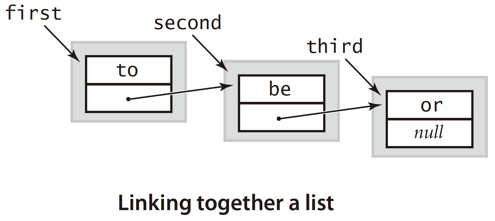

# 1.3 Bags, Queues, and Stacks

Three fundamental data types: bag, queue, and stack. They involve **collections of objects**.

* A **bag** is a collection where removing items is not supported.
* A FIFO queue \(or just a **queue**\) is a collection that is based on the first-in-first-out \(FIFO\) policy.
* A pushdown stack \(or just a **stack**\) is a collection that is based on the last-in-first-out \(LIFO\) policy.

**Generics**: You can read Stack&lt;Item&gt; as “stack of items.” 

**Type parameters** have to be instantiated as reference types, so Java has special mechanisms to allow generic code to be used with primitive types.

Automatically casting a primitive type to a wrapper type is known as **auto-boxing**, and automatically casting a wrapper type to a primitive type is known as **auto-unboxing**.

```java
Stack<Integer> stack = new Stack<Integer>();
stack.push(17);      // auto-boxing (int -> Integer)
int i = stack.pop(); // auto-unboxing (Integer -> int)
```

One of the fundamental operations on collections is to process each item by **iterating** through the collection using Java’s **foreach** statement.

```java
Queue<Transaction> collection = new Queue<Transaction>();
for (Transaction t : collection) { }
```

Implementing iterable collection:

* The collection must implement an `iterator()` method that returns an _java.util.Iterator_ object.
* The Iterator class must include two methods: `hasNext()` and `next()`.

```java
public Iterator<Item> iterator() {
    return new ListIterator();
}

private class ListIterator implements Iterator<Item> {
    private Node current = first;
    public boolean hasNext()  { return current != null; }
    public Item next() {
        if (!hasNext()) throw new NoSuchElementException();
        Item item = current.item;
        current = current.next; 
        return item;
    }
}
```

## Implementation: Linked List

A classic data structure known as the **linked list** enables implementation of bags, queues, and stacks that achieve efficiencies not otherwise possible.



Linked lists are a fundamental alternative to arrays for structuring a collection of data.

A linked list represents a **sequence** of items. We can represent a linked list with a variable of type `Node` simply by ensuring that its value is either null or a reference to a Node whose next field is a reference to a linked list.

```java
private class Node {
  Item item;
  Node next;
}
```

The standard solution to enable arbitrary insertions and deletions is to use a doubly-linked list, where each node has two links, one in each direction.

**Traversing** the list:

```java
for (Node x = first; x != null; x = x.next) {
  // Process x.item.
}
```

**Reverse** the linked list in-place and in one-pass:

```java
public Node reverse(Node head) {
    if (head == null) { return null; } // boundary 
    ListNode a = head;
    ListNode b = head.next;
    head.next = null; // the head is about to be the end
    while (b!=null) {
        ListNode c = b.next;
        b.next = a;
        a = b;
        b = c;
    }  
    return a;
}
```


