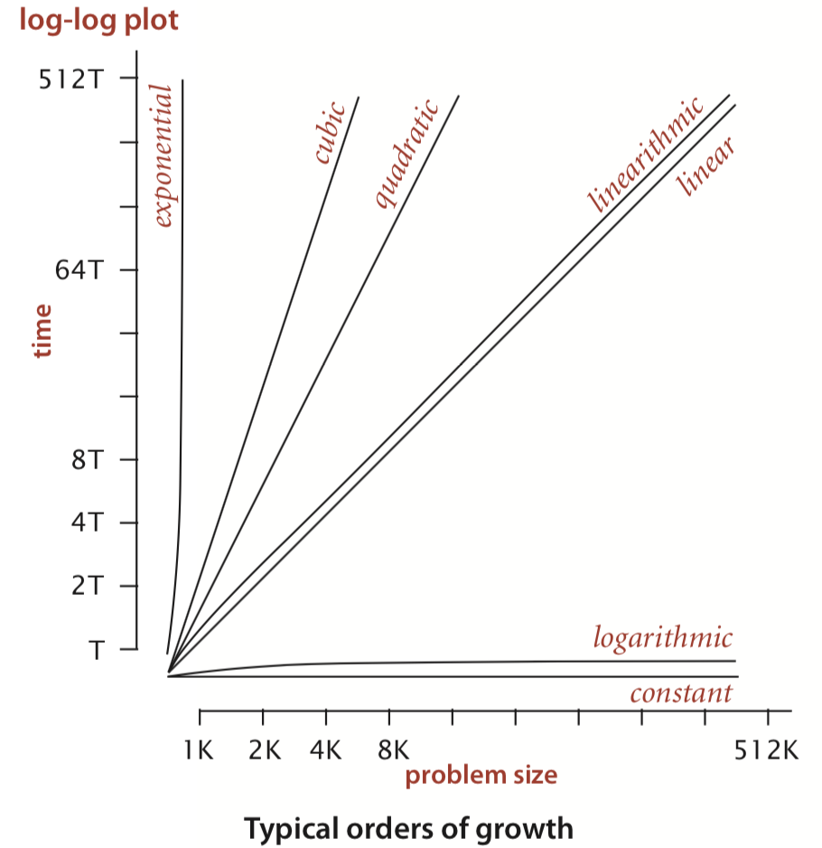

# 1.4 Analysis of Algorithms

## Scientific method

The process scientists use when trying to understand properties of the real world:

* **Observe** some feature of the natural world, generally with precise measurements.
* **Hypothesize** a model that is consistent with the observations.
* **Predict** events using the hypothesis.
* **Verify** the predictions by making further observations.
* **Validate** by repeating until the hypothesis and observations agree.

## Mathematical models

The total running time of a program is determined by two primary factors:

* The cost of executing each statement.
* The frequency of execution of each statement.

**Tilde approximations**: We write $$～f(N)$$ to represent any function that, when divided by $$f(N)$$ , approaches 1 as N grows, and we write $$g(N)～f(N)$$ to indicate that $$g(N)/f(N)$$ approaches 1 as N grows.

For example, we use the approximation ~$$N^3/6$$ to describe the number of times the if statement in ThreeSum is executed, since $$N^3/6+N^2/2+N/3$$ divided by $$N^3/6$$ approaches 1 as N grows. The **order of growth** is $$N^3$$ .

## Order-of-growth classifications

We use just a few structural primitives \(statements, conditionals, loops, nesting, and method calls\) to implement algorithms, so very often the order of growth of the cost is one of just a few functions of the problem size _N_.

These classifications are the most common:

**Constant**: A program executes a fixed number of operations to finish its job; consequently its running time does not depend on N. Most Java operations take constant time. \(数组元素访问\)

**Logarithmic**: The classic example of a program whose running time is logarithmic in the problem size is **binary search**. _The **base** of the logarithm is not relevant_ with respect to the order of growth \(since all logarithms with a constant base are related by a constant factor\), so we use $$logN$$ when referring to order of growth. \(二分查找\)

**Linear**: Programs that spend a constant amount of time processing each piece of input data, or that are based on a single for loop, are quite common. \(遍历搜索\)

**Linearithmic**: We use the term linearithmic order of growth $$NlogN$$. Again, the base of the logarithm is not relevant with respect to the order of growth. The prototypical examples of linearithmic algorithms are [Mergesort](../2.-sorting/2.2-mergesort.md) and [Quicksort](../2.-sorting/2.3-quicksort.md). \(归并排序、快速排序\)

**Quadratic**: A typical program whose running time has order of growth $$N^2$$ has two nested for loops, used for some calculation involving all pairs of N elements. \(冒泡排序、插入排序\)

**Cubic**: order of growth $$N^3$$ 

**Exponential**: Generally, we use the term exponential to refer to algorithms whose order of growth is $$b^N$$ for any constant b &gt; 1, even though different values of b lead to vastly different running times.

