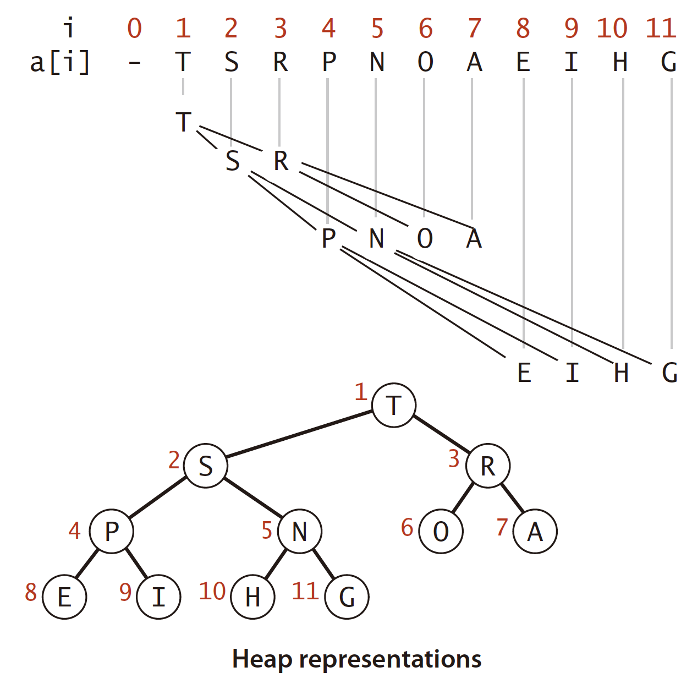

# 2.4 Priority Queues

Priority queue supports two operations: remove the maximum \(the largest key\) and insert.

An important sorting algorithm known as **heapsort** also follows naturally from our heap-based priority-queue implementations.

We shall see how priority queues are an appropriate abstraction for implementing several fundamental **graph-searching** algorithms.

## Implementation

A **binary tree** is **heap-ordered** if the key in each node is larger than or equal to the keys in that node’s two children \(if any\).

A **binary heap** is a collection of keys arranged in a complete **heap-ordered** binary tree, represented in **level order** in an **array** \(not using the first entry\).



The binary heap is a data structure that can efficiently support the basic priority-queue operations. 

In a binary heap, the parent of the node in position k is in position k/2 and, conversely, the two children of the node in position k are in positions 2k and 2k + 1.

We represent a heap of size N in private array pq\[\] of length N + 1, with pq\[0\] unused and the heap in pq\[1\] through pq\[N\].

### Swim and Sink

The heap operations work by first making a simple modification that could violate the heap condition, then traveling through the heap, modifying the heap as required to ensure that the heap condition is satisfied everywhere. We refer to this process as **reheapifying**.

* Bottom-up reheapify \(swim\): If a node’s key becomes larger than its parent’s key, it has to **swim** to a higher level in the heap to fix the violation.
* Top-down reheapify \(sink\): If a node’s key becomes smaller than one or both of its children’s keys, it has to **sink** to a lower level in the heap to fix the violation.

### Insert and Remove the maximum

* Insert. We add the new key at the end of the array, increment the size of the heap, and then swim up through the heap with that key to restore the heap condition.
* Remove the maximum. We take the largest key off the top, put the item from the end of the heap at the top, decrement the size of the heap, and then sink down through the heap with that key to restore the heap condition.

## Heapsort

Heapsort breaks into two phases: **heap construction**, where we reorganize the original array into a heap, and the **sortdown**, where we pull the items out of the heap in decreasing order to build the sorted result.

Heap construction: proceed from _right to left_ through the array, using `sink()` to make subheaps. \(Then the array was heap-ordered\)

Sortdown: remove the largest remaining item from the heap and put it into the array position vacated as the heap shrinks.

```java
public static void sort(Comparable[] a) {
    int N = a.length;
    // heap construction
    for (int k = N/2; k >= 1; k--)
        sink(a, k, N);
    // sortdown
    while (N > 1) {
        exch(a, 1, N--);
        sink(a, 1, N);
    }
}
```


