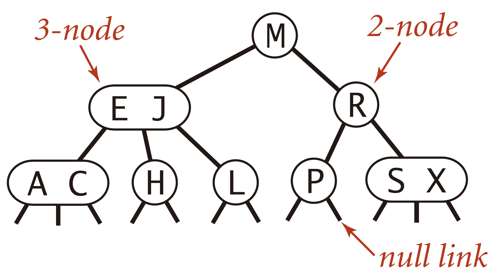
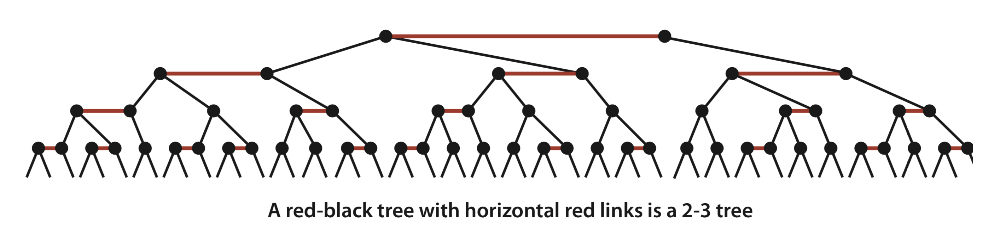
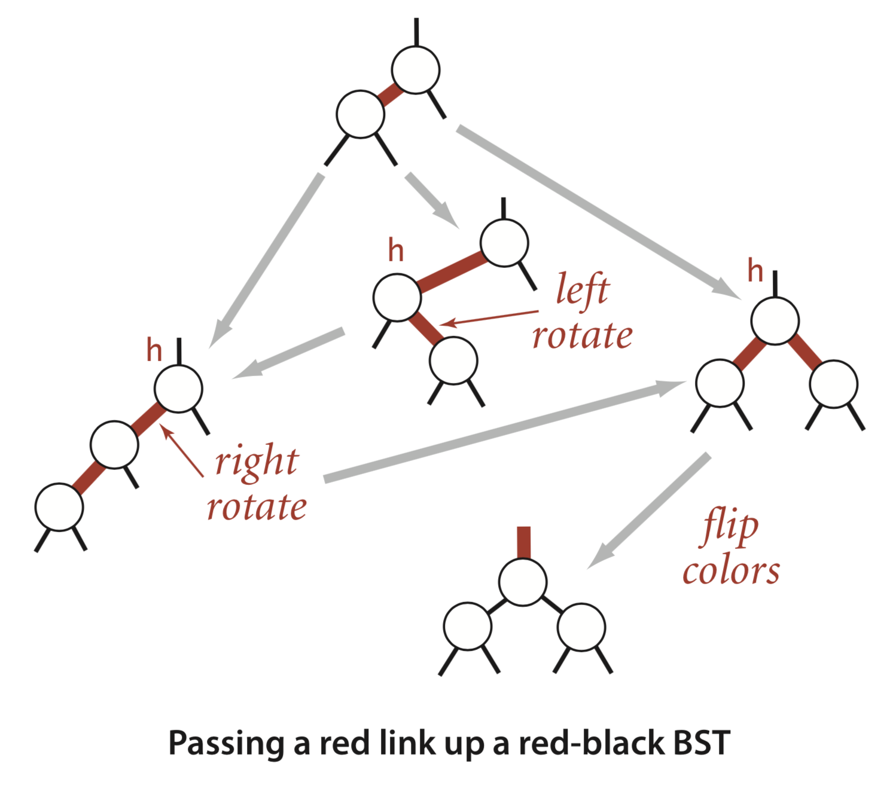

# 3.3 Balanced Search Trees

BSTs have poor worst-case performance. Ideally, we would like to keep our BSTs perfectly **balanced**. Unfortunately, maintaining perfect balance for dynamic insertions is too expensive. In this section, we consider a data structure that slightly relaxes the perfect balance requirement.

## 2-3 search trees

A 2-3 search tree is a tree that is either **empty** or

* A 2-node, with one key \(and associated value\) and two links, a left link to a 2-3 search tree with smaller keys, and a right link to a 2-3 search tree with larger keys.
* A 3-node, with **two keys** \(and associated values\) and **three links**, a left link to a 2-3 search tree with smaller keys, a **middle** link to a 2-3 search tree with keys **between the node’s keys**, and a right link to a 2-3 search tree with larger keys.

As usual, we refer to a link to an empty tree as a **null** link.



A **perfectly balanced** 2-3 search tree is one whose null links are all the same distance from the root.


To be concise, we use the term **2-3 tree** to refer to a perfectly balanced 2-3 search tree.


### Insert

1. Insert into a 2-node: just replace the node with a 3-node.
2. Insert into a tree consisting of a single 3-node: make a 4-node, split 4-node into 2-3 tree. \(p439\)
3. Insert into a 3-node whose parent is a 2-node: move the middle key to the node’s parent.
4. Insert into a 3-node whose parent is a 3-node: move the middle key to the node’s parent until reaching a 2-node, which we replace with a 3-node that does not need to be further split, or until reaching a 3-node at the root.
5. Splitting the root: the same way as 2. Increase the height of the tree by 1.

Splitting a temporary 4-node in a 2-3 tree involves one of six **transformations**. \(p441\) Moreover, these local transformations **preserve** the global properties that the tree is **ordered and perfectly balanced**. Recall that in a BST, the increasing-order sequence for 10 keys results in a worst-case tree of height 9. In the 2-3 trees, the height is 2.

A perfectly balanced 2-3 tree strikes a remarkably flat posture. For example, the height of a 2-3 tree that contains 1 billion keys is between 19 and 30.

Search and insert operations in a 2-3 tree with _N_ keys are guaranteed to visit at most $$lgN$$ nodes.

## Red-black BSTs

A simple representation of 2-3 tree known as a red-black BST that leads to a natural implementation. The basic idea behind red-black BSTs is to encode 2-3 trees by starting with standard BSTs \(which are made up of 2-nodes\) and adding extra information to encode 3-nodes.

We represent 3-nodes as "two 2-nodes" connected by a single **red link** that **leans left**. \(One of the 2-nodes is the left child of the other\). One advantage of using such a representation is that it allows us to use our `get()` code for standard BST search without modification.

### An equivalent definition

* Red links lean left.
* No node has two red links connected to it. \(At most 1 red link in each node\)
* The tree has **perfect black balance**: every path from the root to a null link has the same number of black links.



### **1-1 correspondence**

1-1 correspondence: red-black BSTs are both BSTs and 2-3 trees.

Then we get the best of both worlds: the simple and efficient search method from standard BSTs and the efficient insertion-balancing method from 2-3 trees!

Color representation: we encode the color of links in nodes. By convention, null links are black. The color of a node is the color of the link pointing to it.

```java
private class Node {
    private Key key;           // key
    private Value val;         // associated data
    private Node left, right;  // links to left and right subtrees
    private boolean color;     // color of parent link
    private int size;          // subtree count
}
```


What happen if the right child's color is red, or even both children's color are red?


This implementation might cause right-leaning red links or two red links in a row during an operation, thus we need an operation called **rotation**.

We can maintain our 1-1 correspondence between 2-3 trees and red-black BSTs during insertion by judicious use of three simple operations: **left rotate**, **right rotate**, and **color flip**; to preserve the defining properties of red-black BSTs.

left rotate:

```java
// make a right-leaning link lean to the left
private Node rotateLeft(Node h) {
    Node x = h.right; 
    h.right = x.left;
    x.left = h;
    x.color = x.left.color;
    x.left.color = RED;
    x.size = h.size;
    h.size = size(h.left) + size(h.right) + 1;
    return x;
}
```

color flip:

```java
// flip the colors of a node and its two children
private void flipColors(Node h) {
    // h must have opposite color of its two children
    assert (!isRed(h) &&  isRed(h.left) &&  isRed(h.right)) 
    || (isRed(h)  && !isRed(h.left) && !isRed(h.right));
    h.color = !h.color;
    h.left.color = !h.left.color;
    h.right.color = !h.right.color;
}
```

### Insert

1. Insert into a single 2-node
2. Insert into a 2-node at the bottom
3. Insert into a single 3-node
4. Insert into a 3-node at the bottom

To insert into a 3-node, create a temporary 4-node, split it, and pass a red link to the middle key up to its parent. Continuing the same process, we pass a red link up the tree until reaching a 2-node or the root.



```java
// insert the key-value pair in the subtree rooted at h
private Node put(Node h, Key key, Value val) { 
    if (h == null) return new Node(key, val, RED, 1);

    int cmp = key.compareTo(h.key);
    if      (cmp < 0) h.left  = put(h.left,  key, val); 
    else if (cmp > 0) h.right = put(h.right, key, val); 
    else              h.val   = val;

    // fix-up any right-leaning links
    if (isRed(h.right) && !isRed(h.left))      h = rotateLeft(h);
    if (isRed(h.left)  &&  isRed(h.left.left)) h = rotateRight(h);
    if (isRed(h.left)  &&  isRed(h.right))     flipColors(h);
    h.size = size(h.left) + size(h.right) + 1;

    return h;
}
```

### Delete

Since `put()` in is already one of the most intricate methods that we consider in this book, and the implementations of `deleteMin()`, `deleteMax()`, and `delete()` for red-black BSTs are a bit more complicated, we defer their full implementations to exercises...

### Perfomance

All symbol-table operations in red-black BSTs are guaranteed to be **logarithmic** in the size of the tree.

