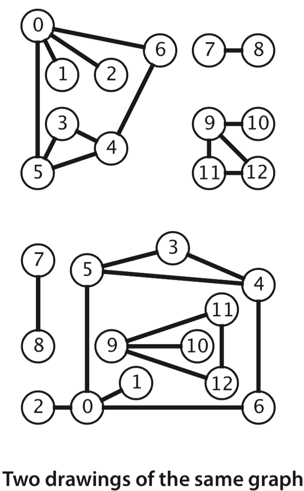
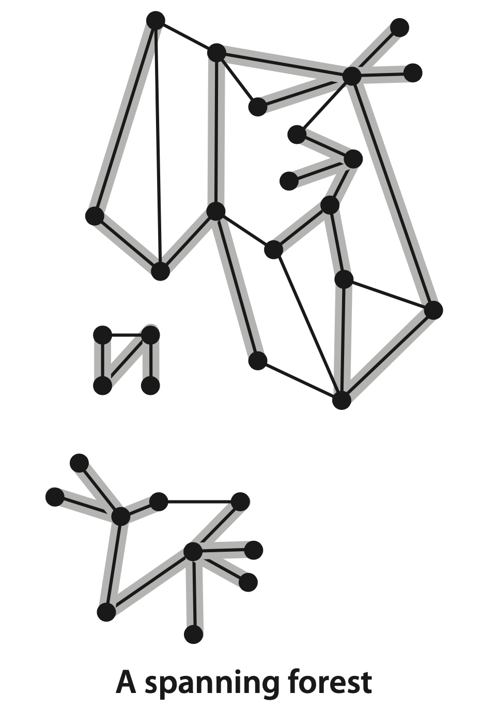
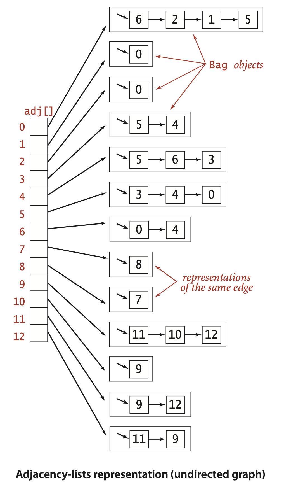
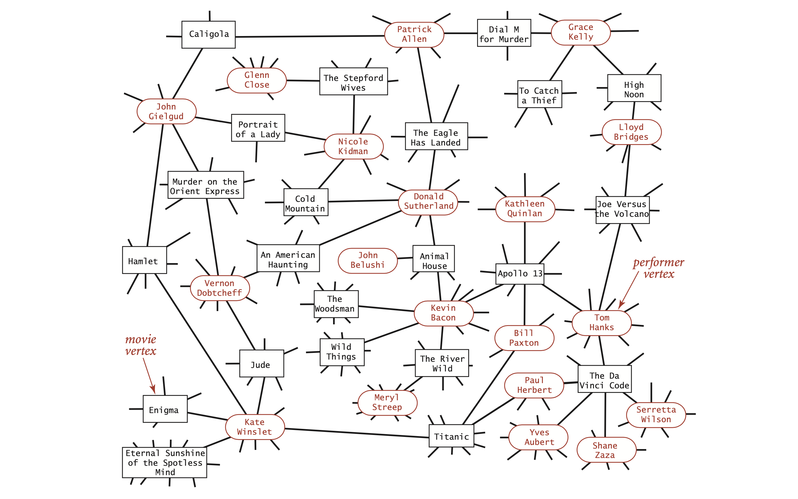

# 4.1 Undirected Graphs

Our starting point is the study of graph models where edges are nothing more than connections between vertices. We use the term **undirected graph** in contexts where we need to distinguish this model from other models. Since this is the simplest model, we start with the following definition: A **graph** is a set of **vertices** and a collection of **edges** that each connect a pair of vertices.

By convention, we use the names **0 through V-1** for the vertices in a V-vertex graph 用 \[0, V-1\] 表示 V 个顶点的图. The main reason that we choose this system is to make it easy to write code that efficiently accesses information corresponding to each vertex, using **array indexing**.

We use the notation **v-w** to refer to an edge that connects v and w.

A **drawing** gives us intuition about the structure of the graph; but a graph can be drawn in different ways.



Mathematicians sometimes refer to graphs with no **parallel edges** （两个顶点之间有多于一条条边）or **self-loops** （顶点到其自身的边）as simple graphs. Typically, our implementations allow self-loops and parallel edges \(because they arise in applications\), but we do not include them in examples.

When there is an edge connecting two vertices, we say that the vertices are **adjacent** to one another and that the edge is **incident** to both vertices. The **degree** of a vertex is the number of edges incident to it. A subgraph is a subset of a graph’s edges \(and associated vertices\) that constitutes a graph. Many computational tasks involve identifying subgraphs of various types. Of particular interest are edges that take us through a sequence of vertices in a graph 找寻图中的路径.

A path in a graph is a sequence of vertices connected by edges. A **simple path** is one with no repeated vertices. A cycle is a path with at least one edge whose first and last vertices are the same. A **simple cycle** is a cycle with no repeated edges or vertices \(except the requisite repetition of the first and last vertices\). The **length** of a path or a cycle is its number of edges.


Most often, we work with simple cycles and simple paths and drop the _simple_ modifier.


We say that one vertex is **connected** to another if there exists a path that contains both of them. We use notation like `u-v-w-x` to represent a path from u to x and `u-v-w-x-u` to represent a cycle. Several of the algorithms that we consider **find paths and cycles**.

A graph is **connected** if there is a path from every vertex to every other vertex in the graph. 

An **acyclic** graph 无环图 is a graph with no cycles. Several of the algorithms that we consider are concerned with **finding acyclic subgraphs** of a given graph that satisfy certain properties.

A **tree** is an acyclic connected graph 无环连通图. A disjoint set of trees is called a **forest**. A spanning tree 生成树 of a connected graph is a subgraph that contains all of that graph’s vertices and is a single tree. A spanning forest of a graph is the union of spanning trees of its connected components.



A graph G with V vertices is a tree if and only if it satisfies any of the following five conditions: 

* G has V-1 edges and no cycles. 
* G has V-1 edges and is connected.
* G is connected, but removing any edge disconnects it.
* G is acyclic, but adding any edge creates a cycle.
* Exactly one simple path connects each pair of vertices in G.

Several of the algorithms that we consider **find spanning trees and forests**.

The density of a graph is the proportion of possible pairs of vertices that are connected by edges. A sparse graph has relatively few of the possible edges present. The applications that we consider nearly always involve sparse graphs.

## Representation

Two data structures for representing graphs:

An adjacency matrix 邻接矩阵, where we maintain a V-by-V boolean array, with the entry in row v and column w defined to be true if there is an edge adjacent to both vertex v and vertex w in the graph, and to be false otherwise.

An array of adjacency lists 邻接表, where we maintain a vertex-indexed array of lists of the vertices adjacent to each vertex.



The standard graph representation for graphs that are not dense is called the **adjacency-lists** data structure, where we keep track of all the vertices adjacent to each vertex on a **linked list** \(Bag ADT\) that is associated with that vertex. We maintain an **array** of lists so that, given a vertex, we can immediately access its list. To add an edge connecting v and w, we add w to v’s adjacency list and v to w’s adjacency list. Thus, each edge appears **twice** in the data structure.

```java
public class Graph {
    private final int V; //the number of vertices
    private int E; // by the number of edges
    private Bag<Integer>[] adj; //adjacency-lists
    
    public Graph(int V) {
       this.V = V; this.E = 0;
       adj = (Bag<Integer>[]) new Bag[V]; // Create array of lists.
       for (int v = 0; v < V; v++)
          adj[v] = new Bag<Integer>(); // Initialize all lists to empty
     }
     
     public int V()  {  return V;  }
     public int E()  {  return E;  }
     
     public void addEdge(int v, int w) {
        adj[v].add(w); // Add w to v’s list.
        adj[w].add(v); // Add v to w’s list.
        E++;
     }
     
     public Iterable<Integer> adj(int v) {
        return adj[v];
     }
}
```

## Graph processing

Since we consider a large number of graph-processing algorithms, our initial design goal is to decouple our implementations from the graph representation. To do so, we develop, for each given task, a task-specific class so that clients can create objects to perform the task.

### Depth First Search

A classic recursive method for searching in a connected graph \(visiting all of its vertices and edges\) is called depth-first search \(DFS\). 

The DepthFirstSearch class represents a data type for determining the vertices connected to a given source vertex. It follows the graph’s edges to find the vertices connected to the source.

```java
public class DepthFirstSearch {
    private boolean[] marked;    // marked[v] = is there an s-v path?
    private int count;           // number of vertices connected to s
    
    // Computes the vertices in graph G that are connected to 
    // the source vertex s.
    public DepthFirstSearch(Graph G, int s) {
        marked = new boolean[G.V()];
        dfs(G, s);
    }
    
    private void dfs(Graph G, int v) {
        marked[v] = true; // mark the starting point as visited
        count++;
        for (int w : G.adj(v))
            if (!marked[w]) dfs(G, w);
    }
}
```

### Depth First Paths

The **single-source paths** problem is fundamental to graph processing: Is there a path from s to a given target vertex v? If so, find such a path.

```java
public class DepthFirstPaths {
    private boolean[] marked; // Has dfs() been called for this vertex?
    private int[] edgeTo; // last vertex on known path to this vertex
    private final int s; // source
    
    public DepthFirstPaths(Graph G, int s) {
        marked = new boolean[G.V()];
        edgeTo = new int[G.V()];
        this.s = s;
        dfs(G, s);
    }
    
    private void dfs(Graph G, int v) {
        marked[v] = true; // mark the starting point as visited
        for (int w : G.adj(v)) {
            if (!marked[w]) {
                edgeTo[w] = v;
                dfs(G, w);
            }
        }
    }
    
    public boolean hasPathTo(int v) {
        return marked[v];
    }
    
    public Iterable<Integer> pathTo(int v) {
        if (!hasPathTo(v)) return null;
        Stack<Integer> path = new Stack<Integer>();
        for (int x = v; x != s; x = edgeTo[x]) {
            path.push(x);
        }
        path.push(s);
        return path;
    }
}
```

### Breadth First Paths

**Single-source shortest paths**: Given a graph and a source vertex s, Is there a path from s to a given target vertex v? If so, find a shortest such path.

```java
public class BreadthFirstPaths {
     private boolean[] marked; // Is a shortest path to this vertex known?
     private int[] edgeTo;     // last vertex on known path to this vertex
     private final int s;      // source
     
     public BreadthFirstPaths(Graph G, int s) {
          marked = new boolean[G.V()];
          edgeTo = new int[G.V()];
          this.s = s;
          bfs(G, s);
     }
     
     private void bfs(Graph G, int s) {
        Queue<Integer> q = new Queue<Integer>();
        marked[s] = true; // Mark the source
        queue.enqueue(s); // and put it on the queue.
        while (!q.isEmpty()) {
            int v = queue.dequeue(); // Remove next vertex from the queue.
            for (int w : G.adj(v)) {
                if (!marked[w]) {
                    edgeTo[w] = v;
                    marked[w] = true;
                    q.enqueue(w);
                }
            }
        }
    }
}
```

### Cycle detection

Is a given graph acyclic? The **Cycle** class represents a data type for determining whether an undirected graph has a simple cycle.

```java
public class Cycle {
    private boolean[] marked;
    
    public Cycle(Graph G) {
        marked = new boolean[G.V()];
        for (int s = 0; s < G.V(); s++)
            if (!marked[s])
                dfs(G, s, s);
    }
    
    private void dfs(Graph G, int v, int u) {
        marked[v] = true;
        for (int w : G.adj(v)) {
            if (!marked[w]) { 
                dfs(G, w, v);
            }
            else if (w != u) { 
                hasCycle = true
                return
            }
        }
    }
}
```

### Two-colorability

Can the vertices of a given graph be assigned one of two colors in such a way that no edge connects vertices of the same color? which is equivalent to this question: Is the graph _bipartite_ 二分图?

```java
public class TwoColor {
    private boolean[] marked;
    private boolean[] color;
    private boolean isTwoColorable = true;

    public TwoColor(Graph G) {
        marked = new boolean[G.V()];
        color = new boolean[G.V()];
        for (int s = 0; s < G.V(); s++) 
            if (!marked[s])
                dfs(G, s);
    }
    
    private void dfs(Graph G, int v) {
        marked[v] = true;
        for (int w : G.adj(v)) {
            if (!marked[w]) {
                color[w] = !color[v];
                dfs(G, w);
            } else if (color[w] == color[v]) {
                isTwoColorable = false;
            }
        }
    }
}
```

## Symbol graphs

Typical applications use strings, not integer indices, to define and refer to vertices. To accommodate such applications, we define an input format with the following properties:

* Vertex names are strings.
* Each line represents a set of edges, connecting the first vertex name on the line

  to each of the other vertices named on the line.

The _movies.txt_ file consists of lines listing a movie name followed by a list of the performers in the movie. In the context of graph processing, we can view it as defining a graph with movies and performers as vertices and each line defining the adjacency list of edges connecting each movie to its performers. Note that the graph is a **bipartite graph**—there are no edges connecting performers to performers or movies to movies.



当我们构建好二分图之后，就得到了提供反向索引的能力！This client immediately provides the useful **inverted index** functionality that we considered in Section 3.5. In the case of _movies.txt_, typing a movie name and getting its cast is not much more than regurgitating the corresponding line in the input file, but typing the name of a performer and getting the list of movies in which that performer has appeared is **inverting the index**. The bipartite graph model automatically serves as an inverted index.

A SymbolGraph implementation builds three data structures:

* A symbol table st with String keys \(vertex names\) and int values \(indices\)
* An array keys\[\] that serves as an inverted index
* A Graph G built using the indices to refer to vertices


```java
public class SymbolGraph {
     private ST<String, Integer> st;
     private String[] keys;
     private Graph G;
     public SymbolGraph(String stream, String sp) {}
     public boolean contains(String s) { return st.contains(s); }
     public int index(String s) { return st.get(s); }
     public String name(int v) { return keys[v]; }
     public Graph G() { return G; }
}
```

Degrees of separation. One of the classic applications of graph processing is to find the degree of separation between two individuals in a social network. 考虑一张中国各城市机场连通图，Degrees of separation 代表两个机场之间需要飞行的次数。

