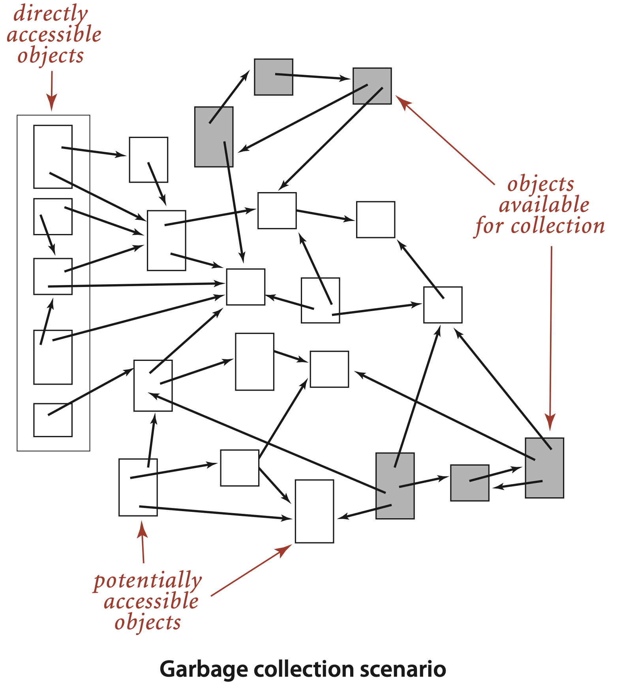
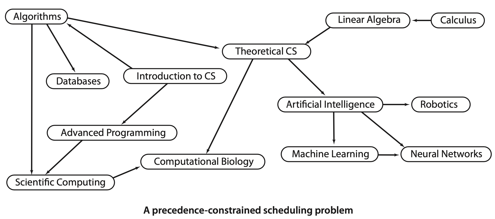
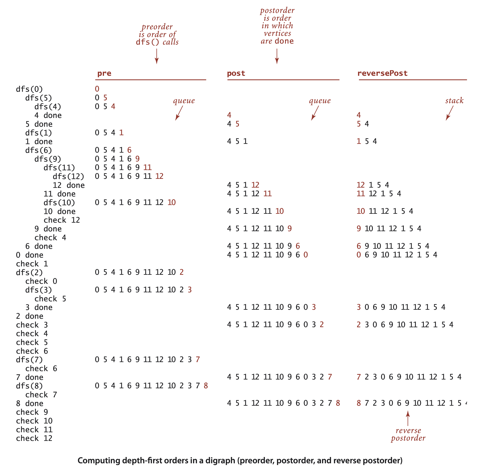

# 4.2 Directed Graph

In directed graphs, edges are one-way: the pair of vertices that defines each edge is an ordered pair that specifies a one-way adjacency. Many applications \(for example, graphs that represent the web, scheduling constraints, or telephone calls\) are naturally expressed in terms of directed graphs.

Definition. A **directed graph** \(or digraph\) is a set of vertices and a collection of directed edges. Each directed edge connects an ordered pair of vertices.

We say that a directed edge points from the first vertex in the pair and points to the second vertex in the pair. The **outdegree** 出度 of a vertex in a digraph is the number of edges going from it; the **indegree** 入度 of a vertex is the number of edges going to it. The first vertex in a directed edge is called its head; the second vertex is called its tail. We use the notation v-&gt;w to refer to an edge that points from v to w in a digraph.

Definition. A **directed path** in a digraph is a sequence of vertices in which there is a \(directed\) edge pointing from each vertex in the sequence to its successor in the sequence. A **directed cycle** is a directed path with at least one edge whose first and last vertices are the same. A simple cycle is a cycle with no repeated edges or vertices \(except the requisite repetition of the first and last vertices\).（本书只讨论 simple cycle）The length of a path or a cycle is its number of edges.

注意这两者的区别：distinction between reachability in digraphs and connectivity in undirected graphs.

```java
public class Digraph {
     private final int V;
     private int E;
     private Bag<Integer>[] adj;
     
     public Digraph(int V) {
          this.V = V;
          this.E = 0;
          adj = (Bag<Integer>[]) new Bag[V];
          for (int v = 0; v < V; v++) {
               adj[v] = new Bag<Integer>();
          }
     }
     
     public int V()  {  return V;  }
     public int E()  {  return E;  }
     
     public void addEdge(int v, int w) {
          adj[v].add(w);
          E++;
     }
     
     public Iterable<Integer> adj(int v)
     {  return adj[v];  }
     
     public Digraph reverse() {
          Digraph R = new Digraph(V);
          for (int v = 0; v < V; v++)
               for (int w : adj(v))
                    R.addEdge(w, v);
          return R;
     }
}
```

## Depth First Search

Single-source reachability. Given a digraph and a source vertex s, support queries of the form Is there a directed path from s to a given target vertex v?

Multiple-source reachability. Given a digraph and a set of source vertices, support queries of the form Is there a directed path from any vertex in the set to a given target vertex v? This problem arises in the solution of a classic string-processing problem that we consider in Section 5.4.

```java
public class DirectedDFS {
    private boolean[] marked;
    public DirectedDFS(Digraph G, int s) {
        marked = new boolean[G.V()];
        dfs(G, s);
    }
    
    public DirectedDFS(Digraph G, Iterable<Integer> sources) {
        marked = new boolean[G.V()];
        for (int s : sources)
           if (!marked[s]) dfs(G, s);
    }
    
    private void dfs(Digraph G, int v) {
        marked[v] = true;
        for (int w : G.adj(v))
           if (!marked[w]) dfs(G, w);
    }
}
```

Mark-and-sweep garbage collection. An important application of multiple-source reachability is found in typical memory-management systems, including many implementations of Java. A mark-and-sweep garbage collection strategy reserves one bit per object for the purpose of garbage collection, then periodically marks the set of potentially accessible objects by running a digraph reachability algorithm like DirectedDFS and sweeps through all objects, collecting the unmarked ones for use for new objects.



Single-source directed paths and Single-source shortest directed paths. On the booksite and in the exercises at the end of this section, we refer to these solutions as DepthFirstDirectedPaths and BreadthFirstDirectedPaths, respectively.

## Cycles and DAGs

Directed cycles are of particular importance in applications that involve processing digraphs.

Precedence-constrained scheduling problem. Given a set of jobs to be completed, with precedence constraints that specify that certain jobs have to be completed before certain other jobs are begun, how can we schedule the jobs such that they are all completed while still respecting the constraints?



For any such problem, a digraph model is immediate, with vertices corresponding to jobs and directed edges corresponding to precedence constraints. For economy, we switch the example to our standard model with vertices labeled as integers, as shown at left. In digraphs, precedence-constrained scheduling amounts to the following fundamental problem:

**Topological sort** 拓扑排序. Given a digraph, put the vertices in order such that all its directed edges point from a vertex earlier in the order to a vertex later in the order \(or report that doing so is not possible\).

In general, if a precedence-constrained scheduling problem has a directed cycle, then there is no feasible solution. To check for such errors, we need to be able to solve the following problem: Directed cycle detection. Does a given digraph have a directed cycle? If so, find the vertices on some such cycle, in order from some vertex back to itself.

A **directed acyclic graph \(DAG\)** is a digraph with no directed cycles. For job scheduling and many other applications it is required that no directed cycle exists.

```java
public class DirectedCycle { // cycle-finding constructor
     private boolean[] marked;
     private int[] edgeTo; // last vertex on known path to this vertex
     private Stack<Integer> cycle; // vertices on a cycle (if one exists)
     private boolean[] onStack; // vertices on recursive call stack
     
     public DirectedCycle(Digraph G) {
          onStack = new boolean[G.V()];
          edgeTo = new int[G.V()];
          marked = new boolean[G.V()];
          for (int v = 0; v < G.V(); v++)
            if (!marked[v]) dfs(G, v);
     }
     
     private void dfs(Digraph G, int v) {
        onStack[v] = true;
        marked[v] = true;
        for (int w : G.adj(v)) {
           if (this.hasCycle()) return;
           else if (!marked[w]) {
              edgeTo[w] = v;
              dfs(G, w);
           } else if (onStack[w]) {
              cycle = new Stack<Integer>();
              for (int x = v; x != w; x = edgeTo[x])
                 cycle.push(x);
              cycle.push(w);
              cycle.push(v);
           }
        }
        onStack[v] = false;
     }
}
```

A digraph has a topological order if and only if it is a DAG. Precedence-constrained scheduling amounts to computing a topological order for the vertices of a DAG. A one-line addition to our standard recursive DFS does the job! It is based on the idea that depth-first search visits each vertex exactly once.

DepthFirstOrder supports pre\(\), post\(\), and reversePost\(\) methods that are useful for advanced graph-processing algorithms. For example, order\(\) in Topological consists of a call on reversePost\(\).

* Preorder: Put the vertex on a queue before the recursive calls.
* Postorder: Put the vertex on a queue after the recursive calls.
* Reverse postorder: Put the vertex on a stack after the recursive calls.




