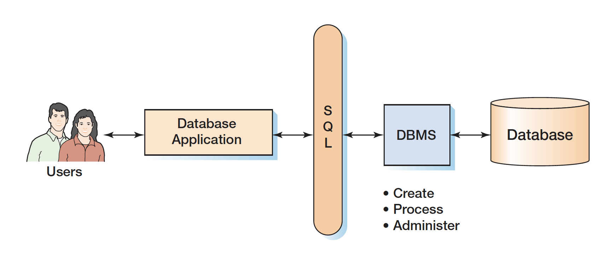
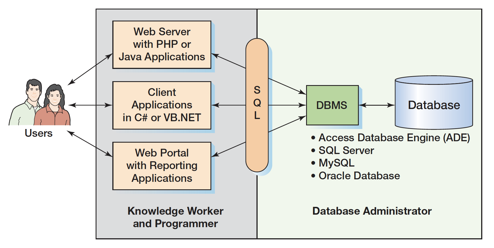

# 1. Introduce

The purpose of a database is to help people keep track of things, and the most commonly used 
type of database is the **relational database**.

A **database** contains multiple **tables**. Table has **rows** and **columns**.

Each row in a
 table is uniquely identified by a **primary key**, and the values of these keys are used to create the
 relationships between the tables.

If the numbers used in primary key columns are automatically generated and assigned in the database itself, then the key is
 also called a **surrogate key**.

### Typical **database applications**

* CRM system is an information system that manages customer contacts from initial solicitation through acceptance, purchase, continuing purchase, support and so forth.
* ERP is an information system that touches every department in a manufacturing company including sales, inventory, production planning, purchasing, and other business functions. \(a leading vendor is SAP\)
* E-commerce: Order entry, billing, shipping, and customer support. Surprisingly, however, the largest databases at an e-commerce site are not order-processing database but the database that track customer browser behavior. It keeps track of each web page or even each web page component, customer clicks, additions and abandoned shopping carts and so forth. \(amazon and drugstore, grows at the rate of tens of millions of rows per day\)
* Reporting and Data Mining Database Applications: These applications use the data generated by order processing and other operational
   systems to produce information to help manage the enterprise. Such applications do not 
  generate new data, but instead summarize existing data to provide insights to management. Digital dashboards and other reporting systems assess past and current performance. Data mining 
  applications predict future performance.
* Business intelligence \(BI\) system: reporting and data mining applications.

### The components of a database system

A database system is typically defined to consist of four components:
 users, the database application, the database management system \(DBMS\), and the database.

**Users**: keep
track of things.

**Database application** serves as an 
intermediary between the user and the DBMS.

**DBMS** is a computer program used to create,
 process, and administer the database. Commercial DBMS products are like Access, SQL Server from Microsoft; Oracle
 Database and MySQL from Oracle; DB2 from IBM.

**Database** is a collection of related tables and other 
structures. A database is **self-describing** because it contains a description of itself. Such
 descriptive data is called **metadata** because it is data about data. Metadata is stored in tables. You can write SQL to query metadata by just apply the SQL statements
 to metadata tables rather than user tables.


MariaDB is a community-developed fork of the MySQL relational database management system intended to remain free under the GNU GPL.


### Database Design

Correct database design is both important and difficult. Consequently, the world is full of poorly designed databases.

There are three types of database design: 

* from existing data \(discussed in [here](untitled.md)\)
* new information system development: the entity-relationship\(ER\) data modeling \(discussed in [here](5.-er-relationship-model.md)\)
* database redesign: migrate, integrate, reverse engineer.

### Working domains

### Brief History of Database Processing

Prior to 1970, all data were stored in separate files.

Early database used hierarchies or trees to represent 
relationships.

The relational model, and, later, SQL made sense.

All micro DBMS 
products were eliminated
by Microsoft Access in
the early 1990s.

In the mid-1980s, object-oriented programming \(OOP\) emerged, object-oriented DBMS appeared but never caught on.

Open source DBMS like MySQL released. 

In the late 1990s, XML was defined. XML database processing was given a further boost with the definition of XML Web service
 standards such as **SOAP**, WSDL, UDDI
, and others.

Following the development of XML, the
 **NoSQL**\(not only SQL\) movement and **Big Data** have emerged in recent years, particularly following a 2009 conference organized around work on open source
 **distributed databases**. The NoSQL movement should really be
called a **NoRelational** movement because the work is really on databases that do not follow the
 relational model.

The Big Data movement
is based on the need for information systems to handle increasing large sets of data and,
 together with NoSQL databases, is the basis for such applications as Facebook 
and Twitter.

