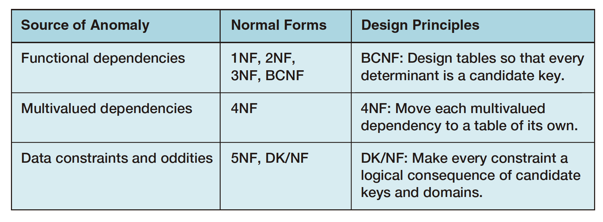

# 3. Relational Model and Normalization

A **relation** is a special case of a table. All relations are tables, but not all tables are relations.

Characteristics of Relations:

* Rows contain data about an entity.
* Columns contain data about attributes of the entities.
* All entries in a column are of the same kind.
* Each column has a unique name.
* Cells of the table hold a single value.
* The order of the columns/rows is unimportant.
* No two rows may be identical.


Some SQL statements do produce
 tables with duplicate rows. Such row duplication occurs only as a result of SQL manipulation. Tables that you design 
to be stored in the database should never contain duplicate rows.


3 sets of terms are used to describe relation structure:

* \(relation, attribute, tuple\)
* \(table, column, row\)
* \(file, field, record\)\(legacy\)

## Functional Dependency

In general, a functional dependency exists when the value of one or more attributes 
**determines** the value of other attribute\(s\).

If each value of A will be paired with one and only one value of B, then we can say that B is **functionally dependent** upon A and written as `A->B` .

For example, we can say that EmployeeName is functionally dependent on Employee\#, written as:`Employee# -> EmployeeName`where employee\# is called the **determinant**.

The only reason for having relations is to store instances of dependencies. If B can be calculated by algorithm from A, there is no need to have a relation to store.

The determinant of a functional dependency can consist of more than one attribute like `(A, B) -> C`. In this case, the determinant is called a **composite determinant**.

No single skill is more important for designing databases than the ability to identify functional 
dependencies. Sample data can be incomplete, so the best strategies are to 
think about the nature of the business activity from which the data arise and to ask the users.

## Keys

In general, a **key** is a combination of one or more columns that is used to identify particular
 rows in a relation. Keys that have two or more columns are called **composite keys**.

A **candidate key** is a determinant that determines all of the other columns in a relation. Candidate keys identify a _unique_ row in a relation.

When designing a database, one of the candidate keys is selected to be the **primary key**. A table has only one primary key. The primary
 key can have one column, or it can be a composite.

A primary key, must have unique data values inserted into every row of the table. This is named the **entity integrity constraint**.

A **surrogate key** is an artificial column that is added to a table to serve as the primary key.

A **foreign key** is a column or composite of columns that is the primary key of a table other
than the one in which it appears.

We have defined three constraints so far:

* Domain integrity constraint: all of the values in a column are of the same kind.
* Entity integrity constraint: a primary key must have unique data values inserted into every row of the table.
* Referential integrity constraint: the value of a foreign key matches a valid value of a primary key.

These 3 constraints are to create **database integrity**.

## Normal Forms

Relations are
 categorized into **normal forms** based on the kinds of problems that they have. To understand normal 
forms, we need first to define **modification anomalies**.

* deletion anomaly: When we delete one 
  row, the structure of this table forces us to lose facts about two different things.
*  insertion anomaly: The structure of 
  this table forces us to enter facts about two entities when we just want to enter facts about one.
* update anomaly: changing existing data creates a data inconsistency to other rows.

Normalization theory can be divided into three major categories:

Most modification anomalies occur because of problems with functional dependencies. BCNF will eliminate all anomalies due to functional dependencies.

Some anomalies arise because of another
 kind of dependency called a **multivalued dependency**. Those anomalies can be eliminated by
 4NF.

The third source of anomalies is esoteric. These problems involve specific, rare, and even
 strange data constraints. Accordingly, we will not discuss them in this text.

### From 1NF to BCNF

For practical purposes, we will define **1NF** as it is used in this book as a table that: \(1\) Meets the set of conditions for a relation, and
 \(2\) Has a defined primary key.

A relation is in **2NF** if and only if it’s in 1NF and all non-key attributes are determined by the entire primary key. This means that if the primary key is a composite primary key, then no
 non-key attribute can be determined by only part 
of the key.

A relation is in **3NF** if and only if it’s in 2NF and there are no non-key attributes determined by another non-key attribute \(transitive dependency, if `A->B` and `B->C`, THEN
 `A->C`\).

A relation is in **BCNF** if and only if it is in 3NF and every determinant 
is a candidate key. The only way a relation in 3NF
 requiring further normalization to get it into BCNF is if it has
 _overlapping composite candidate keys_.

Instead of progressively testing a relation for 1NF, 2NF, 3NF, and BCNF, which referred as “Step-by-
Step” method, you can eliminate such problems by simply designing \(or redesigning\) your tables
 so that every determinant is a candidate key, referred as “Straight-to-BCNF” or “**general normalization**” method \(we prefer!\).

### 4NF

A **multivalued dependency** 
occurs when a determinant is matched with a particular set of values: If each value of A will be paired with more than one values of B then we can say that B is multivalue dependent upon A and it is written as A-&gt;-&gt;B.

When you put multivalued dependencies into a table of their own, they disappear. The result is just a table with _two columns_; the primary key also the only candidate key is the composite of those two columns. When multivalued dependencies have been isolated in this way, the table is said to be in **4NF**.

