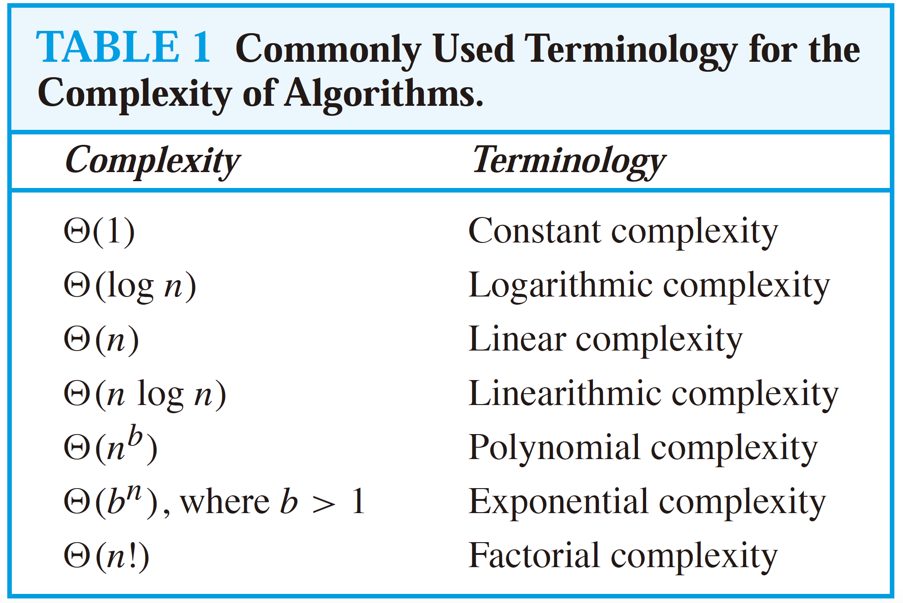

# Fundamentals

## Logic and Proofs

### Proposition

Our discussion begins with an introduction to the basic building blocks of logic—**propositions**. A proposition 命题 is a declarative sentence \(that is, a sentence that declares a fact\) that is either true or false, but not both.

The **truth value** of a proposition is true, denoted by T, if it is a true proposition, and the truth value of a proposition is false, denoted by F, if it is a false proposition.

We use letters to denote **propositional variables** such as _p, q, r, s_, . . . . New propositions, called **compound propositions**, are formed from existing propositions using logical operators:

* The _negation_ of p, denoted by¬p.
* The _conjunction_ of p and q, denoted by p ∧ q.
* The _disjunction_ of p and q, denoted by p ∨ q. \(_inclusive or_\)
* The _exclusive or_ of p and q, denoted by p ⊕ q, is the proposition that is true when exactly one of p and q is true and is false otherwise.

The **conditional statement** 条件语句 p → q is the proposition “if p, then q.” p is called the _hypothesis_ and q is called the _conclusion_. It is false when p is true and q is false, and true otherwise.

When p is false, q may be either true or false, because the statement says nothing about the truth value of q. There are ways to express this statement:

* p is sufficient for q, q is necessary for p
* “p only if q”, p cannot be true when q is not true
* “q unless ¬p“

We can form some new conditional statements starting with a conditional statement p → q.

* q → p is called the _converse_ 逆命题 of p → q
* ¬q →¬p is called the _contrapositive_ 逆否命题 of p → q
* ¬p →¬q is called the _inverse_ 反命题 of p → q

When two compound propositions always have the same truth value we call them **equivalent**, so that a conditional statement and its contrapositive are equivalent. The converse and the inverse of a conditional statement are also equivalent.

The **biconditional statement** p ↔ q is the proposition “p if and only if q.”  It's true when p and q have the same truth values, and is false otherwise.

A compound proposition that is always true is called a _tautology 永真式_. A compound proposition that is always false is called a _contradiction 矛盾式_.

Compound propositions that have the same truth values in all possible cases are called **logically equivalent**.

De Morgan laws:

* ¬\(p ∨ q\) and ¬p ∧¬q are logically equivalent.
* ¬\(p ∧ q\) and ¬p ∨¬q are logically equivalent.

### Predicates and Quantifiers

In this section we will introduce a more powerful type of logic called **predicate logic**.

We can denote the statement “x is greater than 3” by **P\(x\)**, where P denotes the **predicate** “is greater than 3” and x is the **variable**. Once a value has been assigned to the variable x, the statement P\(x\) becomes a proposition and has a truth value. In this case, P\(3\) is false and P\(4\) is true.

Predicates are also used to establish the correctness of computer programs, that is, to show that computer programs always produce the desired output when given valid input. \(Note that unless the correctness of a computer program is established, no amount of testing can show that it produces the desired output for all input values, unless every input value is tested.\) The statements that describe valid input are known as **preconditions** and the conditions that the output should satisfy when the program has run are known as **postconditions**.

**Quantification** expresses the extent to which a predicate is true over a range of elements. 

The **universal quantification** of P\(x\) for a particular **domain** is the proposition that asserts that P\(x\) is true for all values of x in this domain, denoted by **∀xP\(x\)**. Note that a single _counterexample_ is all we need to establish that ∀xP\(x\) is false.

The **existential quantification** of P\(x\) is the proposition “there exists an element x in the domain such that P\(x\).”, denoted by **∃xP\(x\)**.

The rules for negations for quantifiers are called De Morgan’s laws for quantifiers.

* ¬∀xP\(x\) is logically equivalent with ∃x ¬P\(x\)
* ¬∃xQ\(x\) is logically equivalent with ∀x ¬Q\(x\)

### Proofs

Formally, a **theorem** 定理 is a statement that can be shown to be true. We demonstrate that a theorem is true with a **proof**. **Axioms** 公理 are statements we assume to be true. A **conjecture** 猜想 is a statement that is being proposed to be a true statement.

## Basic Structures

### Sets

A set is an unordered collection of objects, called elements or members of the set. A set is said to contain its elements. We write **a ∈ A** to denote that a is an element of the set A.

These sets, each denoted using a boldface letter, play an important role in discrete mathematics:

* **N** = {0, 1, 2, 3, . . .}, the set of natural numbers（自然数/非负整数）
* **Z** = {. . . ,−2,−1, 0, 1, 2, . . .}, the set of integers
* **Z+** = {1, 2, 3, . . .}, the set of positive integers
* **Q** = {p/q \| p ∈ Z, q ∈ Z, and q != 0}, the set of rational numbers 有理数
* **R**, the set of real numbers（实数，有理数和无理数的总称）
* **R+**, the set of positive real numbers
* **C**, the set of complex numbers（复数）

\[a, b\] is called the closed interval from a to b and \(a, b\) is called the open interval from a to b.

The set A is a **subset** of B if and only if every element of A is also an element of B.We use the notation **A ⊆ B** to indicate that A is a subset of the set B.

If there are exactly n distinct elements in S where n is a nonnegative integer, we say that S is a **finite set** and that n is the _cardinality_ of S, denoted by \|S\|.

Given a set S, the **power set** of S is the set of all subsets of the set S. The power set of S is denoted by P\(S\). If a set has n elements, then its power set has $$2^n$$ elements.

Let A and B be sets. The **Cartesian product** 笛卡尔积 of A and B, denoted by A × B, is the set of all **ordered pairs** \(a, b\), where a ∈ A and b ∈ B. Hence, A × B = {\(a, b\) \| a ∈ A ∧ b ∈ B}.

We define the **truth set** of P to be the set of elements x in D for which P\(x\) is true. The truth set of P\(x\) is denoted by {x ∈ D \| P\(x\)}.

The **union** of the sets A and B, A ∪ B = {x \| x ∈ A ∨ x ∈ B}.

The cardinality of a union of two finite sets is \|A ∪ B\| = \|A\| + \|B\| − \|A ∩ B\|.

The **intersection** of the sets A and B, A ∩ B = {x \| x ∈ A ∧ x ∈ B}.

The **difference** 差集 of A and B, denoted by A − B, is the set containing those elements that are in A but not in B, also called the **complement** 补集 of B with respect to A.

There are various ways to represent sets using a computer. Assume that the universal set U is finite. First, specify an arbitrary ordering of the elements of U, for instance $$a_1, a_2, ..., a_n$$ . Represent a subset A of U with the bit string of length n, where the ith bit in this string is 1 if $$a_i$$ belongs to A and is 0 $$a_i$$ ai does not belong to A.

### Functions

Let A and B be nonempty sets. A _function f_ from A to B is an assignment of exactly one element of B to each element of A, denoted by **f \(a\) = b**_._

If **f** is a function from A to B, we say that A is the **domain** of f and B is the **codomain** of f. We say that f **maps** A to B.

A function f is said to be one-to-one, if and only if f \(a\) = f \(b\) implies that a = b for all a and b in the domain of f. A function is said to be injective if it is one-to-one.

### Sequences and Summations

A **sequence** 序列 is a function from a subset of the set of integers to a set S. We use the notation $$a_n$$ to denote the image of the integer n. We call $$a_n$$ a term of the sequence.

A **recurrence relation** 递推关系 for the sequence {$$a_n$$} is an equation that expresses $$a_n$$ in terms of one or more of the previous terms of the sequence.

Using mathematical induction 数学归纳法, it can be shown that a recurrence relation together with its **initial conditions** determines a unique solution.

The Fibonacci sequence, $$f_0$$ , $$f_1$$ , $$f_2$$ , . . . , is defined by the initial conditions $$a = b = 0$$, $$f_1$$ = 1, and the recurrence relation $$f_n = f_{n-1} + f_{n-2}$$ for n = 2, 3, 4, . . . .

We say that we have solved the recurrence relation together with the initial conditions when we find an explicit formula, called a **closed formula**, for the terms of the sequence.

We use the **summation** notation: $$\sum^{n}_{j=m} a_j$$ to represent $$a_{m}$$ + $$a_{m+1}$$ + · · · + $$a_{n}$$ .


### Matrix

A **matrix** is a rectangular array of numbers. A matrix with m rows and n columns is called an m × n matrix. A matrix with the same number of rows as columns is called **square**. Two matrices are equal if they have the same number of rows and the same number of columns and the corresponding entries in every position are equal.

$$A = \begin{bmatrix} a_{11}&a_{12}&\cdots&a_{1n}\\ a_{21}&a_{22}&\cdots&a_{2n}\\ \vdots&\vdots&\ddots&\vdots\\ a_{m1}&a_{m2}&\cdots&a_{mn}\\ \end{bmatrix}$$ 

## Algorithms

An **algorithm** is a finite sequence of precise instructions for performing a computation or for solving a problem.

Searching: linear search, binary search.

Sorting: bubble sorting, insertion sorting, etc.

Many algorithms we will study in this book are designed to solve **optimization problems** 最优化问题.

Algorithms that make what seems to be the “best” choice at each step are called **greedy algorithms** 贪婪算法.

### The Growth of Functions

One of the advantages of using **big-O notation**, which we introduce in this section, is that we can estimate the growth of a function without worrying about constant multipliers or smaller order terms. This means that, using big-O notation, we do not have to worry about the hardware and software used to implement an algorithm. Furthermore, using big-O notation, we can assume that the different operations used in an algorithm take the same time, which simplifies the analysis considerably.

Let _f_ and _g_ be functions from the set of integers or the set of real numbers to the set of real numbers. We say that _f\(x\)_ is _O\(g\(x\)\)_ if there are constants C and k such that \|f\(x\)\| ≤ C\|g\(x\)\| whenever x &gt; k. \[This is read as “f \(x\) is big-oh of g\(x\).”\]

When big-O notation is used, the function g in the relationship f \(x\) is O\(g\(x\)\) is chosen to be as small as possible.

Polynomials 多项式 can often be used to estimate the **growth of functions**. The leading term of a polynomial dominates its growth.

Let $$f(x)=a_nx^n+a_{n-1}x^{n-1}+...+a_1x+a_0$$, where $$a_0$$ , $$a_1$$ , . . . , $$a_{n-1}$$ , $$a_n$$ are real numbers. Then $$f(x)$$ is $$O(x^n)$$ .

1 + 2+· · ·+n ≤ n + n+· · ·+n = $$n^2 $$.

The factorial function 阶乘 f\(n\) = n! is defined by n! = 1 · 2 · 3 · · · · · n whenever n is a positive integer, and 0! = 1.

Note that the function n! grows rapidly. For instance, 20! = 2,432,902,008,176,640,000.

n! = 1 · 2 · 3 · · · · · n ≤ n · n · n · · · · · n = $$n^n$$ .

Taking logarithms of both sides: $$log\ n! \leq log\ n^n = n\ log\ n$$ .

Big-O notation is used to estimate the number of operations needed to solve a problem using a specified procedure or algorithm. The functions used in these estimates often include the following: 1, log n, n, n log n, $$n^2$$ , $$2^n$$ , n!

### Complexity of Algorithms

Analysis of the time required to solve a problem of a particular size involves the **time complexity** of the algorithms. Because data structures are not dealt with in detail in this book, **space complexity** will not be considered.

**Worst-case** analysis tells us how many operations an algorithm requires to guarantee that it will produce a solution. The average number of operations used to solve the problem over all possible inputs of a given size is found in **average-case** analysis.

Greedy algorithms provide an example of an **algorithmic paradigm**, that is, a general approach based on a particular concept that can be used to construct algorithms for solving a variety of problems.

Brute force is an important, and basic, algorithmic paradigm. In a **brute-force** algorithm 蛮力算法, a problem is solved in the most straightforward manner based on the statement of the problem and the definitions of terms.



A problem that is solvable using an algorithm with polynomial worst-case complexity is called **tractable**. The situation is much worse for problems that cannot be solved using an algorithm with worst-case polynomial time complexity. Such problems are called **intractable**.

Some problems even exist for which it can be shown that no algorithm exists for solving them. Such problems are called **unsolvable**. The first proof that there are unsolvable problems was provided by the great English mathematician and computer scientist Alan Turing when he showed that the **halting problem** is unsolvable.

## Induction and Recursion

In general, mathematical induction can be used to prove statements that assert that P\(n\) is true for _all positive integers_ n, where P\(n\) is a propositional function.

A proof by mathematical induction has two parts, a basis step, where we show that P\(1\) is true, and an inductive step, where we show that for all positive integers k, if P\(k\) is true, then P\(k + 1\) is true.

> In fact, mathematical induction, strong induction, and well-ordering are all equivalent principles.

Sometimes it is difficult to define an object explicitly. However, it may be easy to define this object in terms of itself. This process is called **recursion** 递归.

When we define a set recursively, we specify some initial elements in a **basis step** and provide a rule for constructing new elements from those we already have in the **recursive step**.

An algorithm is called **recursive** if it solves a problem by reducing it to an instance of the same problem with smaller input.


```java
int fibonacci(int n) {
    if (n == 0) return 0;
    if (n == 1) return 1;
    return fibonacci(n - 1) + fibonacci(n -2);
}
```


Instead of successively reducing the computation to the evaluation of the function at smaller integers, we can start with the value of the function at one or more integers, the base cases, and successively apply the recursive definition to find the values of the function at successive larger integers. Such a procedure is called **iterative**.

```java
int fibonacci(int n) {
    if (n == 0) return 0;
    int x = 0, y = 0;
    for (int i = 1; i < n; i++) {
        int z = x + y;
        x = y;
        y = z;
    }
    return y;
}
```

We have shown that a recursive algorithm may require far more computation than an iterative one when a recursively defined function is evaluated. It is sometimes preferable to use a recursive procedure even if it is less efficient than the iterative procedure. In particular, this is true when the recursive approach is easily implemented and the iterative approach is not.

