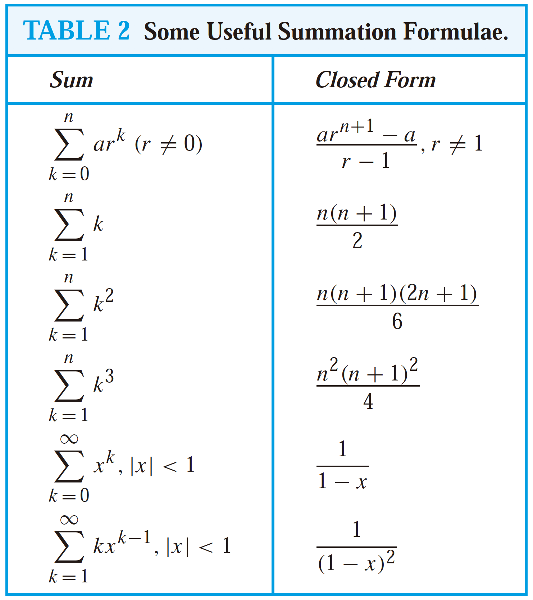

# 2. Basic Structure

## Sets

A set is an unordered collection of objects, called elements or members of the set. A set is said to contain its elements. We write **a ∈ A** to denote that a is an element of the set A.

These sets, each denoted using a boldface letter, play an important role in discrete mathematics:

* **N** = {0, 1, 2, 3, . . .}, the set of natural numbers（自然数/非负整数）
* **Z** = {. . . ,−2,−1, 0, 1, 2, . . .}, the set of integers
* **Z+** = {1, 2, 3, . . .}, the set of positive integers
* **Q** = {p/q \| p ∈ Z, q ∈ Z, and q = 0}, the set of rational numbers 有理数
* **R**, the set of real numbers（实数，有理数和无理数的总称）
* **R+**, the set of positive real numbers
* **C**, the set of complex numbers（复数）

\[a, b\] is called the closed interval from a to b and \(a, b\) is called the open interval from a to b.

The set A is a **subset** of B if and only if every element of A is also an element of B.We use the notation **A ⊆ B** to indicate that A is a subset of the set B.

If there are exactly n distinct elements in S where n is a nonnegative integer, we say that S is a **finite set** and that n is the _cardinality_ of S, denoted by \|S\|.

Given a set S, the **power set** of S is the set of all subsets of the set S. The power set of S is denoted by P\(S\). If a set has n elements, then its power set has $$2^n$$ elements.

Let A and B be sets. The **Cartesian product** of A and B, denoted by A × B, is the set of all **ordered pairs** \(a, b\), where a ∈ A and b ∈ B. Hence, A × B = {\(a, b\) \| a ∈ A ∧ b ∈ B}.

We define the **truth set** of P to be the set of elements x in D for which P\(x\) is true. The truth set of P\(x\) is denoted by {x ∈ D \| P\(x\)}.

The **union** of the sets A and B, A ∪ B = {x \| x ∈ A ∨ x ∈ B}.

The cardinality of a union of two finite sets is \|A ∪ B\| = \|A\| + \|B\| − \|A ∩ B\|.

The **intersection** of the sets A and B, A ∩ B = {x \| x ∈ A ∧ x ∈ B}.

The **difference** 差集 of A and B, denoted by A − B, is the set containing those elements that are in A but not in B, also called the **complement** 补集 of B with respect to A.

Computer Representation of Sets: Assume that the universal set U is finite. Represent a subset A of U with the bit string of length n, where the ith bit in this string is 1 if ai belongs to A and is 0 if ai does not belong to A.

## Functions

Let A and B be nonempty sets. A _function f_ from A to B is an assignment of exactly one element of B to each element of A, denoted by **f \(a\) = b**_._

If **f** is a function from A to B, we say that A is the **domain** of f and B is the **codomain** of f. We say that f **maps** A to B.

A function f is said to be one-to-one, if and only if f \(a\) = f \(b\) implies that a = b for all a and b in the domain of f. A function is said to be injective if it is one-to-one.

## Sequences and Summations

A **sequence** 序列 is a function from a subset of the set of integers to a set S. We use the notation $$a_n$$ to denote the image of the integer n. We call $$a_n$$ a term of the sequence.

A **recurrence relation** 递推关系 for the sequence {$$a_n$$} is an equation that expresses an in terms of one or more of the previous terms of the sequence.

Using mathematical induction 数学归纳法, it can be shown that a recurrence relation together with its **initial conditions** determines a unique solution.

The Fibonacci sequence, $$f_0$$ , $$f_1$$ , $$f_2$$ , . . . , is defined by the initial conditions $$a = b$$ = 0, $$f_1$$ = 1, and the recurrence relation $$f_n = f_{n-1} + f_{n-2}$$ for n = 2, 3, 4, . . . .

We say that we have solved the recurrence relation together with the initial conditions when we find an explicit formula, called a **closed formula**, for the terms of the sequence.

We use the **summation** notation: $$\sum^{n}_{j=m} a_j$$ to represent $$a_{m}$$ + $$a_{m+1}$$ + · · · + $$a_{n}$$ .

## Matrix

A **matrix** is a rectangular array of numbers. A matrix with m rows and n columns is called an m × n matrix. A matrix with the same number of rows as columns is called **square**. Two matrices are equal if they have the same number of rows and the same number of columns and the corresponding entries in every position are equal.

$$A = \begin{bmatrix} a_{11}&a_{12}&\cdots&a_{1n}\\ a_{21}&a_{22}&\cdots&a_{2n}\\ \vdots&\vdots&\ddots&\vdots\\ a_{m1}&a_{m2}&\cdots&a_{mn}\\ \end{bmatrix}$$ 

