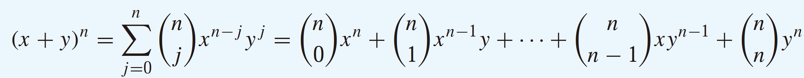
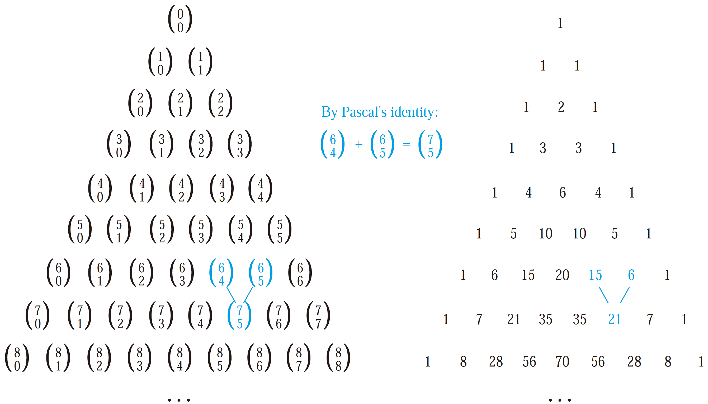

# Counting

## Basics

We first present two basic counting principles, the **product rule** 乘法法则 and the **sum rule** 加法法则.

The produce rule: Suppose that a _procedure_ can be broken down into a sequence of two tasks. If there are $$n_1$$ ways to do the first task and $$n_2$$ ways to do the second task, then there are $$n_1n_2$$ ways to do the procedure.

The sum rule: If a task can be done either in one of $$n_1$$ ways or in one of $$n_2$$ ways, where none of the set of $$n_1$$ ways is the same as any of the set of $$n_2$$ ways, then there are $$n_1 + n_2$$ ways to do the task.

The subtraction rule is also known as the principle of **inclusion–exclusion** 容斥原理, especially when it is used to count the number of elements in the union of two sets.

The subtraction rule: If a task can be done in either $$n_1$$ ways or $$n_2$$ ways, then the number of ways to do the task is $$n_1 + n_2$$ minus the number of ways to do the task that are common to the two different ways.

The division rule: There are n/d ways to do a task if it can be done using a procedure that can be carried out in n ways, and for every way w, exactly d of the n ways correspond to way w.

## Pigeonhole


THEOREM 1 The pigeonhole principle: If k is a positive integer and k + 1 or more objects are placed into k boxes, then there is at least one box containing two or more of the objects.



THEOREM 2 The generalized pigeonhole principle: If N objects are placed into k boxes, then there is at least one box containing at least N/k objects.


## Permutations and Combinations

The number of **r-permutations** of a set with n elements is denoted by **P\(n, r\)**.


THEOREM 1: If n is a positive integer and r is an integer with 1 ≤ r ≤ n, then there are P\(n, r\) = n\(n − 1\)\(n − 2\) · · · \(n − r + 1\) r-permutations of a set with n distinct elements.


The number of r-combinations of a set with n distinct elements is denoted by C\(n, r\). Note that C\(n, r\) is also denoted by  $$(_r^n)$$  and is called a **binomial coefficient** 二项式系数.


THEOREM 2: The number of r-combinations of a set with n elements, where n is a nonnegative integer and r is an integer with 0 ≤ r ≤ n, equals $$C(n, r) = \frac{n!}{r! (n-r)!} = \frac{n(n-1)...(n-r+1)}{r!}$$ .



COROLLARY 2: Let n and r be nonnegative integers with r ≤ n. Then C\(n, r\) = C\(n, n − r\).


## Binomial Coefficients

The expansion of $$(x+y)^3$$ can be found using combinatorial reasoning instead of multiplying the three terms out.


The Binomial Theorem:



Corollary 1: Let n be a nonnegative integer. Then $$\sum_{k=0}^n(^n_k) = 2^n$$ .


The binomial coefficients satisfy many different identities 恒等式.

Pascal's identity 帕斯卡恒等式: Let n and k be positive integers with n ≥ k. Then:

 $$(^{n+1}_k) =  (^{n}_{k-1}) + (^{n}_k)$$ or $$(^{n}_k) =  (^{n-1}_{k-1}) + (^{n-1}_k)$$ 

Pascal’s identity is the basis for a geometric arrangement of the binomial coefficients in a triangle, known as **Pascal’s triangle**:

The nth row in the triangle consists of the binomial coefficients  $$(^n_k)$$ , k = 0, 1, . . . , n.

## Repetition


THEOREM 1: The number of r-permutations of a set of n objects with repetition allowed is $$n^r$$ .



THEOREM 2: There are C\(n + r − 1, r\) = C\(n + r − 1, n − 1\) r-combinations from a set with n elements when repetition of elements is allowed.


## Generating Permutations

Many different algorithms have been developed to generate the n! permutations of a set. We will describe one of these that is based on the **lexicographic** \(or dictionary\) **ordering**.

In this ordering, the permutation $$a_1a_2...a_n$$ precedes the permutation of $$b_1b_2...b_n$$ , if for some k, with 1 ≤ k ≤ n, $$a_1 = b_1$$, $$a_2 = b_2$$ , . . . , $$a_{k-1} = b_{k-1}$$ , and $$a_k < b_k$$ . In other words, a permutation of the set of the n smallest positive integers precedes \(in lexicographic order\) a second permutation if the number in this permutation in the first position where the two permutations disagree is smaller than the number in that position in the second permutation.

An [algorithm](https://leetcode.com/problems/next-permutation/) for generating the permutations of {1, 2, . . . , n} can be based on a procedure that constructs the next permutation in lexicographic order following a given permutation $$a_1a_2...a_n$$.

## Generating Combinations

How can we generate all the combinations of the elements of a finite set? Recall that the bit string corresponding to a subset has a 1 in position k if $$a_k$$ is in the subset, and has a 0 in this position if $$a_k$$ is not in the subset. If all the bit strings of length n can be listed, then by the correspondence between subsets and bit strings, a list of all the subsets is obtained.

