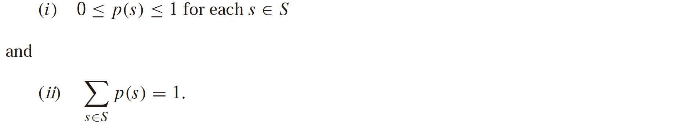
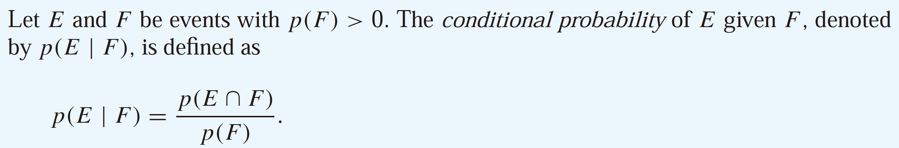
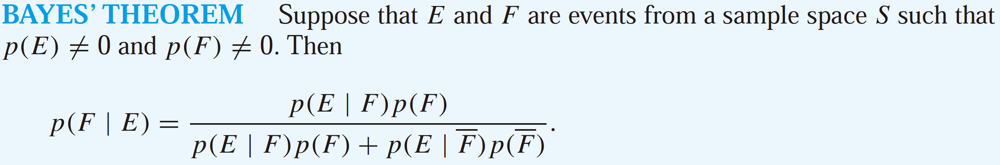
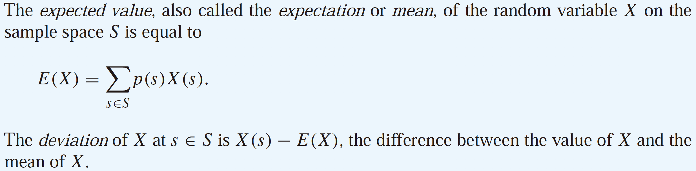
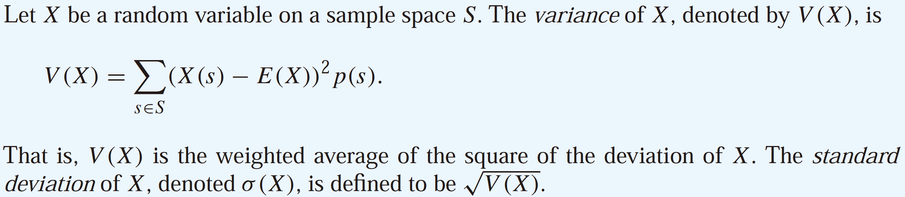

# Probability

Although probability theory was originally invented to study gambling, it now plays an essential role in a wide variety of disciplines.

An **experiment** is a procedure that yields one of a given set of possible outcomes. The **sample space** of the experiment is the set of possible outcomes. An **event** is a subset of the sample space.

Laplace’s definition: If S is a finite nonempty sample space of equally likely outcomes, and E is an event, that is, a subset of S, then the **probability** of E is $$p(E) = \frac{|E|}{|S|}$$ .

Let S be the sample space of an experiment with a finite or countable number of outcomes. We assign a probability _p\(s\)_ to each outcome s. We require that two conditions be met: 

This is a generalization of Laplace’s definition in which each of n outcomes is assigned a probability of 1/n. The function p from the set of all outcomes of the sample space S is called a probability distribution.

In general, to find the **conditional probability** of E given F, we use F as the sample space:

The events E and F are **independent** if and only if p\(E ∩ F\) = p\(E\)p\(F\).

Suppose that an experiment can have only two possible outcomes. Each performance of an experiment with two possible outcomes is called a **Bernoulli trial**. In general, a possible outcome of a Bernoulli trial is called a success or a failure.

The probability of exactly k successes in n independent Bernoulli trials, with probability of success p and probability of failure q = 1 − p, is $$C(n, k)p^kq^{n-k}$$ , denoted by _b\(k; n, p\)_. Considered as a function of k, we call this function the **binomial distribution**.

We can find the conditional probability that an event F occurs, given that an event E has occurred, when we know p\(E \| F\), p\(E \| F\), and p\(F\). The result we can obtain is called **Bayes’ theorem** 贝叶斯定理.

A **random variable** is a function from the sample space of an experiment to the set of real numbers.

The **distribution** of a random variable X on a sample space S is the set of pairs \(r, p\(X = r\)\) for all r ∈ X\(S\), where p\(X = r\) is the probability that X takes the value r.

The expected value of a random variable tells us its average value. The **variance** of a random variable helps us characterize how widely a random variable is distributed. In particular, it provides a measure of how widely X is distributed about its expected value.

