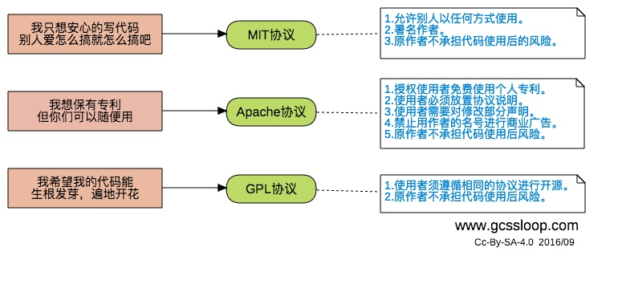

# Basics

## IDE

Xcode auto indent: Control + I.

VSCode auto indent: Shift + Option + F.

## Version Number

Given a version number MAJOR.MINOR.PATCH, increment the:

1. MAJOR version when you make incompatible API changes,
2. MINOR version when you add functionality in a backwards-compatible manner, and
3. PATCH version when you make backwards-compatible bug fixes.

Additional labels for pre-release and build metadata are available as extensions to the MAJOR.MINOR.PATCH format.

Ref: [https://semver.org/](https://semver.org/)

## Open Source License

Ref: [https://choosealicense.com/](https://choosealicense.com/)

## Trends

The [TIOBE](https://www.tiobe.com/tiobe-index/) Programming Community index is an indicator of the popularity of programming languages.

