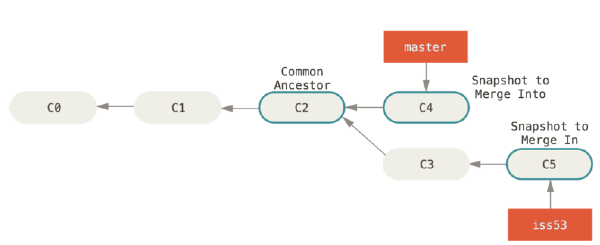
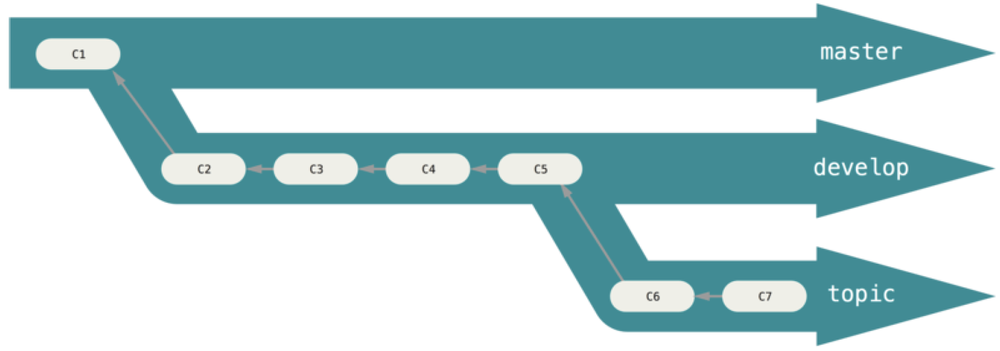
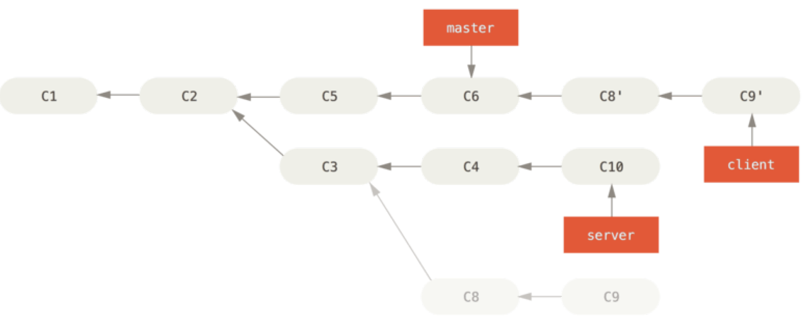
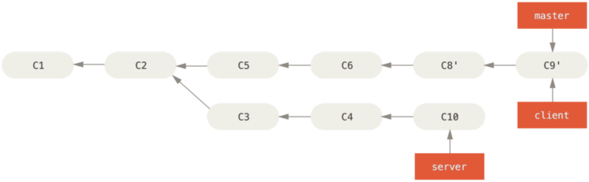

# Git

Version control is a system that records changes to a file or set of files over time so that you can recall specific versions later.

* Local Version Control Systems
* Centralized Version Control Systems: a single server that contains all the versioned files
* Distributed Version Control Systems: Every clone is really a **full** backup of all the data \(the repository, including its full history\).

Git was birth in 2005, developed by Linux development community. Git is amazingly fast, very efficient with large projects. Git has an incredible branching system for non-linear development.

Git thinks about its data more like a stream of **snapshots**. if files have not changed, Git doesn’t store the file again, just a link to the previous identical file it has already stored. In Git, nearly every operation is local.

Everything in Git is check-summed \(SHA-1 hash\). It's very hard to make unredoable changes.

## Git Basic

In Git, all files has 3 states: committed, modified, staged.

Git has 3 levels of **config**: 

* `git config --system` applied to every user on the system
* `git config --global` values specific personally to you
* `.git/config` specific to that single repository

The `git add` can be used to 1. tracking new files. 2. to stage files. 3. to do other things like marking merge-conflicted files as resolved.

The `git rm` stages the file’s removal and also remove it from your working tree.

The `git rm --cached FILE`  keeps the file in your working tree but remove it from your staging area

You can amend your last commit by `git commit --amend`.

Use `git reset HEAD file` to unstage a staged file.

Use `git checkout file` to unmodify a modified file.

By `git clone`, you set up your local **master** branch to track the remote **master** branch.

To see more information about a particular remote, use `git remote show origin`.

Git supports two types of tags: lightweight and annotated.

A lightweight tag `git tag v1.4`,  is very much like a branch that doesn’t change — it’s just a pointer to a specific commit.

An annotated tag `git tag -a v1.4 -m "my version 1.4"` is checksummed; contain the tagger name, email, and date; have a tagging message; and can be signed and verified with GNU Privacy Guard \(GPG\).

You will have to explicitly push tags to a shared server after you have created them by `git push origin tagname`.

## Git Branching

Some people refer to Git’s branching model as its “killer feature”. Git encourages workflows that branch and merge often, even multiple times in a day. Because a branch in Git is actually a simple file that contains the 40 character SHA-1 checksum of the commit it points to, branches are cheap to create and destroy.

```c
$ git checkout -b iss53
// Switched to a new branch "iss53"
```

**HEAD** is a pointer to the local branch you’re currently on.

In this case, Git does a simple three-way merge, using the two snapshots pointed to by the branch tips and the common ancestor of the two. Git creates a new snapshot that results from this three-way merge and automatically creates a new commit that points to it.



You typically have two kinds of workflows:

1. Long-Running Branches \(progressive-stability branching\): having only code that is entirely stable in their **master** branch \(possibly only code that has been or will be released\). And another parallel branch named **develop**.
2. Topic Branches: a short-lived branch that you create and use for a single particular feature or related work.



### **Remote Branches**

Remote references are references \(pointers\) in your remote repositories, including branches, tags, and so on. Remote-tracking branches are references to the state of remote branches. They’re local references that you can’t move; Git moves them for you whenever you do any network communication, to make sure they accurately represent the state of the remote repository. Remote-tracking branches take the form like _origin/master_.

It’s important to note that when you do a _fetch_ that brings down new remote-tracking branches, you don’t automatically have local, editable copies of them. In other words, in this case, you don’t have a new _serverfix_ branch — you only have an _origin/serverfix_ pointer that you can’t modify.

The remote branch that the local branch tracks is called an “upstream branch”.

If you see "ahead by three and behind by one", meaning that there is one commit on the server we haven’t merged in yet and three commits locally that we haven’t pushed.

### Rebasing

In Git, there are two main ways to integrate changes from one branch into another: the **merge** and the **rebase**.

With the rebase command, you can take all the changes that were committed on one branch and replay them on another one.



At this point, you can go back to the master branch and do a fast-forward merge.



Rebasing makes for a cleaner history. If you examine the log of a rebased branch, it looks like a linear history: it appears that all the work happened in series, even when it originally happened in parallel.

Often, you’ll do this to make sure your commits apply cleanly on a remote branch — perhaps in a project to which you’re trying to contribute but that you don’t maintain. In this case, you’d do your work in a branch and then rebase your work onto _origin/master_ when you were ready to submit your patches to the main project. That way, the maintainer doesn’t have to do any integration work — just a fast-forward or a clean apply.

The Perils of Rebasing can be summed up in a single line: **Do not rebase commits that exist outside your repository**. In general the right way is to rebase local changes you’ve made but haven’t shared yet before you push them in order to clean up your story, but never rebase anything you’ve pushed somewhere.

## Git on the server

A remote repository is generally a **bare** repository — a Git repository that has no working directory. Because the repository is only used as a collaboration point, there is no reason to have a snapshot checked out on disk; it’s just the Git data. By convention, bare repository directory names end with the suffix .git.

You can use several type of protocols to make communication with server: local, HTTP, SSH, and Git protocol.

By HTTP, you can use things like username/password authentication. This is probably become the most popular way to use Git now. It can both serve anonymously like the git:// protocol, and also be pushed over with authentication and encryption like the SSH protocol.

SSH doesn’t support anonymous access to your Git repository. All your teammates can log into the server and get a shell as the _git_ user. If you want to restrict that, you will have to change the shell to something else in the _passwd_ file.

Git protocol listens on a dedicated port \(9418\), and with absolutely no authentication, it's suitable for serving a lot of traffic for a public project or serving a very large project that doesn’t require user authentication for read access.

## GitHub

To contributing to a project, you typically do the following steps:

1. **Fork** the project
2. Create a topic branch from master.
3. Make some commits to improve the project.
4. Push this branch to your GitHub project.
5. Open a **Pull Request** on GitHub.
6. Discuss, and optionally continue committing.
7. The project owner merges or closes the Pull Request.

A _Readme_ file serves typically illustrate the following things: 

* What the project is for.
* How to configure and install it.
* An example of how to use it or get it running.
* The license that the project is offered under.
* How to contribute to it.

