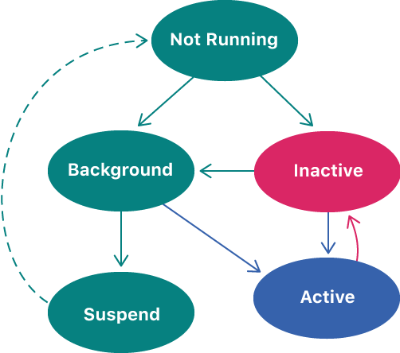

# iOS Application

UIKit: [https://developer.apple.com/documentation/uikit](https://developer.apple.com/documentation/uikit)

Core App: [https://developer.apple.com/documentation/uikit/core\_app](https://developer.apple.com/documentation/uikit/core_app)

## App Launch

Ref: [About the app launch sequence](https://developer.apple.com/documentation/uikit/core_app/managing_your_app_s_life_cycle/responding_to_the_launch_of_your_app/about_the_app_launch_sequence)

1. The app is launched, either explicitly by the user or implicitly by the system.
2. The Xcode-provided `main` function calls UIKit's `UIApplicationMain(_:_:_:_:)`function.
3. The `UIApplicationMain(_:_:_:_:)` function creates the `UIApplication` object and your app delegate. 
4. UIKit loads your app's default interface from the main storyboard or nib file.
5. UIKit calls your app delegate's `application(_:willFinishLaunchingWithOptions:)` method.
6. UIKit performs state restoration, which calls additional methods of your app delegate and view controllers.
7. UIKit calls your app delegate's `application(_:didFinishLaunchingWithOptions:)` method.

Every iOS app has exactly **one** instance of UIApplication \(or, very rarely, a subclass of UIApplication\). A major role of your app’s application object is to handle the initial routing of incoming user **events**\(e.g. touches\).

The application object maintains a list of open windows \(**UIWindow** objects\) and through those can retrieve any of the app’s **UIView** objects.

## Life Cycle

## Universal Links

Ref: [Allowing Apps and Websites to Link to Your Content](https://developer.apple.com/documentation/uikit/core_app/allowing_apps_and_websites_to_link_to_your_content)

While universal links and custom URLs are both acceptable forms of deep linking, _universal links_ _are strongly recommended as a **best practice**_. Key **benefits** are \(1\) One URL works for both your website and your app, allowing your website to handle the link when your app is not installed. \(2\) iOS verifies the association through the Apple App Site Association file on your website, eliminating the possibility that other apps might claim your scheme and redirect your URLs.


Universal links offer a potential **attack** vector into your app, so make sure to validate all URL parameters and discard any malformed URLs.


UIKit apps can communicate through universal links. Supporting universal links allows **other apps** to send small amounts of data directly to your app without using a third-party server. Define the parameters that your app handles within the URL **query** string.

