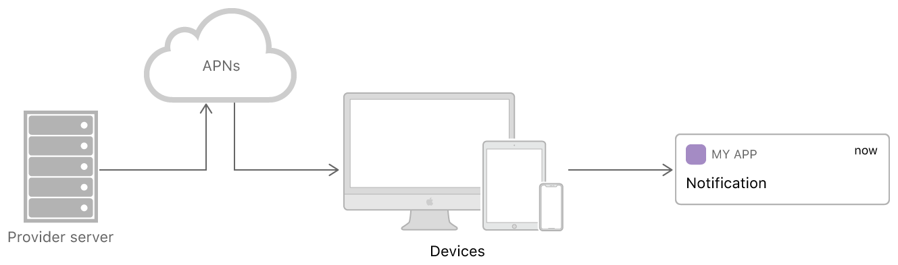

# User Notifications

Push user-facing notifications to the user's device from a server, or generate them locally from your app. See [UserNotification](https://developer.apple.com/documentation/usernotifications). 

## Remote Notification



You are free to use whatever technologies that are appropriate for your company to set up a remote notification server.

* Write code to receive _device tokens_ from instances of your app running on user devices, and to associate those tokens with your users' accounts.
* Determine when to send notifications to your users, and write code to generate notification [payloads](local-and-remote-notification.md#payloads).
* Manage a connection to APNs using _HTTP/2_ and _TLS_.
* Write code to generate POST requests containing your payloads, and send those requests over your HTTP/2 connection.
* For token-based authentication, regenerate your token periodically.

### Establish a Trusted Connection to APNs

What APNs Provides:

* APNs manages an accredited, encrypted, and **persistent** _IP connection_ to the user’s device.
* APNs can _store and forward_ notifications for a device that is currently offline.
* APNs _coalesces_ notifications with the same identifier.

Creating that connection requires installing a [GeoTrust Global CA root certificate](https://www.geotrust.com/resources/root_certificates/certificates/GeoTrust_Global_CA.pem) on each of your provider servers. 

To send notifications, your provider server must establish either [token-based](https://developer.apple.com/documentation/usernotifications/setting_up_a_remote_notification_server/establishing_a_token_based_connection_to_apns) or [certificate-based](https://developer.apple.com/documentation/usernotifications/setting_up_a_remote_notification_server/establishing_a_certificate_based_connection_to_apns) trust with APNs using HTTP/2 and TLS. Both techniques have advantages and disadvantages, so decide which technique is best suited for your company.

**Token-based** authentication offers a stateless way to communicate with APNs. Stateless communication is faster than certificate-based communication because it does not require APNs to look up the certificate, or other information, related to your provider server. There are other advantages to using token-based authentication: You can use the same token from multiple provider servers; You can use one token to distribute notifications for all of your company’s apps. Token-based requests are slightly larger than certificate-based requests because each request contains the token. You must also update and encrypt your tokens at least once an hour using the provider token signing key that Apple provides you.

With **certificate-based authentication**, you use a provider certificate to establish a secure connection between your provider server and APNs. You obtain this certificate from Apple through your developer account. Because trust is established at the server-level, individual notification requests contain only your payload and a device token. You can use a provider certificate to send notifications to a single app. To send remote notifications to multiple apps, you must create separate certificates for each app. You must also manage separate APNs connections for each app’s notifications. As a result, it is often simpler to use token-based authentication to support multiple apps.

When sending many remote notifications, you can establish multiple connections to these servers to improve performance. For example, if you have multiple provider servers, each one can establish its own connection.

### Device Token

To use push notifications, enable the Push Notifications capability in your Xcode project. In your developer account, you must also enable the push notification service for the App ID assigned to your project.

You register your app and receive your device token each time your app **launches** using Apple-provided APIs. APNs issues a new token when the user _restores a device from a backup_, when the user _installs your app on a new device_, and when the user _reinstalls the operating system_.

You use the following code to initiate the registration process with APNs:

```swift
UIApplication.shared.registerForRemoteNotifications()
```


If you want your app’s remote notifications to display alerts, play sounds, or perform other user-facing actions, you must request authorization to do so. If you do not request and receive authorization for your app's interactions, the system delivers all remote notifications to your app **silently**.


### Payloads

Specify the payload for a remote notification using a JSON dictionary. The payload specifies the types of user interactions _\(alert, sound, or badge\)_, and includes any custom data your app needs to respond to the notification.

There are two ways to **localize** the content of remote notifications: Include localized strings directly in the payload. Add localized message strings in your app bundle, and let the system choose which strings to display.

## Firebase

As of April 10, 2018, Google has deprecated GCM. [Firebase Cloud Messaging](https://firebase.google.com/docs/cloud-messaging/) \(FCM\) inherits the reliable and scalable GCM infrastructure, plus many new features. FCM is a **cross-platform** messaging lets you reliably deliver messages at no cost to your Android, iOS, or Web app.

The FCM SDK performs **method swizzling** in two key areas: _mapping your APNs token to the FCM registration token_ and _capturing analytics data_ during downstream message callback handling.

If you **disable** method swizzling, you have to implement the following methods yourself:

```swift
// mapping your APNs token to the FCM registration token
func application(application: UIApplication,
                 didRegisterForRemoteNotificationsWithDeviceToken deviceToken: NSData) {
    Messaging.messaging().apnsToken = deviceToken
    // ... other codes
}
// Receive displayed notifications for iOS 10 devices.
func userNotificationCenter(_ center: UNUserNotificationCenter,
                              willPresent notification: UNNotification,
    withCompletionHandler completionHandler: @escaping (UNNotificationPresentationOptions) -> Void) {
    // With swizzling disabled you must let Messaging know about the message, for Analytics
    Messaging.messaging().appDidReceiveMessage(userInfo)
    // ... other codes
}
```

Generally, you'll need to [upload your APNs authentication key](https://firebase.google.com/docs/cloud-messaging/ios/client#upload_your_apns_authentication_key) and [register for remote notifications](https://firebase.google.com/docs/cloud-messaging/ios/client#register_for_remote_notifications).

By default, the FCM SDK generates a registration token for the client app instance on app launch. Similar to the APNs device token, this token allows you to send targeted notifications to any particular instance of your app. If you have disabled method swizzling, you'll need to explicitly map your APNs token to the FCM registration token.

