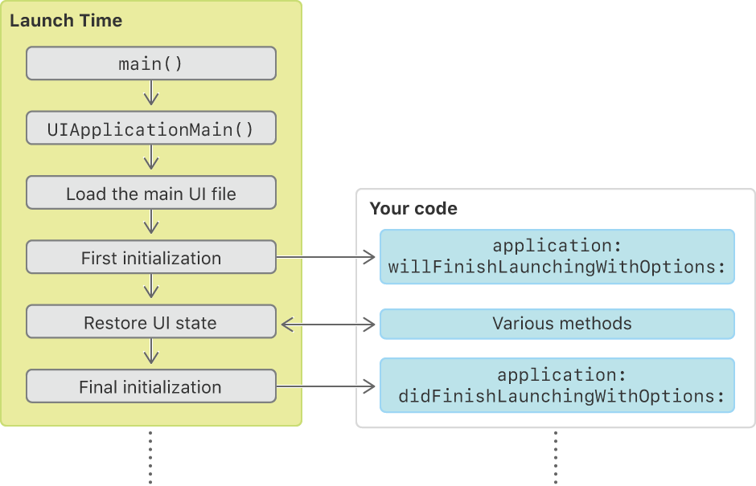
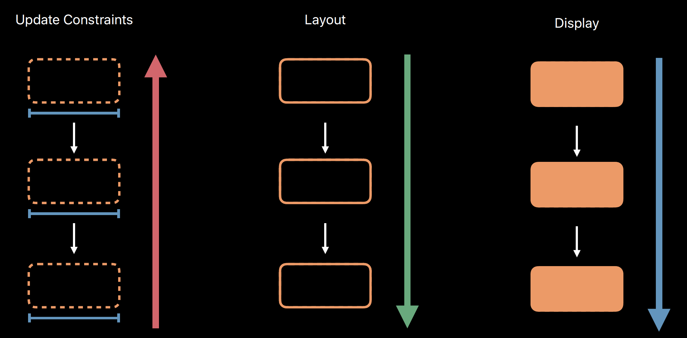

# UIKit

## UIKit

The [UIKit](https://developer.apple.com/documentation/uikit) framework provides the required infrastructure for your **iOS** or **tvOS** apps. It provides the window and view architecture for implementing your interface, the event handling infrastructure for delivering Multi-Touch and other types of input to your app, and the main run loop needed to manage interactions among the user, the system, and your app.

The [structure](https://developer.apple.com/documentation/uikit/about_app_development_with_uikit) of UIKit apps is based on the **Model-View-Controller** \(MVC\) design pattern. You provide the model objects that represent your app’s data structures. UIKit provides most of the view objects. Coordinating the exchange of data between your data objects and the UIKit views are your view controllers and app delegate object.


UIKit provides most of the objects in the controller and view layers of your app. Specifically, UIKit defines the [`UIView`](https://developer.apple.com/documentation/uikit/uiview) class, which is usually responsible for displaying your content onscreen. \(You can also render content directly to the screen using [Metal](https://developer.apple.com/documentation/metal) and other system frameworks.\) The [`UIApplication`](https://developer.apple.com/documentation/uikit/uiapplication) object runs your app’s main event loop and manages your app’s overall life cycle.

## Core App

[UIKit apps](https://developer.apple.com/documentation/uikit/core_app) are always in one of five states:


Apps start off **not running**. When the user explicitly launches the app, the app moves briefly to the **inactive** state before entering the **active** state. \(An active app appears onscreen and is known as a **foreground** app.\) Quitting an active app moves it offscreen and into the _**background**_ state, where it stays until the system **suspends** it a short time later. At its discretion, the system may quietly _**terminate**_ a suspended app, returning it to the not running state.

`applicationWillResignActive(_:)` called when your app is about to move from the active to inactive state. This can occur for certain types of temporary interruptions \(such as an incoming phone call or SMS message\) or when the user quits the app and it begins the transition to the background state. An app in the inactive state continues to run but does not dispatch incoming events to responders.

`applicationDidEnterBackground(_:)`Use this method to release shared resources, invalidate timers, and store enough app state information to restore your app to its current state in case it is terminated later. Your implementation of this method has approximately **five seconds** to perform any tasks and return.

### Launch



1. The app is launched, either explicitly by the user or implicitly by the system.
2. The Xcode-provided `main` function calls UIKit's `UIApplicationMain(_:_:_:_:)`function.
3. The `UIApplicationMain(_:_:_:_:)` function creates the `UIApplication` object and your app delegate. 
4. UIKit loads your app's default interface from the main storyboard or nib file.
5. UIKit calls your app delegate's `application(_:willFinishLaunchingWithOptions:)` method.
6. UIKit performs state restoration, which calls additional methods of your app delegate and view controllers.
7. UIKit calls your app delegate's `application(_:didFinishLaunchingWithOptions:)` method.

### UIApplication

Every iOS app has exactly one instance of UIApplication \(or, very rarely, a subclass of UIApplication\). A major role of your app’s application object is to handle the initial routing of incoming user events\(e.g. touches\). The application object maintains a list of open windows \(UIWindow objects\) and through those can retrieve any of the app’s UIView objects.

### Universal Links

While [universal links](https://developer.apple.com/documentation/uikit/core_app/allowing_apps_and_websites_to_link_to_your_content) and custom URLs are both acceptable forms of deep linking, universal links are strongly recommended as a best practice. Key benefits are \(1\) One URL works for both your website and your app, allowing your website to handle the link when your app is not installed. \(2\) iOS verifies the association through unforgeable URL like [https://www.google.com/apple-app-site-association](https://www.google.com/apple-app-site-association) on your website, eliminating the possibility that other apps might claim your scheme and redirect your URLs.

`appID`: The identifier of the application that will handle the links in the format [&lt;team identifier&gt;.&lt;bundle identifier&gt;](https://developer.apple.com/account/).

Add the `applinks` key to the Apple App Site Association file: `applinks:example.com`.

Universal links offer a potential **attack** vector into your app, so make sure to validate all URL parameters and discard any malformed URLs.

UIKit apps can communicate through universal links. Supporting universal links allows **other apps** to send small amounts of data directly to your app without using a third-party server. Define the parameters that your app handles within the URL **query** string.

## UIScreen, UIWindow, UIView

Every device has at least one [`UIScreen`](https://developer.apple.com/documentation/uikit/uiscreen) object representing the device’s main screen, and additional screen objects represent connected displays.

```swift
let rect = UIScreen.main.bounds
```

A [`UIWindow`](https://developer.apple.com/documentation/uikit/uiwindow) object provides no visible content of its own. All of the window's visible content is provided by its _root view controller_. The window's role is to receive events from UIKit and to forward any relevant events to the root view controller and associated views. 

```swift
let vc = self.window.rootViewController // AppDelegate.swift
```

Most apps need **only one** **window**, on the device’s **main screen**, extra windows are commonly used to [display content on an external screen](https://developer.apple.com/documentation/uikit/windows_and_screens/displaying_content_on_a_connected_screen).

Whereas touch events are delivered to the window where they occurred, events that do not have a relevant coordinate value are delivered to the _**key window**_.

```swift
let keyWindow = UIApplication.shared.keyWindow
keyWindow?.addSubview(topMostView) // topmost view (e.g. alert)
```

## UIViewController

Each view controller manages a view hierarchy. The size and position of the root view is determined by the object that owns it, which is either a parent view controller or the app’s window. The view controller that is owned by the window is the app’s root view controller and its view is sized to fill the window.

View controllers load their views **lazily**. Accessing the view property for the first time loads or creates the view controller’s views. There are several ways to specify the views for a view controller:

* Specify the view controller and its views in your app’s [Storyboard](https://developer.apple.com/library/archive/documentation/General/Conceptual/Devpedia-CocoaApp/Storyboard.html#//apple_ref/doc/uid/TP40009071-CH99). \(preferred\)
* Specify the views for a view controller using a [Nib file](https://developer.apple.com/library/archive/documentation/General/Conceptual/DevPedia-CocoaCore/NibFile.html#//apple_ref/doc/uid/TP40008195-CH34).
* Specify the views for a view controller using the [`loadView()`](https://developer.apple.com/documentation/uikit/uiviewcontroller/1621454-loadview) method. In that method, create your view hierarchy programmatically and assign the root view of that hierarchy to the view controller’s [`view`](https://developer.apple.com/documentation/uikit/uiviewcontroller/1621460-view) property.

When using a storyboard to define your view controller and its associated views, you never initialize your view controller class directly. Instead, view controllers are instantiated by the storyboard €”either automatically when a segue is triggered or programmatically when your app calls the `instantiateViewController(withIdentifier:)` method. When instantiating a view controller from a storyboard, iOS initializes the new view controller by calling its `init(coder:)` method and sets the nibName property to a nib file stored inside the storyboard.

### Rotate

As of iOS 8, **all rotation-related methods are deprecated**. Instead, **rotations** are treated as a change in the size of the view controller’s view and are therefore reported using the `viewWillTransition(to:with:)` method. When the interface orientation changes, UIKit calls this method on the window’s root view controller. That view controller then notifies its child view controllers, propagating the message throughout the view controller hierarchy. The `viewWillLayoutSubviews()` method is also called after the view is resized and positioned by its parent.

The system intersects the view controller'€™s supported orientations with the **app's** supported orientations \(as determined by the Info.plist file or the app delegate's `application(_:supportedInterfaceOrientationsFor:)` method\) and the **device's** supported orientations to determine whether to rotate. For example, the `.portraitUpsideDown` orientation is not supported on iPhone X.

When the user changes the device orientation, the system calls `supportedInterfaceOrientations` on the **root** view controller or the **topmost presented** view controller that fills the window. If the view controller supports the new orientation, the window and view controller are rotated to the new orientation. This method is only called if the view controller'€™s `shouldAutorotate` method returns true.

You can override the `preferredInterfaceOrientationForPresentation` for a view controller that is intended to be presented full screen in a specific orientation.

### Container View Controller

A custom `UIViewController` subclass can also act as a **container** view controller. A container view controller manages the presentation of content of other view controllers it owns, also known as its **child** view controllers. Your container view controller must associate a child view controller with itself before adding the child'€™s root view to the view hierarchy. This allows iOS to properly route events to child view controllers and the views those controllers manage. 

### **State Preservation and Restoration**

The property [`restorationIdentifier`](https://developer.apple.com/documentation/uikit/uiviewcontroller/1621499-restorationidentifier) indicates whether the view controller and its contents should be preserved and is used to identify the view controller during the restoration process. Assigning a string object to the property lets the system know that the view controller should be saved. In addition, the contents of the string are your way to identify the purpose of the view controller.

During subsequent launches, UIKit asks your app for help in recreating the view controllers that were installed the last time your app ran. When it asks for a specific view controller, UIKit provides your app with this restoration identifier and the restoration identifiers of any parent view controllers in the view controller hierarchy. Your app must use this information to create or locate the appropriate view controller object.

## UIView

A view object renders content within its bounds rectangle and handles any interactions with that content. A view is a subclass of UIResponder and can respond to touches and other types of events.

Views can adjust the size and position of their subviews. Use Auto Layout to define the rules for resizing and repositioning your views in response to changes in the view hierarchy.

By default, when a subview’s visible area extends outside of the bounds of its superview, no clipping of the subview's content occurs. Use the `clipsToBounds` property to change that behavior.

The geometry of each view is defined by its **frame** and **bounds** properties. The frame property defines the origin and dimensions of the view in the **coordinate** system of its superview. The bounds property defines the internal dimensions of the view as it sees them and is used almost exclusively in custom drawing code.

### The Render Loop

> [High Performance Auto Layout](https://developer.apple.com/videos/play/wwdc2018/220/)

The Render Loop is the process that runs potentially at 120 times every second. That makes sure that all the content is ready to go for each frame. It consists of three phases -- Update Constraints, Layout, and Display.

| Update Constraints | Layout | Display |
| :--- | :--- | :--- |
| updateConstraints\(\) | layoutSubViews\(\) | draw\(\_:\) |
| setNeedsUpdateConstraints\(\) | setNeedsLayout\(\) | setNeedsDisplay\(\) |
| updateConstraintsIfNeeded\(\) | layoutIfNeeded\(\) | - |

First every view that needs it will receive `updateConstraints()`. And that runs from the leaf most views up to the view hierarchy towards the window. Next, every view receives `layoutSubViews()`. This runs the opposite direction starting from the window going down towards the leaves. Last, every view gets `draw(_:)` if it needs it also from the window towards the leaves.



### LayoutSubviews

You should not call `layoutSubviews()` directly. If you want to force a layout update, call the ****`setNeedsLayout()` method instead to do so. This method makes a note of the request and returns immediately.

Because this method does not force an immediate update, but instead waits for the next update cycle, you can use it to invalidate the layout of multiple views before any of those views are updated. This behavior allows you to consolidate all of your layout updates to one update cycle, which is usually better for performance.

If you want to update the layout of your views immediately, call the `layoutIfNeeded()` method. If no layout updates are pending, this method exits without modifying the layout or calling any layout-related callbacks.

### Drawing

The default implementation of `draw(_:)` does nothing. Subclasses that use technologies such as Core Graphics and UIKit to draw their view’s content should override this method and implement their drawing code there.

UIKit creates and configures a graphics context for drawing and adjusts the transform of that context so that its origin matches the origin of your view’s bounds rectangle. You can get a reference to the graphics context using the [`UIGraphicsGetCurrentContext()`](https://developer.apple.com/documentation/uikit/1623918-uigraphicsgetcurrentcontext) function, but do not establish a strong reference to the graphics context because it can change between calls to the `draw(_:)` method.

This method is called when a view is first displayed or when an event occurs that invalidates a visible part of the view. You should never call this method directly yourself. To invalidate part of your view, and thus cause that portion to be redrawn, call the `setNeedsDisplay()` instead.

### Subclass

Although there are many good reasons to **subclass** `UIView`, it is recommended that you do so only when the basic `UIView` class or the standard system views do not provide the capabilities that you need. Subclassing requires more work on your part to implement the view and to tune its performance.

Image-based backgrounds - consider using a `UIImageView` object with gesture recognizers instead of subclassing and drawing the image yourself. Alternatively, you can also use a generic `UIView` object and assign your image as the content of the view’s `CALayer` object.

Rather than draw your content using a `draw(_:)` method, embed image and label subviews with the content you want to present.

### Resizing

If you want a given view to size itself to its parent view, you should add it to the parent view before calling `sizeToFit()`.

## Touches, Presses, and Gestures

Apps receive and handle events using _responder objects_. A responder object is any instance of the `UIResponder` class, and common subclasses include `UIView`, `UIViewController`, `UIWindow`, and `UIApplication`. Responders receive the raw event data and must either handle the event or forward it to another responder object.

When your app receives an event, UIKit automatically directs that event to the most appropriate responder object, known as the **first responder**. Unhandled events are passed from responder to responder in the active **responder chain**, which is the dynamic configuration of your app’s responder objects.

You can alter the responder chain by overriding the `next` property of your responder objects. Many UIKit classes already override this property and return specific objects.

* UIView: If the view is the root view of a view controller, the next responder is the view controller.
* UIViewController: If the view controller’s view is the root view of a window, the next responder is the window object. If the view controller was presented by another view controller, the next responder is the presenting view controller.
* UIWindow: The window's next responder is the UIApplication object.
* UIApplication: The next responder is the app delegate.


UIKit designates an object as the first responder to an event based on the **type** of that event. There are several kinds of events:

* Touch events are the most common and are delivered to the view in which the touch originally occurred.
* Motion events are UIKit triggered and are separate from the motion events reported by the Core Motion framework. \(e.g shake to undo\)
* Remote-control events allow a responder object to receive commands from an external accessory or headset.
* Press events represent interactions with a game controller, AppleTV remote, or other device that has physical buttons.

To handle a specific type of event, a responder must **override** the corresponding methods. For example, to handle touch events, a responder implements the [`touchesBegan(_:with:)`](https://developer.apple.com/documentation/uikit/uiresponder/1621142-touchesbegan), etc. methods.

[Gesture recognizers](https://developer.apple.com/documentation/uikit/uigesturerecognizer) receive touch and press events before their view does.

UIKit compares the touch location to the bounds of view objects in the view hierarchy. The [`hitTest(_:with:)`](https://developer.apple.com/documentation/uikit/uiview/1622469-hittest) method of `UIView` traverses the view hierarchy, looking for the deepest subview that contains the specified touch, which becomes the first responder for the touch event. If a touch location is outside of a view’s bounds, the `hitTest(_:with:)` method ignores that view and all of its subviews.

This method traverses the view hierarchy by calling the [`point(inside:with:)`](https://developer.apple.com/documentation/uikit/uiview/1622533-point) method of each subview to determine which subview should receive a touch event.  


