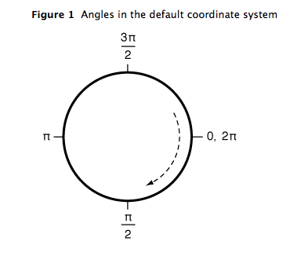
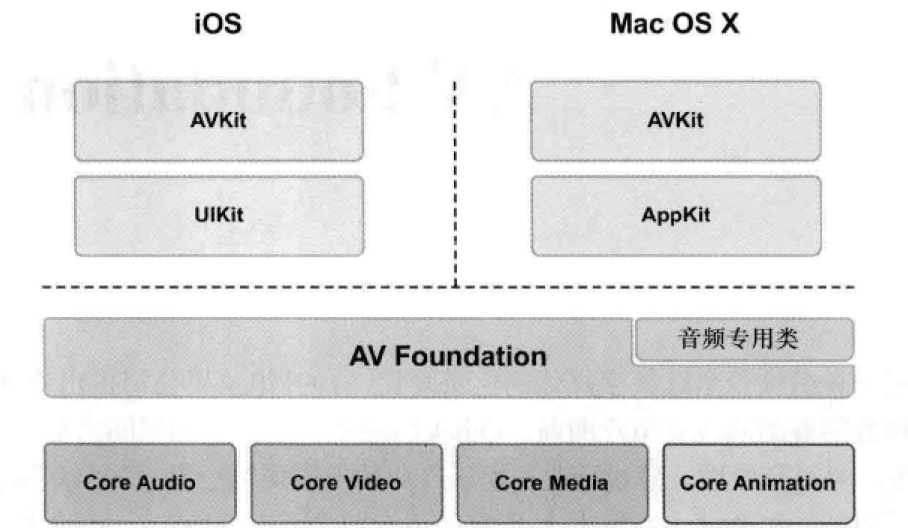

# Frameworks

## Foundation

The [Foundation](https://developer.apple.com/documentation/foundation) framework provides a base layer of functionality for apps and frameworks, including:

* text processing, date and time calculations, sorting and filtering, The [Swift Standard Library](https://developer.apple.com/documentation/swift/swift_standard_library) provides many of the same types available in the Foundation framework.
* data storage and persistence
* networking, e.g. URL Loading System.
* XPC, Object Runtime, Process and Threads \(e.g. RunLoop,  Operation\), 

The classes, protocols, and data types defined by Foundation are used throughout the macOS, iOS, watchOS, and tvOS SDKs.

## Process and Threads

### RunLoop

A `RunLoop` object processes input for sources such as mouse and keyboard events from the window system, [`Port`](https://developer.apple.com/documentation/foundation/port) objects, and [`NSConnection`](https://developer.apple.com/documentation/foundation/nsconnection) objects. A `RunLoop` object also processes [`Timer`](https://developer.apple.com/documentation/foundation/timer) events.

Your application neither creates or explicitly manages `RunLoop` objects. Each [`Thread`](https://developer.apple.com/documentation/foundation/thread) object—including the application’s _main_ thread—has an `RunLoop` object automatically created for it as needed. If you need to access the current thread’s run loop, you do so with the class method `current`.

```swift
print(Thread.current.description)
```

The `RunLoop` class is generally not considered to be **thread-safe** and its methods should only be called within the context of the current thread. You should never try to call the methods of an `RunLoop` object running in a different thread, as doing so might cause unexpected results.

### Operation

Because the [`Operation`](https://developer.apple.com/documentation/foundation/operation) class is an abstract class, you do not use it directly but instead subclass or use one of the system-defined subclasses to perform the actual task:

* The `NSInvocationOperation` implements a **non-concurrent** operation.
* The `BlockOperation` manages the **concurrent** execution of one or more blocks. You can use this object to execute several blocks at once without having to create separate operation objects for each. When executing more than one block, the operation itself is considered finished only when all blocks have finished executing. Blocks added to a block operation are dispatched with default **priority** to an appropriate work queue.

An operation object is a single-shot object—that is, it executes its task once and cannot be used to execute it again. You typically execute operations by adding them to an operation queue \(an instance of the `OperationQueue` class\). An operation queue executes its operations either directly, by running them on secondary threads, or indirectly using the `libdispatch` library \(also known as **Grand Central Dispatch**\).

```swift
let operation1 = BlockOperation {
    print("operation1...")
}
operation1.addExecutionBlock {
    print("operation1.1...")
}
        
let operation2 = BlockOperation {
    print("operation2...")
}
operation2.addDependency(operation1)
        
operationQueue.addOperations([operation1, operation2], waitUntilFinished: false)
// If true, the current thread is blocked until all of the specified operations finish executing.
// If false, the operations are added to the queue and control returns immediately to the caller.
```

Dependencies are a convenient way to execute operations in a **specific order**. By default, an operation object that has dependencies is not considered ready until all of its dependent operation objects have finished executing. The dependencies make no distinction about whether a dependent operation finished successfully or unsuccessfully. \(In other words, canceling an operation similarly marks it as finished.\)

The `NSOperation` class is itself **multicore** aware. It is therefore safe to call the methods of an `NSOperation` object from multiple threads without creating additional locks to synchronize access to the object.

### OperationQueue

An [operation queue](https://developer.apple.com/documentation/foundation/operationqueue) executes its queued `Operation` objects based on their priority and readiness. After being added to an operation queue, an operation remains in its queue until it reports that it is finished with its task. You can’t directly remove an operation from a queue after it has been added.

Operation queues retain operations until they're finished, and queues themselves are retained until all operations are finished. Suspending an operation queue with operations that aren't finished can result in a **memory leak**.

## **URL Loading System**

The URL Loading System provides access to resources identified by URLs, using standard protocols like https or custom protocols you create. Loading is performed **asynchronously**, so your app can remain responsive and handle incoming data or errors as they arrive.

The _completion_ _handler_ is called on a different Grand Central Dispatch queue than the one that created the task. Therefore, any work that uses data or error to update the UI should be explicitly placed on the main queue, as shown here.

```swift
func startLoad() {
    let url = URL(string: "https://www.example.com/")!
    let task = URLSession.shared.dataTask(with: url) { 
        data, response, error in
        if let error = error {
            self.handleClientError(error)
            return
        }
        guard let httpResponse = response as? HTTPURLResponse,
            (200...299).contains(httpResponse.statusCode) else {
            self.handleServerError(response)
            return
        }
        if let mimeType = httpResponse.mimeType, mimeType == "text/html",
            let data = data,
            let string = String(data: data, encoding: .utf8) {
            DispatchQueue.main.async {
                self.webView.loadHTMLString(string, baseURL: url)
            }
        }
    }
    //Tasks are created in a suspended state, 
    //and can be started by calling resume().
    task.resume()
}
```

1. First Step

1.1  You use a [`URLSession`](https://developer.apple.com/documentation/foundation/urlsession) instance to create one or more [`URLSessionTask`](https://developer.apple.com/documentation/foundation/urlsessiontask) instances, which can _fetch and return data to your app, download files, or upload data and files_ to remote locations. To configure a session, you use a [`URLSessionConfiguration`](https://developer.apple.com/documentation/foundation/urlsessionconfiguration) object, which controls behavior like how to use caches and cookies, or whether to allow connections on a cellular network.

2. Request and Response

2.1 [`URLRequest`](https://developer.apple.com/documentation/foundation/urlrequest) encapsulates two basic data elements of a load request: the URL to load, and the [policy](https://developer.apple.com/documentation/foundation/nsurlrequest/cachepolicy) to use when consulting the URL content cache made available by the implementation.

2.2 The related [`HTTPURLResponse`](https://developer.apple.com/documentation/foundation/httpurlresponse) class is a commonly used subclass of `URLResponse` whose objects represent a response to an HTTP URL load request and store additional protocol-specific information such as the response headers. Whenever you make an HTTP request, the `URLResponse` object you get back is actually an instance of the [`HTTPURLResponse`](https://developer.apple.com/documentation/foundation/httpurlresponse) class.

3. Cache Behaviour

The [`URLCache`](https://developer.apple.com/documentation/foundation/urlcache) class is used for caching responses from network resources. Your app can directly access the shared cache instance by using the shared property of `URLCache`. Or, you can create your own caches for different purposes, setting distinct caches on your [`URLSessionConfiguration`](https://developer.apple.com/documentation/foundation/urlsessionconfiguration) objects.

4. Authentication and Credentials

When your app makes a request with a [`URLSessionTask`](https://developer.apple.com/documentation/foundation/urlsessiontask), the server may respond with one or more demands for credentials before continuing. The session task attempts to handle this for you. If it can’t, it calls your session’s delegate to handle the challenges. If you don’t implement a delegate, your request may be denied by the server, and you receive a response with HTTP status code 401 \(Forbidden\) instead of the data you expect.

## **Core Animation**

[Core Animation](https://developer.apple.com/documentation/quartzcore) provides high frame rates and smooth animations without burdening the CPU and slowing down your app. Most of the work required to draw each frame of an animation is done for you.

Layers are often used to provide the backing store for views but can also be used without a view to display content. 

```swift
let layer = self.view.layer
```

A layer’s main job is to manage the visual content that you provide but the layer itself has visual attributes that can be set, such as a background color, border, and shadow. In addition to managing visual content, the layer also maintains information about the geometry of its content \(such as its position, size, and transform\) that is used to present that content onscreen. Modifying the properties of the layer is how you initiate animations on the layer’s content or geometry.

If the layer object was created by a view, the view typically assigns itself as the layer’s **delegate** automatically, and you should not change that relationship.



## Audio and Video

The [AVKit](https://developer.apple.com/documentation/avkit) framework provides a high-level interface for playing video content. Using [AVPlayerViewController](https://developer.apple.com/documentation/avkit/avplayerviewcontroller) makes it easy for you to add media playback capabilities to your application matching the styling and features of the native system players.



The [Media Player](https://developer.apple.com/documentation/mediaplayer) framework provides developers with several ways to play media. Add the ability to find and play songs, audio podcasts, audio books, and more from within your app.

The [AVFoundation](https://developer.apple.com/documentation/avfoundation) framework combines four major technology areas that together encompass a wide range of tasks for capturing, processing, synthesizing, controlling, importing and exporting audiovisual media on Apple platforms.


