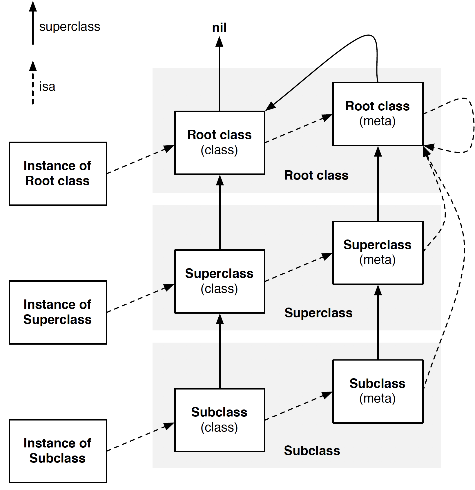

# Objective-C

## NSObject

​[NSObject](https://developer.apple.com/documentation/objectivec/nsobject?language=objc) is the root class of most Objective-C class hierarchies, from which subclasses inherit a basic interface to the runtime system and the ability to behave as Objective-C objects.

An object that conforms to [NSObject protocol](https://developer.apple.com/documentation/objectivec/1418956-nsobject) can be considered a first-class object. Such an object can be asked about its: 

* Class, and the place of its class in the inheritance hierarchy;
* Conformance to protocols;
* Ability to respond to a particular message. 

The Cocoa root class NSObject adopts this protocol. This protocol is imported into Swift with the name NSObjectProtocol.

`-(BOOL)isKindOfClass:(Class)aClass;` Returns a Boolean value that indicates whether the receiver is an **instance** **of** **given class** or an instance of any class that **inherits** from that class.

`-(BOOL)isMemberOfClass:(Class)aClass;` Returns a Boolean value that indicates whether the receiver is an **instance** **of** **a given class**.

> objc.h

```c
#if !OBJC_TYPES_DEFINED
/// An opaque type that represents an Objective-C class.
typedef struct objc_class *Class;

/// Represents an instance of a class.
struct objc_object {
    Class _Nonnull isa  OBJC_ISA_AVAILABILITY;
};

/// A pointer to an instance of a class.
typedef struct objc_object *id;
#endif
```

> runtime.h

```c
struct objc_class {
    Class _Nonnull isa  OBJC_ISA_AVAILABILITY;

#if !__OBJC2__
    Class _Nullable super_class    OBJC2_UNAVAILABLE;
    const char * _Nonnull name     OBJC2_UNAVAILABLE;
    long version                   OBJC2_UNAVAILABLE;
    long info                      OBJC2_UNAVAILABLE;
    long instance_size             OBJC2_UNAVAILABLE;
    struct objc_ivar_list * _Nullable ivars                  OBJC2_UNAVAILABLE;
    struct objc_method_list * _Nullable * _Nullable methodLists    OBJC2_UNAVAILABLE;
    struct objc_cache * _Nonnull cache                       OBJC2_UNAVAILABLE;
    struct objc_protocol_list * _Nullable protocols          OBJC2_UNAVAILABLE;
#endif

} OBJC2_UNAVAILABLE;
/* Use `Class` instead of `struct objc_class *` */
```

The `super_class` pointer creates the hierarchy. The `isa` pointer describes the type of an instance.



## J2ObjC

[J2ObjC](https://developers.google.com/j2objc/) is an open-source command-line tool from Google that translates Java source code to Objective-C for the iOS platform. The goal is to write an app's non-UI code \(such as **business logic** and **data models**\) in Java, which is then shared by web apps \(using [GWT](http://www.gwtproject.org/)\), Android apps, and iOS apps.


GWT \(Google Web Toolkit\) is a development toolkit for building and optimizing complex **browser-based** applications.


See [How Google Inbox shares 70% of its code across Android, iOS, and the Web](https://arstechnica.com/information-technology/2014/11/how-google-inbox-shares-70-of-its-code-across-android-ios-and-the-web/). Google has built itself a good enough arsenal of cross compilers that it can write an app's logic once for Android in Java, and can then cross-compile to Objective-C for iOS and JavaScript for browsers. Java-to-JavaScript is handled by the **GWT**.

## KVO and KVC

Key-value observing \(KVO\) provides a mechanism that allows objects to be notified of changes to specific properties of other objects.

When an object is key-value coding \(KVC\) compliant, its properties are addressable via string parameters through a concise, uniform messaging interface.

```objectivec
@interface BankAccount : NSObject
@property (nonatomic) NSNumber* currentBalance;              // An attribute
@property (nonatomic) Person* owner;                         // A to-one relation
@property (nonatomic) NSArray< Transaction* >* transactions; // A to-many relation
@end
```

Because the `BankAccount` class is key-value coding compliant, it recognizes the keys `owner`, `currentBalance`, and `transactions`, which are the names of its properties. Instead of calling the `setCurrentBalance:` method, you can set the value by its key:

`[myAccount setValue:@(100.0) forKey:@"currentBalance"];`.

## NSAutoreleasePool

[NSAutoreleasePool](https://developer.apple.com/documentation/foundation/nsautoreleasepool?language=objc) is an object that supports Cocoa’s reference-counted memory management system.

In a **reference-counted** environment \(as opposed to one which uses **garbage collection**\), an `NSAutoreleasePool` object contains objects that have received an `autorelease` message and when drained it sends a `release` message to each of those objects. Thus, sending `autorelease` instead of `release` to an object **extends the lifetime** of that object at least until the pool itself is drained \(it may be longer if the object is subsequently retained\). An object can be put into the same pool several times, in which case it receives a `release` message for each time it was put into the pool.

```objectivec
int main(int argc, char * argv[]) {
    @autoreleasepool {
        return UIApplicationMain(argc, argv, nil, NSStringFromClass([AppDelegate class]));
    }
}
```

In a reference counted environment, Cocoa expects there to be an autorelease pool always available. If a pool is not available, autoreleased objects do not get released and you leak memory. In this situation, your program will typically log suitable warning messages.

The Application Kit creates an autorelease pool on the **main thread** at the beginning of **every cycle** **of the event loop**, and **drains it at the end**, thereby releasing any autoreleased objects generated while processing an event. If you use the Application Kit, you therefore typically don’t have to create your own pools. If your application creates _a lot of temporary autoreleased objects within the event loop_, however, it may be beneficial to create “local” autorelease pools to help to minimize the peak memory footprint.

```objectivec
@autoreleasepool {
    // Code benefitting from a local autorelease pool.
}
```

If you use Automatic Reference Counting \(ARC\), you cannot use autorelease pools directly.`@autoreleasepool` blocks are more efficient than using an instance of `NSAutoreleasePool` directly; you can also use them even if you do not use ARC.

Each thread \(including the main thread\) maintains its own **stack** of `NSAutoreleasePool`objects. As new pools are created, they get added to the **top of the stack**. When pools are deallocated, they are removed from the stack. Autoreleased objects are placed into the **top autorelease pool** for the current thread. When a thread terminates, it automatically drains all of the autorelease pools associated with itself.

### Threads

If you are making Cocoa calls outside of the Application Kit’s main thread—for example if you create a Foundation-only application or if you detach a thread—you need to create your own autorelease pool.

If your application or thread is long-lived and potentially generates a lot of autoreleased objects, you should **periodically drain and create** autorelease pools \(like the Application Kit does on the main thread\); otherwise, autoreleased objects accumulate and your memory footprint grows. If, however, your detached thread does not make Cocoa calls, you do not need to create an autorelease pool.

### Garbage Collection

In a garbage-collected environment, there is no need for autorelease pools. You may, however, write a framework that is designed to work in both a garbage-collected and reference-counted environment. In this case, you can use autorelease pools to **hint** to the collector that collection may be appropriate.

In a garbage-collected environment, sending a `drain` message to a pool triggers garbage collection if necessary; `release`, however, is a no-op.

In a reference-counted environment, `drain` has the same effect as `release`. Typically, therefore, you should use `drain` instead of `release`.

