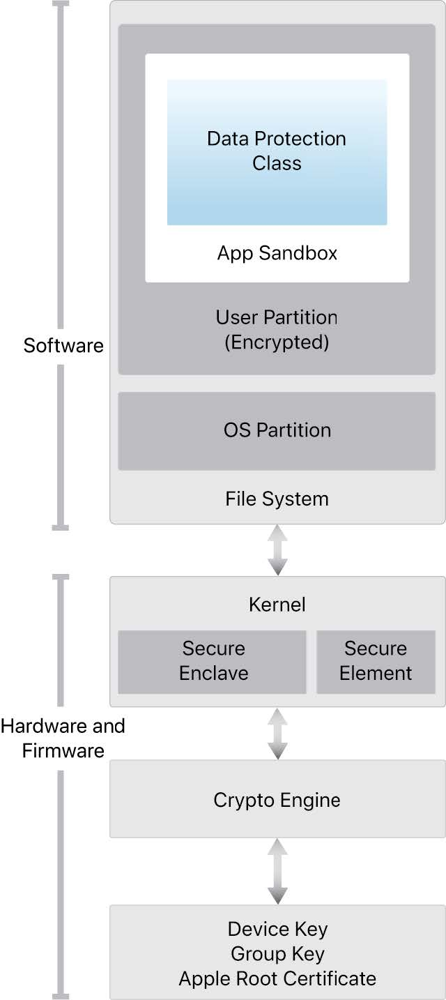

# Security

EN: [https://www.apple.com/business/site/docs/iOS\_Security\_Guide.pdf](https://www.apple.com/cn/business/site/docs/iOS_Security_Guide.pdf)  
CN: [https://www.apple.com/cn/business/site/docs/iOS\_Security\_Guide.pdf](https://www.apple.com/cn/business/site/docs/iOS_Security_Guide.pdf)

Security architecture diagram of iOS:

## Apple Pay

Apple Pay doesn’t collect any transaction information that can be tied back to the user. Payment transactions are between the user, the merchant, and the card issuer.

Components:

* Secure Element: a chip running the [Java Card](http://www.oracle.com/technetwork/java/embedded/javacard/overview/index.html) platform
* NFC controller: routes communication between the application processor and the Secure Element, and between the Secure Element and the point-of-sale terminal
* Wallet: user application
* Security Enclave 隔区: manages the authentication process and enables a payment transaction to proceed.
* Apple Pay servers: manage the setup and provisioning of credit and debit cards in Wallet and the Device Account Numbers stored in the Secure Element. They communicate both with the device and with the payment network servers.

The Secure Element hosts a specially designed **applet** to manage Apple Pay. It also includes payment applets certified by the payment networks.

Once payment is authorized by the cardholder using Touch ID or passcode, or on an unlocked Apple Watch by double-clicking the side button, contactless responses prepared by the payment applets within the Secure Element are exclusively routed by the NFC controller to the NFC field.

When a user adds a credit card to Apple Pay, Apple securely sends the card information, along with other information about user’s account and device, to the card issuer. Using this information, the card issuer will determine whether to approve adding the card to Apple Pay.

Apple Pay uses three server-side calls as part of the card provisioning process: Required Fields, Check Card, and Link and Provision.

Full card numbers aren’t stored on the device or on Apple servers. Instead, a unique Device Account Number is created, encrypted, and then stored in the Secure Element that Apple can’t access it.

