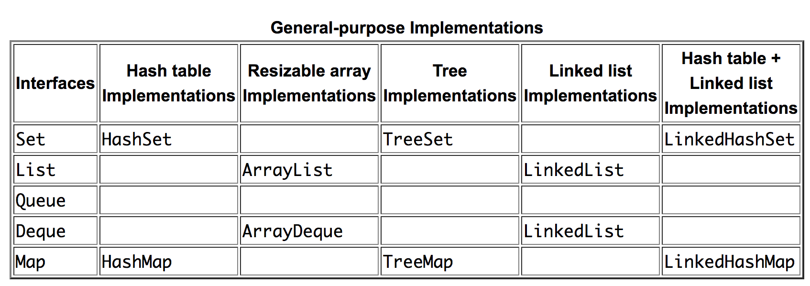

# 4. Collections

## Core Collection Interfaces

A collection is simply an object that groups multiple elements into a single unit. A _collections framework_ is a unified architecture for representing and manipulating collections. All collections frameworks contain **interfaces**, **implementations** and **algorithms**.

The Java Collections Framework hierarchy consists of two distinct interface trees:


A **collection** represents a group of objects known as its _elements_. The Java platform doesn't provide any direct implementations of this interface.

**Set** is a collection that cannot contain duplicate elements. **SortedSet** is a Set that maintains its elements in ascending order.

**List** is an _ordered_ collection \(sometimes called a sequence\). Lists can contain duplicate elements. The user of a List generally has precise control over where in the list each element is inserted and can access elements by their **integer index** \(numerical position\).

**Queue** is a collection used to hold multiple elements prior to processing. Queues typically, but do not necessarily, order elements in a FIFO manner. Among the exceptions are priority queues.

**Deque** can be used both as LIFO stacks and FIFO queues. In a deque all new elements can be inserted, retrieved and removed at **both ends**. 

**Map** is an object that maps keys to values. A Map cannot contain duplicate keys; each key can map to at most one value. **SortedMap** is a Map that maintains its mappings in ascending key order.

## Collection

The Collection interface contains methods that perform basic operations:

* int size\(\)
* boolean isEmpty\(\)
* boolean contains\(Object element\)
* boolean add\(E element\)
* boolean remove\(Object element\)
* Iterator&lt;E&gt; iterator\(\)
* void clear\(\)
* Object\[\] toArray\(\)

There are three ways to traverse collections: \(1\) using **aggregate operations** \(2\) with the **for-each** construct and \(3\) by using **Iterators**.

In JDK 8 and later, the preferred method of iterating over a collection is to obtain a **stream** and perform aggregate operations on it. The following code with lambda expression sequentially iterates through a collection of shapes and prints out the red objects:

```java
myShapesCollection.stream()
.filter(e -> e.getColor() == Color.RED)
.forEach(e -> System.out.println(e.getName()));
```

List interface also provides a richer iterator, called a **ListIterator**, which allows you to traverse the list in either direction, modify the list during iteration, and obtain the current position of the iterator.

## Map

The Java platform contains three general-purpose Map implementations: HashMap, TreeMap, and LinkedHashMap. Their behavior and performance are precisely analogous to HashSet, TreeSet, and LinkedHashSet.

* HashSet, which stores its elements in a hash table, is the best-performing implementation; however it makes no guarantees concerning the order of iteration.
* TreeSet, which stores its elements in a red-black tree, orders its elements based on their values; it is substantially slower than HashSet.
* LinkedHashSet, which is implemented as a hash table with a linked list running through it, orders its elements based on the order in which they were inserted into the set \(insertion-order\).

## Implementation

General-purpose implementations are the most commonly used implementations, designed for everyday use. 

Concurrent implementations are designed to support high concurrency. These implementations are part of the java.util.concurrent package.



**HashSet**, **ArrayList**, and **HashMap** are clearly the ones to use for most applications.

SortedSet and the SortedMap are implemented by TreeSet and TreeMap.

The one for Queue is _LinkedList_. The one for deque is _ArrayDeque_.

**None of there implementations are synchronized**. The legacy collections **Vector** and **Hashtable** are synchronized. The present approach was taken because collections are frequently used when the synchronization is of no benefit.

## Example

```java
List<Integer> result = new ArrayList<>(); //interface to implementation
result.add(100); // polymorphism
```

