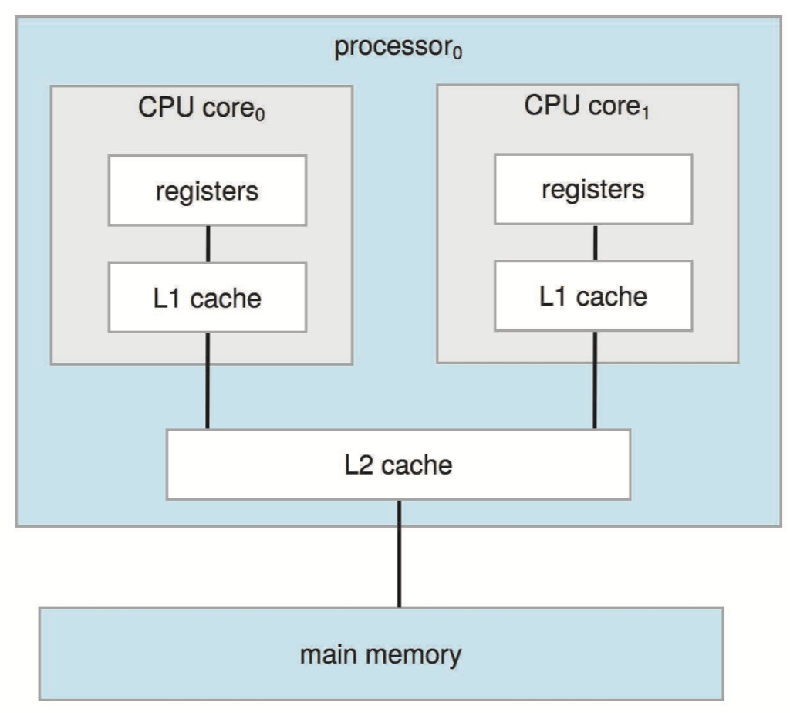

# 1. Introduction

## What is Operation System?

An operating system is software that manages a computer’s hardware, acts as an intermediary between the user and the hardware.

A more common definition, and the one that we usually follow, is that the operating system is the one program running __at all times on the computer—usually called the **kernel**. Along with the kernel, there are two other types of programs: **system programs**, and **application programs**.

**Mobile** operating systems often include not only a core kernel but also **middleware**—a set of software frameworks that provide additional services to application developers.

### Embedded Systems

The embedded systems vary considerably. Some are general-purpose computers, running standard operating systems—such as Linux—with special-purpose applications to implement the functionality. Others are hardware devices with a special-purpose embedded operating system providing just the functionality desired. Yet others are hardware devices with application-specific integrated circuits \(**ASICs**\) that perform their tasks without an operating system.

Embedded systems almost always run **real-time operating systems**. A realtime system is used when rigid time requirements have been placed on the operation of a processor or the flow of data.

### Free and Open-Source OS

Although all free software is open source, some open-source software is not “free.” GNU/Linux is the most famous open-source operating system. Windows is proprietary software. Apple’s macOS operating system comprises a hybrid approach. It contains an open-source kernel named **Darwin** but includes proprietary, closed-source components as well.

## Computer-System Organization

A computer system can be divided roughly into four components: the **hardware**, the **operating system**, the **application programs**, and a **user**.

A modern general-purpose computer system consists of one or more CPUs and a number of **device controllers** connected through a common **bus** that provides access between components and shared memory. 

Typically, operating systems have a **device driver** for each device controller. This device driver understands the device controller and provides the rest of the operating system with a uniform interface to the device. The CPU and the device controllers can execute in parallel, competing for memory cycles. To ensure orderly access to the shared memory, a memory controller synchronizes access to the memory.

Device Driver: software; DeviceController: hardware.

To understand how such a system operates, we focus on three key aspects of the system: interrupt, storage structure and I/O structure.

### Interrupt

Hardware may trigger an interrupt at any time by sending a signal to the CPU, usually by way of the system bus. \(There may be many buses within a computer system, but the system bus is the main communications path between the major components.\) When the CPU is interrupted, it stops what it is doing and immediately transfers execution to a fixed location. On completion, the CPU resumes the interrupted computation.

Interrupts must be handled quickly, as they occur very frequently. A table of pointers to interrupt routines is stored in low memory \(the first hundred or so locations\). This array, or **interrupt vector**, of addresses is then indexed by a unique number, given with the interrupt request, to provide the address of the interrupt service routine for the interrupting device.

We say that the device controller _raises_ an interrupt by asserting a signal on the interrupt request line, the CPU _catches_ the interrupt and _dispatches_ it to the **interrupt handler**, and the handler _clears_ the interrupt by servicing the device.

Figure 1.5 illustrates the design of the interrupt vector for **Intel** processors. The events from 0 to 31, which are **nonmaskable**, are used to signal various error conditions. The events from 32 to 255, which are **maskable**, are used for purposes such as device-generated interrupts.

The interrupt mechanism also implements a system of **interrupt priority levels**. These levels enable the CPU to _defer_ the handling of low-priority interrupts without masking all interrupts and makes it possible for a high-priority interrupt to preempt the execution of a low-priority interrupt.

### Storage Structure

In a larger sense, the storage structure consists of **registers**, **main memory**, and **secondary storage**.

The CPU can load instructions only from memory, so any programs must first be loaded into memory to run, called main memory \(also called random-access memory, or **RAM**\).

Computers use other forms of memory as well. For example, the first program to run on computer power-on is a **bootstrap program**. Since RAM is volatile, the computer uses electrically erasable programmable read-only memory \(**EEPROM**\) and other forms of **firmware** to to hold the bootstrap program and data. For example, the iPhone uses EEPROM to store serial numbers and hardware information about the device.

The basic unit of computer storage is the **bit**. A bit can contain one of two values, 0 and 1. A **byte** is 8 bits, and on most computers it is the smallest convenient chunk of storage. All forms of memory provide an **array of bytes**. Each byte has its own **address**.

A typical **instruction–execution cycle**, as executed on a system with a **von Neumann architecture**, first fetches an instruction from memory and stores that instruction in the **instruction register**. The instruction is then decoded and may cause operands to be fetched from memory and stored in some internal register. After the instruction on the operands has been executed, the result may be stored back in memory.

Most computer systems provide **secondary storage** as an extension of main memory. The most common devices are nonvolatile memory \(NVM\) devices and hard-disk drives \(**HDDs**\). Other possible components may be **tertiary storage** like magnetic tapes.

### I/O Structure

Recall that a general-purpose computer system consists of multiple devices, all of which exchange data via a common bus. The form of interrupt-driven I/O is fine for moving small amounts of data but can produce high overhead when used for bulk data movement such as NVS I/O. To solve this problem, **direct memory access** \(DMA\) is used. Some high-end systems use **switch** rather than bus architecture. On these systems, multiple components can talk to other components concurrently, rather than competing for cycles on a shared bus. In this case, DMA is even more effective.

## Computer-System Architecture

On modern computers, from mobile devices to servers, **multiprocessor** systems now dominate the landscape of computing. The definition of multiprocessor has evolved over time and now includes **multicore** systems. In addition, one chip with multiple cores uses significantly less power than multiple single-core chips, an important issue for mobile devices as well as laptops.

Here we show a dual-core design with two cores on the same processor chip. In this design, each core has its own register set, as well as its own local cache, often known as a level 1 cache. Lower-level caches are generally smaller and faster than higher-level shared caches.

Another type of multiprocessor system is a **clustered** system. They are composed of two or more individual systems—or **nodes**—joined together; each node is typically a multicore system. Such systems are considered **loosely coupled**. Clustering is usually used to provide **high-availability** service. The ability to continue providing service proportional to the level of surviving hardware is called **graceful degradation**. Some systems go beyond graceful degradation and are called **fault tolerant**, because they can suffer a failure of any single component and still continue operation.

Since a cluster consists of several computer systems connected via a network, clusters can also be used to provide **high-performance computing** environments. The application must have been written specifically to take advantage of the cluster, however, this involves a technique known as **parallelization**, which divides a program into separate components that run in parallel on individual cores in a computer or computers in a cluster.

Cluster technology is changing rapidly. Some cluster products support thousands of systems in a cluster, as well as clustered nodes that are separated by miles. Many of these improvements are made possible by **storage-area networks** \(SANs\), which allow many systems to attach to a pool of storage. If the applications and their data are stored on the SAN, then the cluster software can assign the application to run on any host that is attached to the SAN. If the host fails, then any other host can take over. In a database cluster, dozens of hosts can share the same database, greatly increasing performance and reliability.

## Operating-System Operations

For a computer to start running, the bootstrap program must locate the operating-system kernel and load it into memory. Some services are provided outside of the kernel by system programs that are loaded into memory at boot time to become system **daemons**\(守护进程\), which run the entire time the kernel is running. Once this phase is complete, the system is fully booted, and the system waits for some event to occur.

If there are no processes to execute, no I/O devices to service, and no users to whom to respond, an operating system will sit quietly, waiting for something to happen. **Events** are almost always signaled by the occurrence of an **interrupt**. We described [hardware interrupts](1.-introduction.md#interrupt) in previous. Another form of interrupt is a **trap** \(or an **exception**\), which is a software-generated interrupt caused either by an **error** or by a specific request from a user program that an operating-system service be performed by executing a special operation called a **system call**. 硬件中断（硬件通过总线向 CPU 发出信号或硬件异常）和软件中断（软件错误或系统调用）

In a multiprogrammed system, a program in execution is termed a **process**. **Multitasking** is a logical extension of multiprogramming. In multitasking systems, the CPU executes multiple processes by switching among them, but the switches occur frequently, providing the user with a fast **response time**. In addition, if several processes are ready to run at the same time, the system must choose which process will run next. Making this decision is [CPU scheduling](2.-process-management.md#cpu-scheduling).

[Virtual memory](4.-memory-management.md#virtual-memory) ****is a technique that allows the execution of a process that is not completely in memory. The main advantage of this scheme is that it enables users to run programs that are larger than actual physical memory.

Operating system must ensure that an incorrect \(or malicious\) program cannot cause other programs —or the operating system itself—to execute incorrectly. The approach taken by most computer systems is to provide **hardware support** that allows differentiation among various modes of execution. At the very least, we need two separate modes of operation: **user mode** and **kernel mode** \(also called supervisor mode, system mode, or privileged mode\). A bit, called the **mode bit**, is added to the hardware of the computer to indicate the current mode: kernel \(0\) or user \(1\).

The concept of modes can be extended beyond two modes. For example, Intel processors have four separate **protection rings**. **ARMv8** systems have seven modes.

CPUs that support **virtualization** frequently have a separate mode to indicate when the **virtual machine manager** \(VMM\) is in control of the system. In this mode, the VMM has more privileges than user processes but fewer than the kernel. Virtualization allows operating systems to run as applications within other operating systems.

We cannot allow a user program to get stuck in an infinite loop or to fail to call system services and never return control to the operating system. Before turning over control to the user, the operating system ensures that the **timer** is set to interrupt. If the timer interrupts, control transfers automatically to the operating system, which may treat the interrupt as a fatal error or may give the program more time.

## Operation System Structure

We can view an operating system from several vantage points. One view focuses on the **services** that the system provides; another, on the **interface** that it makes available to users and programmers; a third, on its **components** and their interconnections.

### Service

### User Interfaces

A view of operation system interface, one provides a command-line interface, or **command interpreter**. On systems with multiple command interpreters to choose from, the interpreters are known as **shells**. For example, on UNIX and Linux systems, a user may choose the _C shell, Bourne-Again shell \(or bash\), Korn shell_.

An alternative approach used by UNIX implements most commands through system programs. In this case, the command interpreter does not understand the command in any way; it merely uses the command to identify a **file** to be loaded into memory and executed. Thus, the UNIX command to delete a file `rm file.txt` would search for a file called _rm_, load the file into memory, and execute it with the parameter _file.txt_. In this way, programmers can add new commands to the system easily by creating new files with the proper program logic. The command-interpreter program, which can be small, does not have to be changed for new commands to be added.

If a frequent task requires a set of command-line steps, those steps can be recorded into a file, and that file can be run just like a program. The program is not compiled into executable code but rather is interpreted by the command-line interface. These [shell scripts](https://www.shellscript.sh/) are very common on systems that are command-line oriented, such as UNIX and Linux.

### System Calls

**System calls** provide an interface to the services made available by an operating system. These calls are generally available as functions written in C and C++. Even simple programs may make heavy use of the operating system. Frequently, systems execute thousands of system calls per second. Most programmers never see this level of detail, however. Typically, application developers design programs according to an **application programming interface** \(API\).

Three of the most common APIs available to application programmers are:

* the Windows API for Windows systems
* the POSIX API for POSIX-based systems \(which include virtually all versions of UNIX, Linux, and macOS\)
* the Java API for programs that run on the Java virtual machine.

> 可移植操作系统接口（Portable Operating System Interface，缩写为 POSIX）是 IEEE 为要在各种 UNIX 操作系统上运行软件，而定义 API 的一系列互相关联的标准的总称。

Behind the scenes, the functions that make up an API typically invoke the actual system calls on behalf of the application programmer.

Another important factor in handling system calls is the **run-time environment** \(RTE\) — the full suite of software needed to execute applications written in a given programming language, including its compilers or interpreters as well as other software, such as libraries and loaders. The RTE provides a **system-call interface** that serves as the link to system calls made available by the operating system. Typically, a number is associated with each system call, and the system-call interface maintains a table indexed according to these numbers.

Thus, most of the details of the operating-system interface are hidden from the programmer by the API and are managed by the RTE.

Three general methods are used to pass parameters to the operating system:

* simplest approach is to pass the parameters in **registers**.
* parameters are stored in a block ****in memory and the address of the block is passed as a parameter in a register.
* parameters also can be **pushed** onto a **stack** by the program and **popped** off the stack by the operating system.

System calls can be grouped roughly into six major categories: process control, file management, device management, information maintenance, communications, and protection.

## Linkers and Loaders

Usually, a program resides on disk as a binary executable file—for example, _a.out_ or _prog.exe_.

**Source files** are compiled into object files that are designed to be loaded into any physical memory location, a format known as **relocatable object file**. Next, the linker combines these relocatable object files into a single **binary executable file**. During the linking phase, other object files or libraries may be included as well, such as the standard C or math library. A **loader** is used to load the binary executable file into memory, where it is eligible to run on a CPU core.

In reality, most systems allow a program to dynamically link libraries as the program is loaded. Windows, for instance, supports dynamically linked libraries \(**DLLs**\). The benefit of this approach is that it avoids linking and loading libraries that may end up not being used into an executable file. Instead, the library is conditionally linked and is loaded if it is required during program run time.

## Applications

Fundamentally, applications compiled on one operating system are not executable on other operating systems. Each operating system provides a unique set of system calls, and also there are other barriers. But an application can be made available to run on multiple operating systems in one of three ways:

1. The application can be written in an **interpreted language** \(such as [Python](https://www.python.org/) or [Ruby](https://www.ruby-lang.org/en/)\) that has an **interpreter** available for multiple operating systems. The interpreter reads each line of the source program, executes equivalent instructions on the native instruction set, and calls native operating system calls. Performance suffers relative to that for native applications, and the interpreter provides only a subset of each operating system’s features, possibly limiting the feature sets of the associated applications.
2. The application can be written in a language that includes a **virtual machine** containing the running application. The virtual machine is part of the language’s full RTE. One example of this method is Java. Java has a RTE that includes a loader, bytecode verifier, and other components that load the Java application into the Java virtual machine.
3. The application developer can use a standard language or API in which the compiler generates binaries in a machine- and operating-system- specific language. The application must be **ported** to each operating system on which it will run. This porting can be quite time consuming and must be done for each new version of the application, with subsequent testing and debugging. Perhaps the best-known example is the POSIX API and its set of standards for maintaining source-code compatibility between different variants of UNIX-like operating systems.

APIs, as mentioned above, specify certain functions at the application level. At the architecture level, an **application binary interface** \(ABI\) is used to define how different components of binary code can interface for a given operating system on a given architecture. Because a particular ABI is defined for a certain operating system running on a given architecture, ABIs do little to provide cross-platform compatibility.

## Operation System Design

The lowest levels of the kernel might be written in **assembly language** 汇编语言 and C. Higher-level routines might be written in C and C++, and system libraries might be written in C++ or even higher-level languages.


Android provides a nice example: its kernel is written mostly in C with some assembly language. Most Android system libraries are written in C or C++, and its application frameworks—which provide the developer interface to the system—are written mostly in Java.


The simplest structure for organizing an operating system is no structure at all. That is, place all of the functionality of the kernel into a single, static binary file that runs in a single address space. This approach—known as a **monolithic** structure—is a common technique for designing operating systems.

An example of such limited structuring is the original UNIX operating system, which consists of two separable parts: the kernel and the system programs. The kernel is further separated into a series of interfaces and device drivers, which have been added and expanded over the years as UNIX has evolved. The Linux operating system is based on UNIX and is structured similarly.

The monolithic approach is often known as a **tightly coupled** system because changes to one part of the system can have wide-ranging effects on other parts.

As UNIX expanded, the kernel became large and difficult to manage. In the mid-1980s, researchers at Carnegie Mellon University developed an operating system called **Mach** that modularized the kernel using the microkernel approach. This method structures the operating system by removing all nonessential components from the kernel and implementing them as user- level programs that reside in separate address spaces. Perhaps the best current methodology for operating-system design involves using **loadable kernel modules** \(LKMs\).

In practice, very few operating systems adopt a single, strictly defined structure. Instead, they combine different structures, resulting in hybrid systems.

