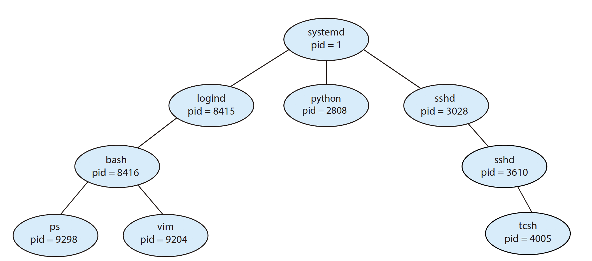

# 2. Process Management

## What is process?

Informally, a process is a program in execution. A program is a _passive_ entity, such as a file containing a list of instructions stored on disk \(often called an **executable file**\). A program becomes a process when an executable file is loaded into memory.

The status of the current activity of a process is represented by the value of the **program counter** and the contents of the **processor’s registers**. The memory layout of a process is typically divided into multiple sections, and is shown in Figure.


* **Text** section—the executable code
* **Data** section—global variables
* **Heap** section—memory that is dynamically allocated during program run time
* **Stack** section—temporary data storage when invoking functions \(such as function parameters, return addresses, and local variables\)

The sizes of the text and data sections are fixed, as their sizes do not change during program run time. The stack and heap sections can shrink and grow dynamically during program execution. 

The figure shown below illustrates the layout of a C program in memory:


Each time a function is called, an **activation record** containing function parameters, local variables, and the return address is **pushed** onto the stack; when control is returned from the function, the activation record is **popped** from the stack. Similarly, the heap will grow as memory is dynamically allocated, and will shrink when memory is returned to the system.

Although the stack and heap sections grow **toward** one another, the operating system must ensure they do not **overlap** one another.

As a process executes, it changes **state**. A process may be in one of the following states: new, running, waiting, ready, terminated. It is important to realize that only one process can be running on any processor core at any instant.


Each process is represented in the operating system by a **process control block** \(**PCB**\)—also called a task control block. On systems that support **multi-threads**, the PCB is expanded to include information for each thread. PCB simply serves as the repository for all the data needed to start, or restart, a process, along with some accounting data.

## Process Scheduling

The objective of multiprogramming is to have some process running at all times so as to maximize CPU utilization. The objective of time sharing is to switch a CPU core among processes so frequently that users can interact with each program while it is running. To meet these objectives, the **process scheduler** selects an available process \(possibly from a set of several available processes\) for program execution on a core. The number of processes currently in memory is known as the **degree of multiprogramming**.

As processes enter the system, they are put into a **ready queue**, where they are ready and waiting to execute on a CPU’s core. This queue is generally stored as a linked list. Processes that are waiting for a certain event to occur — such as completion of I/O — are placed in a **wait queue**.


A common representation of process scheduling is a queueing diagram: the ready queue and a set of wait queues.


A process migrates among the ready queue and various wait queues throughout its lifetime. The role of the **CPU scheduler** is to select from among the processes that are in the ready queue and allocate a CPU core to one of them.

Some operating systems have an intermediate form of scheduling, known as **swapping**, whose key idea is that sometimes it can be advantageous to remove a process from memory \(and from active contention for the CPU\) and thus reduce the degree of multiprogramming. Later, the process can be reintroduced into memory, and its execution can be continued where it left off.

As mentioned, [interrupts](1.-introduction.md#interrupt) cause the operating system to change a CPU core from its current task and to run a kernel routine. Such operations happen frequently on general-purpose systems. When an interrupt occurs, the system needs to **save** the current context of the process running on the CPU core so that it can **restore** that context when its processing is done.

Switching the CPU core to another process requires performing a state save of the current process and a state restore of a different process. This task is known as a **context switch**.


When a context switch occurs, the kernel saves the context of the old process in its PCB and loads the saved context of the new process scheduled to run. Context-switch time is pure overhead, because the system does no useful work while switching. Switching speed varies from machine to machine, a typical speed is a several microseconds\( $$1/10^6$$s \). 


Early versions of iOS did not provide user-application multitasking; only one user application ran in the foreground. Operating-system tasks were multitasked because they were written by Apple and well behaved. [Subsequent versions](https://developer.apple.com/library/archive/releasenotes/General/WhatsNewIniOS/Introduction/Introduction.html) of iOS began to support richer functionality for multi-tasking with fewer restrictions. For example, the larger screen on iPad tablets allowed running two foreground apps at the same time, a technique known as split-screen.

Since its origins, Android has supported multitasking and does not place constraints on the types of applications that can run in the background. If an application requires processing while in the background, the application must use a **service**, a separate application component that runs on behalf of the background process.


## Process Operations

During the course of execution, a process may create several new processes. The creating process is called a parent process, and the new processes are called the children of that process. Each of these new processes may in turn create other processes, forming a **tree of processes**.

Most operating systems \(including UNIX, Linux, and Windows\) identify processes according to a unique **process identifier** \(or **pid**\), which is typically an integer number.



Figure 3.7 illustrates a typical process tree for the Linux operating system. The _systemd_ process \(which always has a pid of 1\) serves as the root parent process for all user processes, and is the first user process created when the system boots.

In general, when a process creates a child process, that child process will need certain resources \(CPU time, memory, files, I/O devices\) to accomplish its task. A child process may be able to obtain its resources directly from the operating system, or it may be constrained to a subset of the resources of the parent process.

A process terminates when it finishes executing its final statement and asks the operating system to delete it by using the `exit()` system call.


Because of resource constraints such as limited memory, mobile operating systems may have to terminate existing processes to reclaim limited system resources. Rather than terminating an arbitrary process, **Android** has identified an importance hierarchy of processes:

* Foreground process—The current process visible on the screen
* Visible process—A process performing an activity that the foreground process is referring to
* Service process—A process performing an activity that is apparent to the user \(such as streaming music\)
* Background process—A process performing an activity not apparent to the user
* Empty process—A process that holds no active components associated with any application



Google’s **Chrome** web browser was designed using a multiprocess architecture. Chrome identifies three different types of processes: browser, renderers, and plug-ins. 

* The browser process is responsible for managing the user interface as well as disk and network. Only one browser process is created.
* Renderer processes contain logic for rendering web pages, a new renderer process is created for each website opened in a new tab.
* A plug-in process is created for each type of plug-in \(such as Flash or QuickTime\) in use.

The advantage of the multiprocess approach is that websites run in isolation from one another. If one website crashes, only its renderer process is affected. Furthermore, renderer processes run in a sandbox, which means that access to disk and network I/O is restricted, minimizing the effects of any security exploits.


## Process Communication

Cooperating processes require an **interprocess communication** \(IPC\) mechanism that will allow them to exchange data. There are two fundamental models of IPC: **shared memory** and **message passing**. Both are common.


### 

We generally think of a server as a **producer** and a client as a **consumer**. For example, a web server produces web content such as HTML files and images, which are consumed by the client web browser requesting the resource.

When shared memory is used for communication between processes, two \(or more\) processes share the same region of memory. POSIX\(Portable Operating System Interface\) provides an API for shared memory.

The Mach operating system uses message passing as its primary form of interprocess communication. Windows provides a form of message passing as well.

A **pipe** provides a conduit for two processes to communicate. There are two forms of pipes, ordinary and named. Ordinary pipes are designed for communication between processes that have a parent–child relationship. Named pipes are more general and allow several processes to communicate.

Two common forms of client–server communication are **sockets** and **remote procedure calls** \(RPCs\). Sockets allow two processes on different machines to communicate over a network. RPCs abstract the concept of function \(procedure\) calls in such a way that a function can be invoked on another process that may reside on a separate computer. The Android operating system uses RPCs as a form of interprocess communication using its [binder](https://developer.android.com/reference/android/os/Binder) framework.

## Threads

A thread is a basic unit of CPU utilization; it comprises a thread ID, a program counter \(PC\), a register set, and a stack. It shares with other threads belonging to the same process its code section, data section, and other operating-system resources, such as open files and signals. A traditional process has a single thread of control. If a process has multiple threads of control, it can perform more than one task at a time.


Notice the distinction between **concurrency** and **parallelism** in this discussion. A concurrent system supports more than one task by allowing all the tasks to make progress. In contrast, a parallel system can perform more than one task simultaneously. Thus, it is possible to have concurrency without parallelism. Before the advent of multiprocessor and multicore architectures, most computer systems had only a single processor, and CPU schedulers were designed to provide the illusion of parallelism by rapidly switching between processes, thereby allowing each process to make progress. Such processes were running concurrently, but not in parallel.

In general, there are two types of parallelism: data parallelism and task parallelism. Data parallelism focuses on distributing subsets of the same data across multiple computing cores and performing the same operation on each core. For example, consider summing the contents of an array of size N. Task parallelism involves distributing not data but tasks \(threads\) across multiple computing cores.

Support for threads may be provided either at the user level, for **user threads**, or by the kernel, for **kernel threads**. Ultimately, a relationship must exist between user threads and kernel threads.


The **many-to-one** model maps many user-level threads to one kernel thread. The entire process will block if a thread makes a blocking system call. Early versions of Java used this model. Very few systems continue to use the model.

The **one-to-one** model maps each user thread to a kernel thread. The only drawback to this model is that creating a user thread requires creating the corresponding kernel thread, and a large number of kernel threads may burden the performance of a system. Linux and Windows implement the one-to-one model.

The **many-to-many** model multiplexes many user-level threads to a smaller or equal number of kernel threads. In practice it is difficult to implement. In addition, with an increasing number of processing cores appearing on most systems, limiting the number of kernel threads has become less important. As a result, most operating systems now use the one-to-one model. However, some contemporary concurrency libraries have developers identify **tasks** that are then mapped to threads using the many-to-many model.

### Libraries

A **thread library** provides the programmer with an API for creating and managing threads. Three main thread libraries are in use today: POSIX Pthreads, Windows, and Java.

Before we proceed with our examples of thread creation, we introduce two general strategies for creating multiple threads: **asynchronous** threading and **synchronous** threading. With asynchronous threading, once the parent creates a child thread, the parent resumes its execution, so that the parent and child execute concurrently and independently of one another. Asynchronous threading is the strategy used in the multithreaded server and is also commonly used for designing responsive user interfaces.

Synchronous threading occurs when the parent thread creates \(**forks**\) one or more children and then must wait for all of its children to terminate and **join** it before it resumes. Only after all of the children have joined can the parent resume execution. Typically, synchronous threading involves significant data sharing among threads. For example, the parent thread may combine the results calculated by its various children. \(\*All of the following examples use synchronous threading.\)


The Java [_Executor_](https://docs.oracle.com/javase/7/docs/api/java/util/concurrent/Executor.html) framework is based on the **producer-consumer** model; tasks implementing the _Runnable_ interface are produced, and the threads that execute these tasks consume them. The advantage of this approach is that it not only divides thread creation from execution but also provides a mechanism for communication between concurrent tasks.

The **JVM** is typically implemented on top of a host operating system. This setup allows the JVM to hide the implementation details of the underlying operating system and to provide a consistent, abstract environment that allows Java programs to operate on any platform that supports a JVM. The specification for the JVM does not indicate how Java threads are to be mapped to the underlying operating system, instead leaving that decision to the particular implementation of the JVM. For example, for the Windows might use the Windows API; Linux and macOS systems might use the Pthreads API.

Unlike many other operating systems, Linux does not distinguish between processes and threads; instead, it refers to each as a task. The Linux `clone()` system call can be used to create tasks that behave either more like processes or more like threads.

### Implicit threading

One way to address these difficulties and better support the design of concurrent and parallel applications is to transfer the creation and management of threading from application developers to compilers and run-time libraries. This strategy, termed implicit threading, is an increasingly popular trend, requires application developers to identify **tasks**—not threads—that can run in parallel. A task is usually written as a function, which the run-time library then maps to a separate thread, typically using the many-to-many model.

In multithreaded web server, if we allow each concurrent request to be serviced in a new thread, we have not placed a bound on the number of threads concurrently active in the system. Unlimited threads could exhaust system resources, one solution to this problem is to use a **thread pool**.

The general idea behind a thread pool is to create a number of threads at start-up and place them into a pool, where they sit and wait for work. When a server receives a request, rather than creating a thread, it instead submits the request to the thread pool and resumes waiting for additional requests. If there is an available thread in the pool, it is awakened, and the request is serviced immediately. If the pool contains no available thread, the task is queued until one becomes free. Once a thread completes its service, it returns to the pool and awaits more work.

Apple's Grand Central Dispatch \(GCD\) schedules tasks for run-time execution by placing them on a **dispatch queue**. Internally, GCD’s thread pool is composed of POSIX threads. GCD actively manages the pool, allowing the number of threads to grow and shrink according to application demand and system capacity.

## CPU Scheduling

On modern operating systems it is kernel-level threads—not processes—that are in fact being scheduled by the operating system.

Process execution consists of a cycle of CPU execution and I/O wait. Processes alternate between these two states. Process execution begins with a **CPU burst**. That is followed by an **I/O burst**, and so on. Eventually, the final CPU burst ends with a system request to terminate execution. An I/O-bound program typically has many _short_ CPU bursts. A CPU-bound program might have a few _long_ CPU bursts. This distribution can be important when implementing a CPU-scheduling algorithm.

Whenever the CPU becomes idle, the operating system must select one of the processes in the ready queue to be executed. The selection process is carried out by the **CPU scheduler**. The records in the queues are generally process control blocks \(PCBs\) of the processes.

CPU-scheduling decisions may take place under the following four circumstances:

1. When a process switches from the running state to the waiting state 
2. When a process switches from the running state to the ready state
3. When a process switches from the waiting state to the ready state 
4. When a process terminates

When scheduling takes place only under circumstances 1 and 4, we say that the scheduling scheme is **non-preemptive** or cooperative. Otherwise, it is **pre-emptive**. Virtually all modern operating systems including Windows, macOS, Linux, and UNIX use **preemptive** scheduling algorithms.

The **dispatcher** is the module that gives control of the CPU’s core to the process selected by the CPU scheduler. This function involves the following: Switching context from one process to another; Switching to user mode; Jumping to the proper location in the user program to resume that program.


## Process Synchronization

A situation where several processes access and manipulate the same data concurrently and the outcome of the execution depends on the particular order in which the access takes place, is called a **race condition**. To guard against the race condition, we require that the processes be **synchronized** in some way.

Consider a system consisting of n processes. Each process has a segment of code, called a **critical section**, in which the process may be accessing — and updating — data that is shared with at least one other process. The important feature of the system is that, when one process is executing in its critical section, no other process is allowed to execute in its critical section.

```c
while(true) {
    // entry section
    critical section
    // exit section
    remainder section
}
```

......

