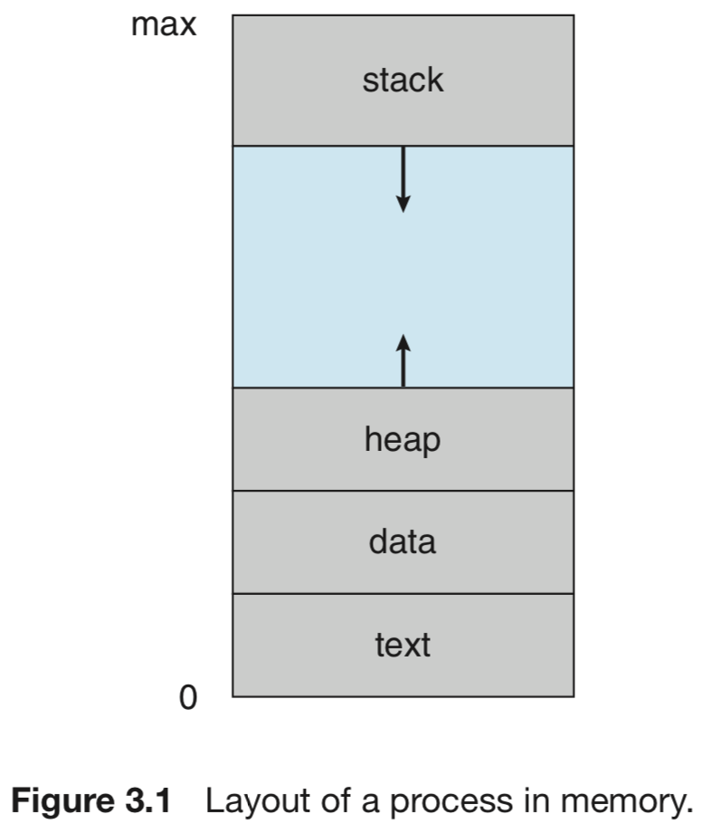

# 2. Process Management

Informally, a process is a program in execution. The status of the current activity of a process is represented by the value of the **program counter** and the contents of the **processor’s registers**. The memory layout of a process is typically divided into multiple sections, and is shown in Figure.

* **Text** section—the executable code
* **Data** section—global variables
* **Heap** section—memory that is dynamically allocated during program run time
* **Stack** section—temporary data storage when invoking functions \(such as function parameters, return addresses, and local variables\)

The sizes of the text and data sections are fixed, as their sizes do not change during program run time. The stack and heap sections can shrink and grow dynamically during program execution.

The figure shown below illustrates the layout of a C program in memory:

Each time a function is called, an **activation record** containing function parameters, local variables, and the return address is pushed onto the stack; when control is returned from the function, the activation record is popped from the stack. Similarly, the heap will grow as memory is dynamically allocated, and will shrink when memory is returned to the system. Although the stack and heap sections grow **toward** one another, the operating system must ensure they do not **overlap** one another.

A program is a passive entity, such as a file containing a list of instructions stored on disk \(often called an **executable file**\). A program becomes a process when an executable file is loaded into memory.

As a process executes, it changes **state**. A process may be in one of the following states: new, running ,waiting, ready, terminated. It is important to realize that only one process can be **running** on any processor core at any instant.

Each process is represented in the operating system by a **process control block** \(**PCB**\)—also called a task control block. On systems that support multi-**threads**, the PCB is expanded to include information for each thread.

