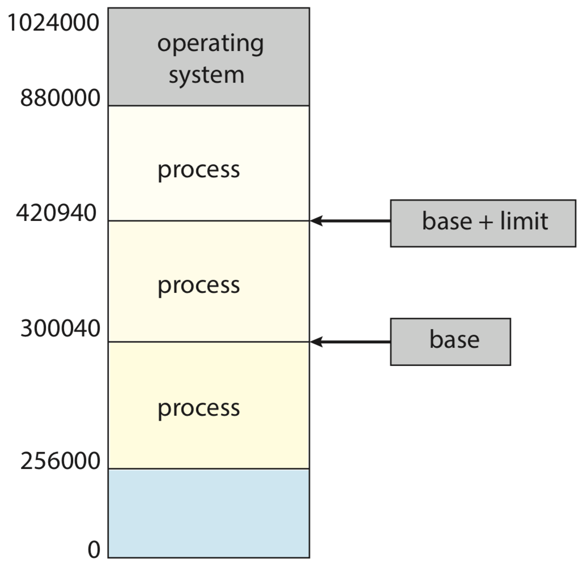

# 3. Memory Management

## Main Memory

Memory consists of a large array of bytes, each with its own address. A typical instruction-execution cycle, for example, first fetches an instruction from memory. The instruction is then decoded and may cause operands to be fetched from memory. After the instruction has been executed, results may be stored back in memory.

We first need to make sure that each process has a separate memory space. We can provide this protection by using two registers, the **base register** holds the smallest legal physical memory address; the **limit register** specifies the size of the range.



Addresses in the source program are generally symbolic \(such as the variable _count_\). A compiler typically binds these symbolic addresses to relocatable addresses \(such as “14 bytes from the beginning of this module”\). The linker or loader in turn binds the relocatable addresses to absolute addresses \(such as 74014\). Each binding is a mapping from one address space to another. If the process can be moved during its execution from one memory segment to another, then binding must be delayed until **run time**. Most operating systems use this method.

An address generated by the CPU is commonly referred to as a **logical address**, whereas an address seen by the memory unit—that is, the one loaded into the memory-address register of the memory—is commonly referred to as a **physical address**.

Binding addresses at either compile or load time generates identical logical and physical addresses. However, the execution-time address-binding scheme results in differing logical and physical addresses. In this case, we usually refer to the logical address as a **virtual address**. The run-time mapping from virtual to physical addresses is done by a hardware device called the **memory-management unit** \(MMU\).

To obtain better memory-space utilization, we can use **dynamic loading**. The main program is loaded into memory and is executed. Other routines are loaded only when they are needed. In such a situation, although the total program size may be large, the portion that is used \(and hence loaded\) may be much smaller.

**Dynamically linked libraries** \(DLLs\) are system libraries that are linked to user programs when the programs are run. **Dynamic linking**, in contrast, is similar to dynamic loading. Here, though, linking, rather than loading, is postponed until execution time. This feature is usually used with system libraries, such as the standard C language library. Without this facility, each program on a system must include a copy of its language library in the executable image. A second advantage of DLLs is that these libraries can be shared among multiple processes, so that only one instance of the DLL in main memory. For this reason, DLLs are also known as shared libraries, and are used extensively in Windows and Linux systems.

The memory is usually divided into two partitions: one for the operating system and one for the user processes. Most operating systems place the operating system in high memory address.

### Paging

Paging is a memory-management scheme that permits a process’s physical address space to be non-contiguous. The basic method for implementing paging involves breaking physical memory into fixed-sized blocks called **frames** and breaking logical memory into blocks of the same size called **pages**. When a process is to be executed, its pages are loaded into any available memory frames from their source.

Every address generated by the CPU is divided into two parts: a **page number** \(p\) and a **page offset** \(d\). The page number is used as an index into a per-process **page table**. The page table contains the base address of each frame in physical memory, and the offset is the location in the frame being referenced.


The page size \(like the frame size\) is defined by the hardware. For instance, on x86-64 systems, Windows 10 supports page sizes of 4 KB and 2 MB. Linux also supports two page sizes: a default page size \(typically 4 KB\) and an architecture-dependent larger page size called **huge pages**.

```c
// OBTAINING THE PAGE SIZE ON LINUX SYSTEMS
zsh$ getconf PAGESIZE
```

The programmer views memory as one single space, containing only this one program. In fact, the user program is scattered throughout physical memory, which also holds other programs. The logical addresses are translated into physical addresses. This mapping is hidden from the programmer and is controlled by the operating system.

Since the operating system is managing physical memory, it must be aware of the allocation details of physical memory—which frames are allocated, which frames are available, how many total frames there are, and so on. This information is generally kept in a single, system-wide data structure called a **frame table**.

### Swapping

A process, or a portion of a process, can be **swapped** temporarily out of memory to a **backing store** and then brought back into memory for continued execution.

Standard swapping involves moving entire processes between main memory and a backing store. However, most systems, including Linux and Windows, now use a variation of swapping in which pages of a process—rather than an entire process—can be swapped.

A **page out** operation moves a page from memory to the backing store; the reverse process is known as a **page in**.

Instead of using swapping, when free memory falls below a certain threshold, Apple’s iOS asks applications to voluntarily relinquish allocated memory. Applications that fail to free up sufficient memory may be terminated by the operating system. Android adopts a similar strategy.

## Virtual Memory

Virtual memory is a technique that allows the execution of processes that are not completely in memory. This separation allows an extremely large virtual memory to be provided for programmers when only a smaller physical memory is available.

Recall that the [stack and heap sections grow toward one another](2.-process-management.md#what-is-process), the operating system must ensure they do not overlap one another. The large blank space \(or **hole**\) between the heap and the stack is part of the virtual address space but will require actual physical pages only if the heap or stack grows.

### Demand Paging

The instructions being executed must be in physical memory.

The first approach to meeting this requirement is to place the entire logical address space in physical memory. In fact, in many cases, the entire program is not needed. For instance:

* Code to handle unusual error conditions which seldom, if ever, occur in practice.
* Arrays, lists, and tables are often allocated more memory than they actually need.
* Certain options and features of a program may be used rarely.

Even in those cases where the entire program is needed, it may not all be needed at the same time.

An alternative strategy is to load pages only as they are needed, known as **demand paging** and is commonly used in virtual memory systems.

While a process is executing, some pages will be in memory, and some will be in secondary storage. The valid–invalid bit scheme can be used for this purpose. When the bit is set to “_valid_,” the associated page is both legal and in memory. If the bit is set to “_invalid_,” the page either is not valid \(that is, not in the logical address space of the process\) or is valid but is currently in secondary storage.


Access to a page marked invalid causes a **page fault**. The paging hardware, in translating the address through the page table, will notice that the invalid bit is set, causing a **trap** to the operating system.


The hardware to support demand paging is the same as the hardware for paging and swapping:

* Page table. This table has the ability to mark an entry invalid through a valid–invalid bit or a special value of protection bits. 
* Secondary memory. The secondary memory is usually a high-speed disk or NVM device. It is known as the swap device, and the section of storage used for this purpose is known as **swap space**.

When a page fault occurs, the operating system must bring the desired page from secondary storage into main memory. To resolve page faults, most operating systems maintain a **free-frame list**, a pool of free frames for satisfying such requests. When a system starts up, all available memory is placed on the free-frame list. As free frames are requested, the size of the free-frame list shrinks. At some point, the list either falls to zero or falls below a certain **threshold**, at which point it must be repopulated.

### Copy-on-Write

Recall that the `fork()` system call creates a child process that is a duplicate of its parent. We use a technique known as **copy-on-write**, which works by allowing the parent and child processes initially to share the same pages, marked as copy-on-write pages, meaning that if either process writes to a shared page, a copy of the shared page is created.

### Page Replacement

Page replacement takes the following approach. If no frame is free, we find one that is not currently being used and free it. We can free a frame by writing its contents to swap space and changing the page table to indicate that the page is no longer in memory. We can now use the freed frame to hold the page for which the process faulted.

When we select a page for replacement, we examine its **modify bit**. The modify bit for a page is set by the hardware whenever any byte in the page is written into, indicating that the page has been modified.

If the bit is set, we know that the page has been modified since it was read in from secondary storage. In this case, we must write the page to storage. If the modify bit is not set, however, the page has not been modified since it was read into memory. In this case, we need not write the memory page to storage: it is already there. This technique also applies to **read-only** pages. Such pages cannot be modified; thus, they may be discarded when desired. This scheme can significantly reduce the time required to service a page fault, since it reduces I/O time by one-half if the page has not been modified.

We must solve two major problems to implement demand paging, that is, if we have multiple processes in memory, we must decide how many frames to allocate to each process; and when page replacement is required, we must select the frames that are to be replaced.

### Thrashing

Consider what occurs if a process does not have “enough” frames—that is, it does not have the minimum number of frames it needs to support pages in the working set. The process will quickly page-fault. At this point, it must replace some page. However, since all its pages are in active use, it must replace a page that will be needed again right away. Consequently, it quickly faults again, and again, and again, replacing pages that it must bring back in immediately. This high paging activity is called **thrashing**. A process is thrashing if it is spending more time paging than executing.

### Memory Compression

Mobile systems generally do not support either standard swapping or swapping pages. Thus, **memory compression** is an integral part of the memory-management strategy in Android and iOS. In addition, both Windows 10 and macOS support memory compression.

Here, rather than paging out modified frames to swap space, we compress several frames into a single frame, enabling the system to reduce memory usage without resorting to swapping pages. If one of the compressed frames is later referenced, a page fault occurs, and the compressed frame is decompressed, restoring into memory.


