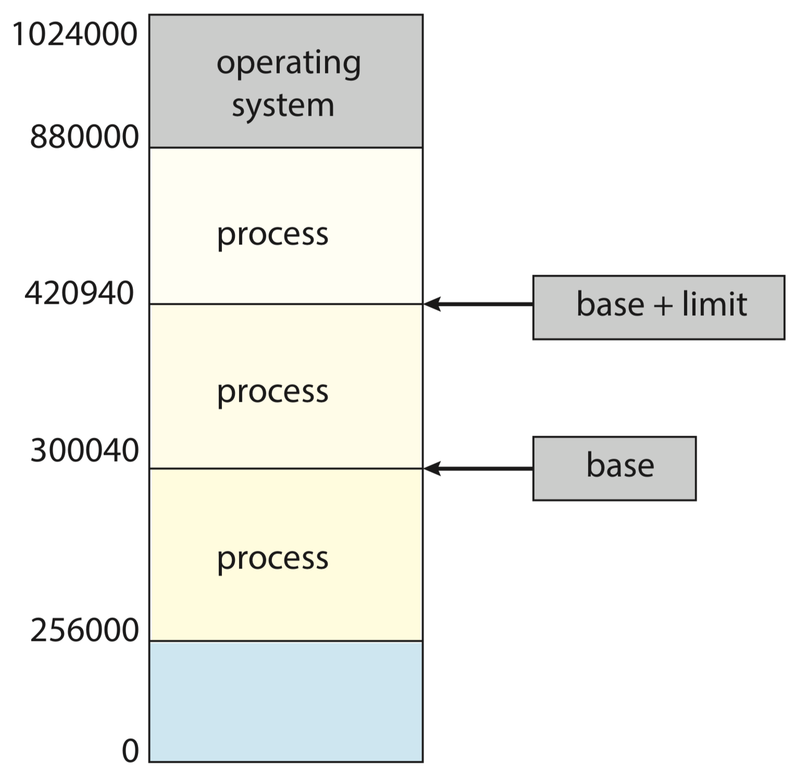
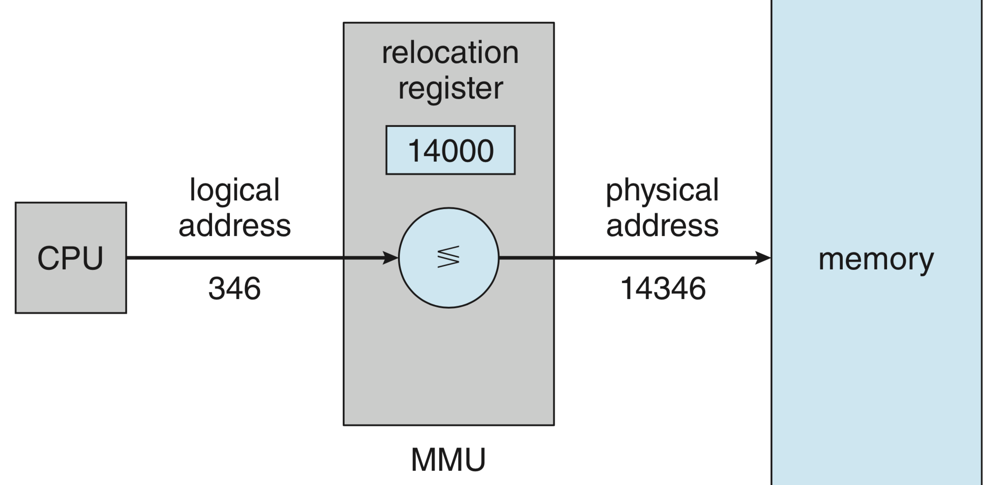

# 3.1 Main Memory

Memory consists of a large array of bytes, each with its own address.

A typical instruction-execution cycle, for example, first fetches an instruction from memory. The instruction is then decoded and may cause operands to be fetched from memory. After the instruction has been executed, results may be stored back in memory.

**Main memory** and the **registers** are the only general-purpose storage that the CPU can access directly. Registers are generally accessible within one cycle of the CPU clock. Completing a memory access may take many cycles of the CPU clock.

We first need to make sure that each process has a separate memory space. We can provide this protection by using two registers, the **base register** holds the smallest legal physical memory address; the **limit register** specifies the size of the range.

**Address Binding**: Addresses in the source program are generally symbolic \(such as the variable _count_\). A compiler typically binds these symbolic addresses to relocatable addresses \(such as “14 bytes from the beginning of this module”\). The linker or loader in turn binds the relocatable addresses to absolute addresses \(such as 74014\). Each binding is a mapping from one address space to another.

Classically, the binding of instructions and data to memory addresses can be done at any step along the way:

* Compile time: If you know at compile time where the process will reside in memory, then **absolute code** can be generated.
* Load time: If it is not known at compile time where the process will reside in memory, then the compiler must generate **relocatable code**. In this case, final binding is delayed until load time.
* **Execution time**: If the process can be moved during its execution from one memory segment to another, then binding must be delayed until run time. _**Most operating systems use this method**_.

An address generated by the CPU is commonly referred to as a **logical address**, whereas an address seen by the memory unit—that is, the one loaded into the memory-address register of the memory—is commonly referred to as a **physical address**.

Binding addresses at either compile or load time generates identical logical and physical addresses. However, the execution-time address-binding scheme results in differing logical and physical addresses. In this case, we usually refer to the logical address as a **virtual address**. We use logical address and virtual address interchangeably in this text. The set of all logical addresses generated by a program is a **logical address space**. The set of all physical addresses corresponding to these logical addresses is a **physical address space**. Thus, in the execution-time address-binding scheme, the logical and physical address spaces differ.

We now have two different types of addresses: logical addresses \(in the range \[ _0_, _max_ \]\) and physical addresses \(in the range \[ _R+0, R+max_ \] for a base value _R_ \). The run-time mapping from virtual to physical addresses is done by a hardware device called the memory-management unit \(MMU\).

To obtain better memory-space utilization, we can use **dynamic loading**. The main program is loaded into memory and is executed. Other routines are loaded only when they are needed. In such a situation, although the total program size may be large, the portion that is used \(and hence loaded\) may be much smaller.

**Dynamically linked libraries** \(DLLs\) are system libraries that are linked to user programs when the programs are run. **Dynamic linking**, in contrast, is similar to dynamic loading. Here, though, linking, rather than loading, is postponed until execution time. This feature is usually used with system libraries, such as the standard C language library. Without this facility, each program on a system must include a copy of its language library \(or at least the routines referenced by the program\) in the executable image. A second advantage of DLLs is that these libraries can be shared among multiple processes, so that only one instance of the DLL in main memory. For this reason, DLLs are also known as shared libraries, and are used extensively in Windows and Linux systems.

The memory is usually divided into two partitions: one for the operating system and one for the user processes. Most operating systems place the operating system in high memory address.

**Paging** is a memory-management scheme that permits a process’s physical address space to be non-contiguous. The basic method for implementing paging involves breaking physical memory into fixed-sized blocks called **frames** and breaking logical memory into blocks of the same size called **pages**. When a process is to be executed, its pages are loaded into any available memory frames from their source.

Every address generated by the CPU is divided into two parts: a **page number** \(p\) and a **page offset** \(d\):

