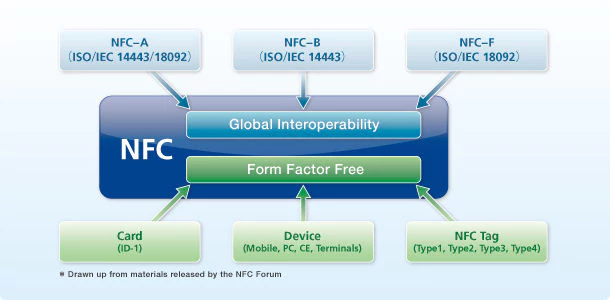
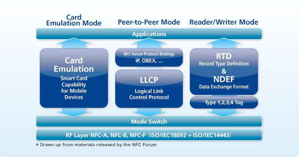
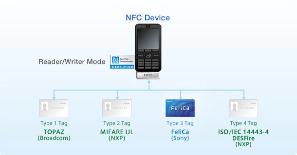

# NFC

## Reference

[https://www.sony.net/Products/felica/NFC/index.html](https://www.sony.net/Products/felica/NFC/index.html)

## Glance

NFC stands for Near Field Communication - a wireless communication technology operating at 13.56 MHz over a short distance of approximately 10 cm. This technology enables communication among electronic devices, as well as between such devices and conventional _contactless IC cards_.

The basis of NFC technology is the international standard ISO/IEC 18092 \(NFCIP-1\). In addition to **NFCIP-1**, NFC is defined by specifications developed by the NFC Forum, a non-profit industry association.

In the NFC Forum specifications, the **Type-A** and **Type-B** communication technologies specified in the contactless IC card international standard **ISO/IEC 14443** are called **NFC-A** and **NFC-B**, respectively. The FeliCa communication technology, based on the Japanese Industrial Standard JIS X 6319.4, is called **NFC-F**. NFC Forum develops specifications to realize global compatibility and consistent handling of these technologies.

NFC-F, the FeliCa communication technology, is defined as one of the communication methods specified in NFCIP-1 and by the NFC Forum. As a result, all NFC devices support NFC-F communication.

## NFC: applications in 3 key areas

Reference: [https://nfc-forum.org/wp-content/uploads/2017/08/NFC-Real-World-II.pdf](https://nfc-forum.org/wp-content/uploads/2017/08/NFC-Real-World-II.pdf)

Three key areas of application for NFC: 

* Service initiation, where the technology is used to ‘unlock’ another service. By touching an NFC-enabled mobile phone against the NFC tag embedded in the poster, the user may be directed to a web site for further information or to book tickets.
* Peer-to-peer, where NFC is used to enable communication between two devices; For relatively **small** amounts of information \(_up to a few kilobytes_\), NFC can be used to transmit the data itself. However, for **larger** amounts of data, NFC is more likely to be used to _establish a separate wireless connection_ \(such as Bluetooth or WiFi\) to carry the content to be exchanged.
* Payment & Ticketing, where NFC will build on the emerging smart ticketing and electronic payment infrastructures.

## NFC: device operates in 3 modes

In **Card Emulation** mode, the NFC-enabled device communicates with an external reader much like a traditional contactless smart card.

**Peer-to-peer** mode enables two NFC-enabled devices to communicate with each other to exchange information and share files. Peer-to-peer mode is standardized on the ISO/IEC 18092 standard.

In **reader/writer** mode, the NFC-enabled device is capable of reading NFC Forum-mandated tag types.

## NFC: 4 tag types each device has to support

In June 2006, the NFC Forum introduced standardized technology architecture, initial specifications and tag formats for NFC-compliant devices. These include Data Exchange Format \(**NDEF**\), and three initial Record Type Definition \(**RTD**\) specifications for smart poster, text and Internet resource reading applications.

In addition, the NFC Forum announced the initial set of **four tag formats** that all NFC Forum-compliant devices **must support**. These are based on **ISO 14443 Types A and B** \(the international standards for contactless smartcards\) and **FeliCa** \(conformant with the ISO 18092, passive communication mode, standard\).

* Type 1 is based on ISO 14443 A and is currently available exclusively from Innovision Research & Technology \(TopazTM\). It has a 96-byte memory capacity.
* Type 2 is also based on ISO 14443 A and is currently exclusively available from Philips \(MIFARE UltraLight\). It has half the memory capacity of Type 1 tags.
* Type 3 is based on **FeliCa** and is currently exclusively available from **Sony**. It has a larger memory \(currently 2kbyte\) and operates at a higher data rate \(212kbit/s\).
* Type 4 is fully compatible with ISO 14443A/B and is available from a number of

  manufacturers, including Philips \(typical product example is MIFARE DESFire\).

  It offers large memory-addressing capability with read speeds of between

  106kbit/s and 424kbit/s.

## NFC: in iOS 11

With the iOS 11 release, Apple took NFC beyond just payments by allowing the iPhone to scan NFC tags. However, there were a number of restrictions. Firstly, an App was required. There was no native NFC tag scanning. Secondly, the App needed to be open. Thirdly, the App **only had access to the NDEF data space on the chip**. In simple terms that means that the App could only read the main memory space on the chip and not access more advanced features such as counters or security settings. Additionally, Apps **could not write** to the tags, they could only read.

