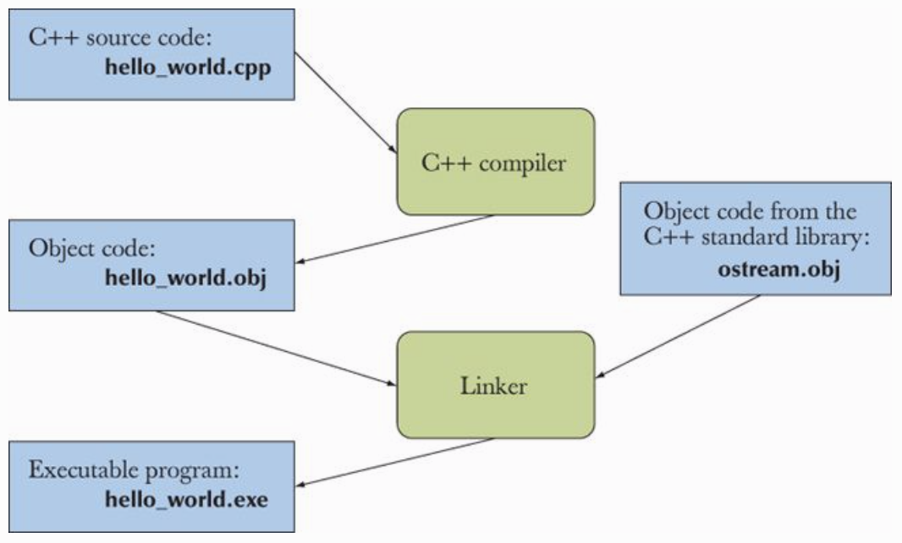

# Programming: C++

## Getting Started

C++, like C, is designed to let programs get close to the hardware when necessary.

C++ is a compiled language. What you read and write is called **source code**, and what the computer executes is called executable, **object code**, or machine code. Typically object code files are given the suffix .o \(Unix\).

A program usually consists of several separate parts, often developed by different people. These separate parts must be linked together to form an **executable** program. Object code and executables are not portable among systems.

In macOS, start with a new Xcode project for command line application, you can also compile the .cpp file in command: `$clang++ -std=c++11 main.cpp`.

**File Redirection** lets us associate a named file with the standard input and the standard output. The command `$./a.out <infile >outfile` will read transactions from a file named infile and write its output to a file named outfile in the current directory.

