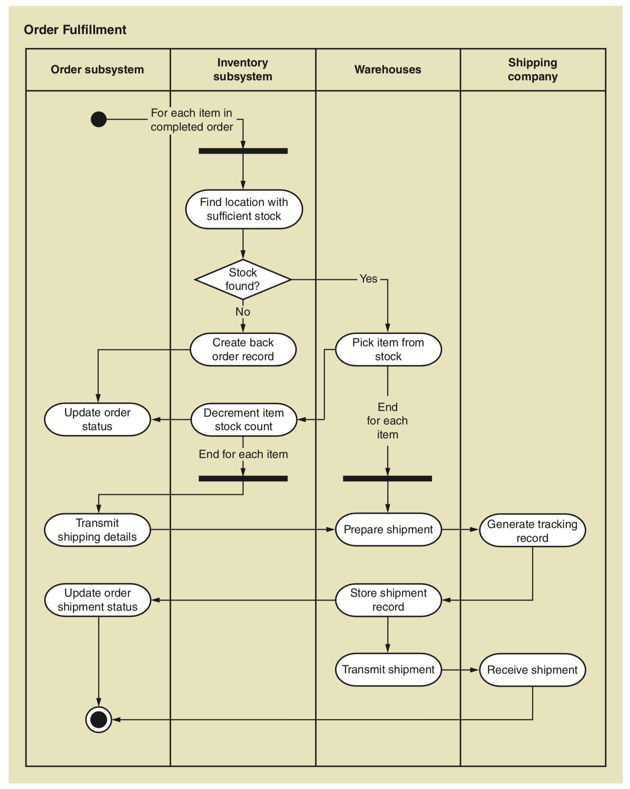

# 2. Systems Analysis Activities

The term **technology architecture** describes the set of computing hardware, network hardware and topology, and system software— such as operating and database management systems—employed by an organization.

The term **application architecture** describes how software resources are organized and constructed to implement an organization’s information systems.

## Activities

* Gather detailed information
* Define requirements
* Prioritize requirements
* Develop user-interface dialogs 
* Evaluate requirements with users

To fully understand system analysis activities, you need to answer a fundamental question: What are requirements?

## Requirements

**System requirements** are all the activities the new system must perform or support and the constraints that the new system must meet. Generally, analysts divide system requirements into two categories: **functional** and **nonfunctional** requirements.

* Functional requirements are the activities that the system must perform. \(Business rules and processes\)
* Nonfunctional requirements are characteristics of the system other than those activities it must perform or support.

It is not always easy to distinguish functional from nonfunctional requirements. One way to do so is to use a framework for identifying and classifying requirements. There have been many such frameworks developed over time; the most widely used today is called **FURPS+**.

* F: functional requirements
* U: usability
* R: reliability
* P: performance
* S: security

+ is an extension of FURPS that adds additional categories, including design constraints as well as implementation, interface, physical, and supportability requirements.

As with any set of requirements categories, FURPS+ has some gray areas and some overlaps among its categories. The answers to such questions are not important. What is important is that all requirements be identified and precisely stated early in the development process and that inconsistencies or trade-offs among them be resolved.

## Models

Analysts build models to describe system requirements and use those models to communicate with users and designers. As with any development activity, an iterative approach is used for creating models. The first draft of a model has some but not all details worked out. The next iteration might fill in more details or correct previous misconceptions.

Analysis and design models can be grouped into three generic types:

* Textual models: text-based system models such as memos, reports, narratives, and event lists. Narrative description is often the best way to initially record information gathered verbally from stakeholders, such as during an interview. In many cases, narratives and other textual models are later converted into a graphical format.
* Graphical models: use pictures and other graphical elements. Many graphical models used in system development are drawn according to the notation specified by the Unified Modeling Language \(**UML**\).
* Mathematical models: formulas

UML is the standard set of diagrams and model constructs used in system development.

## Stakeholders

Stakeholders are your primary _source_ of information for system requirements. Before gathering detailed information, the analyst identifies every type of stakeholder _who_ has an interest in the new system and ensures that critical people from each stakeholder category are available to serve as the business experts.

## Information-Gathering Techniques

Analysts use many techniques to gather information about requirements, including:

* Interviewing users and other stakeholders 
* Distributing and collecting questionnaires
* Reviewing inputs, outputs, and documentation
* Observing and documenting business procedures
* Researching vendor solutions
* Collecting active user comments and suggestions

## Documenting Workflows with Activity Diagrams

As you gather information about business processes, you will need to document your results.

A **workflow** is the sequence of processing steps that completely handles one business transaction or customer request.

An **activity diagram** describes the various user \(or system\) activities, the person who does each activity, and the sequential flow of these activities.

Creating activity diagrams to document workflows is straightforward. The first step is to identify the **agents** to create the appropriate **swimlanes**. Next, follow the various steps of the workflow and then make appropriate **ovals** for the activities. Connect the activity ovals with **arrows** to show the workflow.

## Use Case

A **use case** is an activity the system performs, usually in response to a request by a user. Two techniques are recommended for identifying use cases: the **user goal** technique \(to ask/interview users\) and the **event decomposition** technique. An additional technique, known as the CRUD technique, is often used to validate and enhance the list of use cases.

The appropriate level of detail for identifying use cases is one that focuses on elementary business processes \(EBPs\). An **EBP** is a task that is performed by one person in one place in response to a business **event**, adds measurable business value, and leaves the system and its data in a stable and consistent state.

There are three types of events to consider when using the event decomposition technique to identify use cases: 

* external events: occurs outside the system—usually initiated by an external agent or actor.
* temporal events: an event that occurs as a result of reaching a point in time, like _monthly statements, summary reports._
* and state events \(also called internal events\): an event that occurs when something happens inside the system that triggers the need for processing.

## Use Case Diagrams

The use case diagram is the UML model used to graphically show the use cases and their relationship to users.

In UML, the person who uses the system is called an **actor**. An actor is always outside the **automation boundary** of the system but may be part of the manual portion of the system. Sometimes, the actor is not a person; instead, it can be another system or device that receives services from the system.

