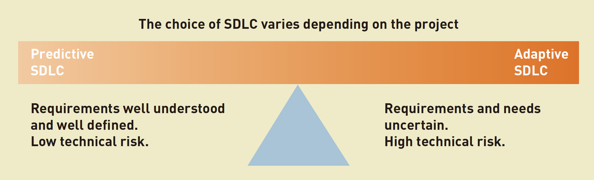
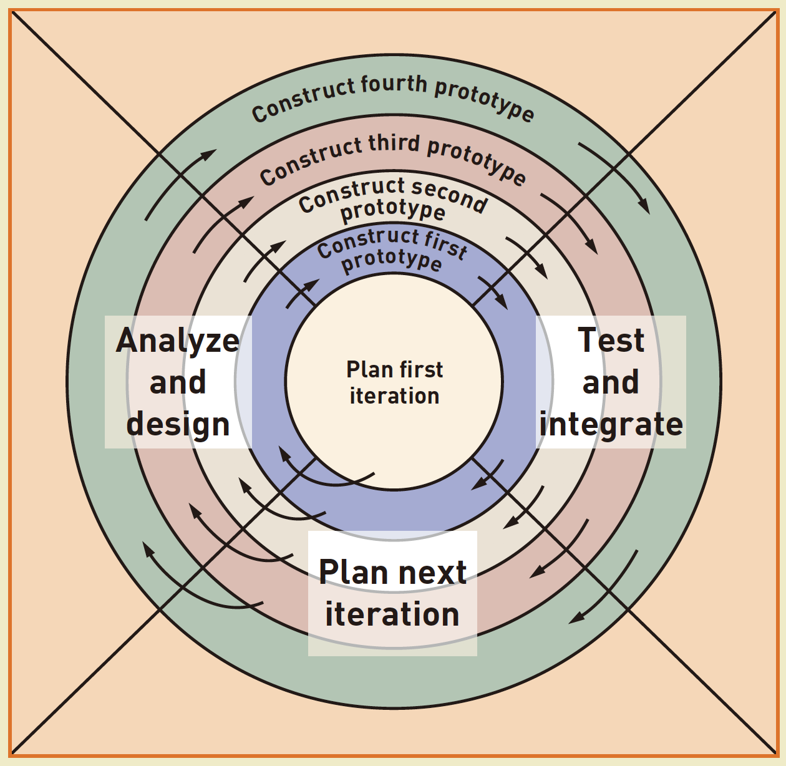

# 4. Project Management

## SDLC

The systems development life cycle \(SDLC\), which was introduced in Chapter 1, is
 a fundamental concept in the success of information system development projects.

In today’s diverse development environment, there are many approaches to
 developing systems, and they are based on different approaches to the SDLC.
 Although it is difficult to find a single, comprehensive classification system that
 encompasses all the approaches, one useful way to categorize them is along a
 continuum from predictive to adaptive.

A **predictive** approach to the SDLC assumes that the development project
 can be planned and organized and that the new information system can be
 developed according to the plan. Predictive SDLCs are useful for building 
systems that are well understood and defined.

An **adaptive** approach to the SDLC is used when the system’s requirements 
and/or the users’ needs aren’t well understood. In this situation, the project can’t 
be planned completely. Some system requirements may need to be determined
 after preliminary development work.

In practice, any project could have—and most do have—predictive and 
adaptive elements. That is why Figure 8-1 shows them as endpoints along a
 continuum, not as mutually exclusive categories.

The most predictive SDLC approach is called a **waterfall** **model**, with the phases of the project 
flowing down, one after another.

A little farther to the right on the predictive/adaptive scale are _modified waterfall
 models_. These are still predictive—that is, they still assume a fairly thorough
 plan—but there is a recognition that the project’s phases must overlap, influencing 
and depending on each other.

There are many ways to depict an adaptive 
SDLC. All include iterations. Rather than having the six phases proceed sequentially
 with some overlap, iterations can be used to create a series of mini-projects that 
address smaller parts of the application.

At the far right on the predictive/adaptive scale is the **spiral model**. It
 is generally considered to be one of 
the earliest conceptualizations of adapting the project based on the results of
each iteration.

The adaptive approach presented in this textbook is
 a simplification of and variation on a more formal iterative approach called the
 **Unified Process** \(UP\).

A related concept to an iterative SDLC is called **incremental development**. 
Incremental development is an SDLC 
approach that completes portions of the system 
in small increments across iterations, with each
 increment being integrated into the whole as it
is completed. Yet another related concept, which is also based on an iterative approach, is
 the idea of a **walking skeleton**.

The predictive waterfall SDLC explicitly includes a support phase, but adaptive, 
iterative SDLCs typically don’t. In fact, newer adaptive SDLCs consider **support**
 to be an entirely separate project worthy of its own support methodology. They begin only after
 the new system has been installed and put into production.

## Methodology

Aside from an SDLC, systems developers have a variety of aids at their disposal
to help them complete activities and tasks. A system development **methodology** is a set of comprehensive guidelines for the SDLC 
that includes specific **models**, **tools**, and
 **techniques**.

Most of the models used in system development are graphical models, and the UML diagrams you have
 encountered so far in this book are examples.

Another important kind of model is a project-planning model, such as
 a **Gantt chart** or **net present value** \(NPV\).

Tools have been specifically designed to help system developers.
 Programmers should be familiar with integrated development environments
\(**IDEs**\). **Visual 
modeling tools** are available to systems analysts to help them create and verify
 important system models.

Techniques are like gathering information, defining functional requirements, or user-interface design techniques as we discussed before.

All system developers should be familiar with two very general approaches 
to software construction and modeling because these form the basis of virtually 
all methodologies: the **structured** approach and the **object-oriented** approach.

## Agile Development

