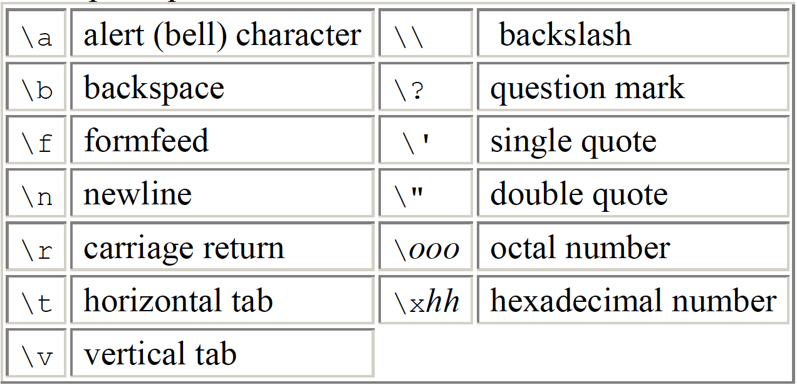

# 2. Type, Operators, Expressions

**Variable Names** are made up of letters and digits; the first character must be a letter. The underscore "\_" counts as a letter. Don't begin variable names with underscore. Upper and lower case letters are distinct.

There are only a few **basic data types** in C: char, int, float, double.

In addition, there are a number of **qualifiers** that can be applied to these basic types.

* _short_ and _long_ apply to integers, _int_ can be omitted.
* _signed_ or _unsigned_ may be applied to _char_ or any integer.
* _long double_ specifies extended-precision floating point.

An integer **constant** like `1234` is an int. A long constant is written with a **terminal** l or L, as in `123456789L`; 

Unsigned constants are written with a terminal u or U, and the suffix ul or UL indicates unsigned long.

Floating-point constants contain a decimal point \(123.4\) or an exponent \(1e-2\) or both; their type is **double**, unless suffixed. The suffixes f or F indicate a float constant; l or L indicate a long double.

A leading 0 \(zero\) on an integer constant means octal \(八进制\); a leading 0x or 0X means hexadecimal \(十六进制\). For example, decimal \(十进制\) 31 can be written as 037 in octal and 0x1f or 0x1F in hex. 0XFUL is an unsigned long constant with value 15 decimal.

A **character constant** is an integer, written as one character within single quotes, such as 'x'.

The complete set of **escape sequences** is：

The character constant '\0' represents the character with value zero, the **null** character.

A **constant expression** is an expression that involves only constants. Such expressions may be evaluated at during **compilation** rather than **run-time**.

A **string constant**, is a sequence of zero or more characters surrounded by double quotes, as in "I am a string". Technically, a string constant is **an array of characters**. The internal representation of a string has a null character '\0' at the end, so the physical storage required is one more than the number of characters written between the quotes.

There is one other kind of constant, the **enumeration** constant. An enumeration is a list of constant **integer values**, as in `enum boolean { NO, YES };`The first name in an enum has value 0, the next 1, and so on, unless explicit values are specified.

Automatic variables for which is no explicit **initializer** have undefined \(i.e., garbage\) values.

The qualifier **const** can be applied to the declaration of any variable to specify that its value will not be changed. For an **array**, the const qualifier says that the elements will not be altered.

The binary arithmetic operators are `+, -, *, /`, and the modulus operator `%`. Integer division **truncates** any fractional part.

The relational operators are `>=, >, <, <=`. The equality operators are `=, !=`. Logical operators are `&&, ||`.

The unary negation operator `!`.

C provides two unusual operators for incrementing and decrementing variables. The expression `++n` increments n **before** its value is used, while `n++` increments n **after** its value has been used.

C provides six **bitwise** **operators** only be applied to **integral** operands. `&, |, ^, <<, >>, ~`.

The operator += is called an assignment operator.

The conditional expression, written with the ternary operator `expr1 ? expr2 : expr3`.

When an operator has operands of different types, they are **converted** to a common type according to a small number of rules.

In general, the only **automatic** conversions are those that convert a narrower operand into a wider one without losing information, such as converting an integer into floating point in an expression like f + i.

Explicit type conversions can be forced in any expression, with a unary operator called a _**cast**_: `(type name) expression`.

