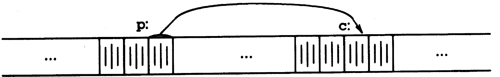
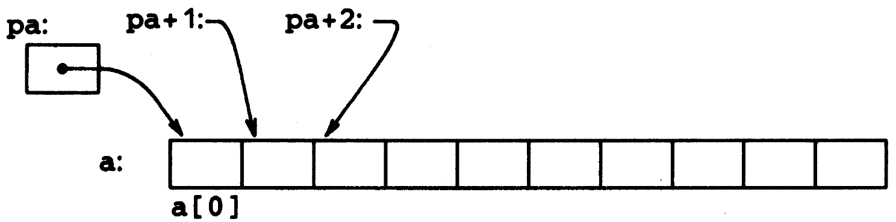
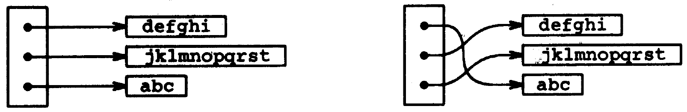

# Pointers

## Pointers and Addresses

A **pointer** is a variable that contains the **address** of a variable.

A typical machine has an array of consecutively numbered or addressed **memory** cells that may be manipulated individually or in contiguous groups. One common situation is that any **byte** can be a _char_, a pair of one-byte cells can be treated as a _short_ integer, and four adjacent bytes form a _long_.

A pointer is a group of cells \(often two or four\) that can hold an address. So if _c_ is a _char_ and _p_ is a _pointer_ that points to it, we could represent the situation this way:



The unary operator **&** gives the address of an object, so the statement `p = &c;` assigns the address of _c_ to the variable _p_, and _p_ is said to "**point to**" _c_.

The & operator only applies to objects in memory: variables and array elements. It cannot be applied to expressions, constants, or _register_ variables.

The unary operator **\*** is the _indirection_ or _dereferencing_ operator; when applied to a pointer, it accesses the object the pointer points to.

```c
int x = 1, y = 2, z[10];
int *ip, *iq; /* ip is a pointer to int */
ip = &x; /* gives the address of x to ip, ip now points to x */
y = *ip; /* access the object, y is now 1 */
*ip = 0; /* x is now 0 */
ip = &z[0]; /* ip is now points to z[0] */
iq = ip; /* iq is now points to whatever ip pointed to */
```

## Pointers and Function Arguments

Since C passes arguments to functions by value, there is no direct way for the called function to alter a variable in the calling function.

For instance, a sorting routine might exchange two out-of-order arguments with a function called _swap_. It is not enough to write `void swap(int x, int y)` because of **call by value**.

The way to obtain the desired effect is to pass pointers to the values to be changed: `swap(&a, &b)`Since the operator & produces the address of a variable, `&a` is a pointer to a. In swap itself, the parameters are declared as pointers, and the operands are accessed indirectly through them: `void swap(int *px, int *py) { }`

## Pointers and Arrays

In C, there is a strong relationship between **pointers and arrays**. Any operation that can be achieved by array subscripting can also be done with pointers.

```c
int *pa; /* pa is a pointer points to int */
pa = &a[0]; /* now pa contains the address of a[0]. */
```

If _pa_ points to a particular element of an array, then by definition _pa+1_ points to the **next** element.



These remarks are **true** regardless of the type or size of the variables in the array. The meaning of "adding 1 to a pointer," and by extension, all pointer arithmetic, is that _pa+1_ points to the next object, and is that _pa+i_ points to the i-th object beyond pa.

If _\*pa_ is an _int_ is four bytes, for example, the _pa+1_ will be moved by four bytes. All the pointer manipulations automatically take into account the size of the objects pointed to.

Since the name of an array is a synonym for the location of the initial element, the assignment `pa=&a[0]` can also be written as `pa = a`.

Rather more surprising, at first sight, is the fact that a reference to `a[i]` can also be written as `*(a+i)`. In evaluating `a[i]`, C converts it to `*(a+i)` immediately, the two forms are equivalent. As the other side of this coin, if _pa_ is a pointer, expressions might use it with a subscript; `pa[i]` is identical to `*(pa+i)`. 

In short, an array-and-index expression is **equivalent** to one written as a pointer and offset.

There is one **difference** between an array name and a pointer that must be kept in mind. A pointer is a variable, but an array name is not a variable; constructions like `a=pa` and `a++` are illegal.

When an array name is passed to a function, what is passed is the **location** of the initial element.

As formal parameters in a function definition, `char s[]` and `char *s`are equivalent. we prefer the **latter** because it says more explicitly that the variable is a pointer.

```c
/* strlen: return length of string s */
int strlen(char *s)
{
    
int n;
    for (n = 0; *s != '\0', s++)
        
n++;
    return n;

}
```

Since _s_ is a pointer, incrementing it is perfectly legal; `s++` has no effect on the character string in the function that called _strlen_, but merely increments _strlen_'s **private copy of the pointer**. Passing pointer arguments doesn't break the rule of call by value.

Pointers may be **compared** under certain circumstances. If _p_ and _q_ point to members of the same array, then relations like `==, !=, <, >=`, etc., work properly.

There is an important difference between these definitions:

```c
char amessage[] = "now is the time"; /* an array */
char *pmessage = "now is the time"; /* a pointer */
```

_amessage_ is an array, just big enough to hold the sequence of characters and '\0' that initializes it. Individual characters within the array may be changed but amessage will always refer to the same storage.

On the other hand, pmessage is a pointer, initialized to point to a string constant; the pointer may subsequently be modified to point elsewhere.

```c
/* strcpy: copy t to s; pointer version 3 */
void strcpy(char *s, char *t)
{
    while (*s++ = *t++)
        ;
}
```

Since pointers are variables themselves, they can be **stored in arrays** just as other variables can.

Let us illustrate by writing a program that will sort a set of text lines into alphabetic order. When two out-of-order lines have to be exchanged, the pointers in the pointer array are exchanged, not the text lines themselves. This eliminates the twin problems of complicated storage management and high overhead that would go with moving the lines themselves.



`char *line[20]` says that _line_ is an array of 20 elements, each element of which is a pointer to a char. That is, `line[i]` is a character pointer, and `*line[i]` is the character it points to, the **first** character of the _i-th_ saved text line.

C provides rectangular multi-dimensional arrays, although in practice they are much less used than arrays of pointers.

```c
static char daytab[2][13] = {
    {0, 31, 28, 31, 30, 31, 30, 31, 31, 30, 31, 30, 31},
 // non-leap year
    {0, 31, 29, 31, 30, 31, 30, 31, 31, 30, 31, 30, 31}
 // leap year
};
```

In C, a two-dimensional array is really a one-dimensional array, each of whose elements is an array.

```c
char *name[] = {
    
"Illegal month",
    "January", "February", "March",
"April", 
    "May", "June",
"July", "August", 
    "September",
"October", "November", "December"
};
```

Newcomers to C are sometimes confused about the difference between a two-dimensional array and an array of pointers,

```c
int a[10][20];
int *b[10];
```

For a_, a_ is a true two-dimensional array: 200 int-sized locations have been set aside. For b, the definition only allocates 10 pointers and does not initialize them; Assuming that each element of _b_ does point to a twenty-element array, then there will be 200 ints set aside, **plus** ten cells for the pointers.

The important advantage of the pointer array is that the rows of the array may be of **different lengths**. That is, each element of b need not point to a twenty-element vector; some may point to two elements, some to fifty, and some to none at all.

## Command-line Arguments

```c
int main(int argc, char const *argv[]){
    return 0;
}
```

When main is called, it is called with two arguments: argument count, and argument vector, a pointer to an array of character strings that contain the arguments, one per string.

A common convention for C programs on UNIX systems is that an argument that begins with a minus sign introduces an optional flag or parameter, like `find -x -npattern`. Furthermore, it is convenient for users if option arguments can be combined, as in `find -nx pattern`.

## Pointers to Functions

In C, a function itself is not a variable, but it is possible to define pointers to functions, which can be assigned, placed in arrays, passed to functions, returned by functions, and so on.

```c
/* qsort: sort v[left]...v[right] into increasing order */
void qsort(void *v[], int left, int right,
 int (*comp)(void *, void *))
{

    int i, last;
    void swap(void *v[], int, int);
    
    if (left >= right) /* do nothing if array contains */
        
return; /* fewer than two elements */
    
swap(v, left, (left + right)/2);
    last = left;
    
for (i = left+1; i <= right; i++)
        
if ((*comp)(v[i], v[left]) < 0)
            
swap(v, ++last, i);
    swap(v, left, last);
    
qsort(v, left, last-1, comp);
    qsort(v, last+1, right, comp);
}
```

As indicated by the function prototype, _qsort_ expects an array of pointers, two integers, and a function with two pointer arguments. The generic pointer type `void*` is used for the pointer arguments. Any pointer can be cast to `void*` and back again without loss of information.


