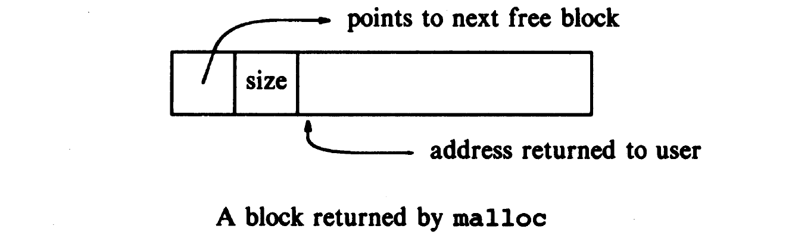
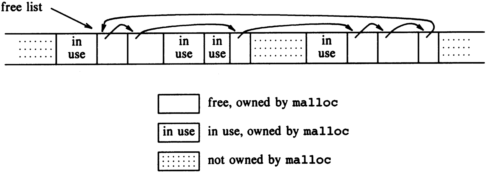

# Structures

## Structure

A structure is a collection of one or more variables, possibly of different types, grouped together under a single name for convenient handling.

Structures help to organize complicated data, particularly in large programs, because they permit a group of related variables to be treated as a unit instead of as separate entities.

```c
struct point { // structure tag
    int x; // member
    int y; 
};

int main(int argc, char const *argv[]) {
    struct point pt; // declaration
    struct point maxpt = { 320, 200 }; // initialization
    printf("%d,%d", pt.x, pt.y); //member operator
    return 0;
}

struct rect { // nested structure
    struct point pt1;
    struct point pt2;
};
```

The only legal operations on a structure are copying it or assigning to it as a unit, taking its address with &, and accessing its members.

If a large structure is to be passed to a function, it is generally more efficient to pass a **pointer** than to copy the whole structure. Structure pointers are just like pointers to ordinary variables.

```c
/* origin is a structure of type struct point */
struct point origin, *pp;
pp = &origin; /* pp is a pointer, it now points to origin */
/* (*pp).x and (*pp).y are the members */
```

Pointers to structures are so frequently used that an alternative **notation** is provided as a shorthand.

```c
printf("origin is (%d, %d)\n", pp->x, pp->y);
```

The structure operators `.` and `->`, together with `()` for function calls and `[]` for subscripts, are at the **top** of the precedence hierarchy and thus bind very tightly.

```c
struct {
    int len;
    char *str;
} *p;
// ++p->len increments len, not p. ++(p->len)
// *p->str fetches whatever str points to; *(p->str)
```

## Arrays of Structures

Consider writing a program to count the occurrences of each C keyword.

```c
struct key {
    char *word;
    int count;
} keytab[] = {
    "auto", 0,
    "break", 0,
    "case", 0,
    /* ... */
    "void", 0,
    "while", 0
};
```

Here inner braces like `{ "auto", 0 }` are not necessary when the initializers are simple variables or character strings, and when all are present.

Don't assume that the size of a structure is the sum of the sizes of its members. Because of **alignment requirements** for different objects, there may be unnamed "holes" in a structure. The following structure might well require eight bytes, not five.

```c
struct {
    char c; // a char is one byte
    int i; // an int is four bytes
};
```

C provides a compile-time unary operator called `sizeof` that can be used to compute the size of any object. The expressions `sizeof object` yield an integer equal to the size of the specified object or type **in bytes**. Strictly, _sizeof_ produces an unsigned integer value whose type, `size_t`, is defined in the header `<stdio.h>`.

Thus, the number of keywords is the size of the array which can be defined by:

```c
#define NKEYS (sizeof keytab / sizeof(struct key))
```

## Data Structures

To represent a node in binary search tree in C:

```c
struct tnode { /* the tree node */
    char *word;
    int count;
    struct tnode *left; // left child
    struct tnode *right; // right child
};
```

A [storage allocator](structures.md#storage-allocator) is needed to make a new _tnode_, where we make use of the standard library function _malloc_, we will discuss this in detail later.

```c
#include <stdlib.h>
/* talloc:  make a tnode */
struct tnode *talloc(void) {
    return (struct tnode *) malloc(sizeof(struct tnode));
}
```

## Typedef

C provides a facility called _typedef_ for creating new data type names. 

```c
typedef char *String;
```

The declaration makes _String_ a synonym for char \* or character pointer, which may then be used in declarations and casts:

```c
String p, lineptr[MAXLINES], alloc(int);
```

As a more complicated example, we could make _typedefs_ for the tree nodes shown earlier in this chapter:

```c
typedef struct tnode *Treeptr;
typedef struct tnode { /* the tree node: */
    // ...
} Treenode;
```

This creates two new type keywords called _Treenode_ \(a structure\) and _Treeptr_ \(a pointer to the structure\).

Besides purely aesthetic issues, there are two main reasons for using _typedef_s.

The first is to parameterize a program against portability problems. If _typedef_s are used for data types that may be machine-dependent, only the _typedefs_ need change when the program is moved. One common situation is to use _typedef_ names for various integer quantities, then make an appropriate set of choices of short, int, and long for each host machine. Types like _size\_t_ and _ptrdiff\_t_ from the standard library are examples.

The second purpose of _typedef_s is to provide better documentation for a program - a type called _Treeptr_ may be easier to understand than one declared only as a pointer to a complicated structure.

## Unions

A union is a variable that may hold \(at different times\) objects of different types and sizes, with the compiler keeping track of size and alignment requirements.

```c
union u_tag {
    int ival;
    float fval;
    char *sval;
} u;
```

The variable _u_ will be large enough to hold the largest of the three types; the specific size is implementation-dependent. Any of these types may be assigned to _u_ and then used in expressions.

Syntactically, members of a union are accessed as: `u->ival`

It is the programmer's responsibility to keep track of which type is currently stored in a union. If the variable _utype_ is used to keep track of the current type stored in _u_, then one might see code such as

```c
if (utype == INT)
   printf("%d\n", u.ival);
if (utype == FLOAT)
   printf("%f\n", u.fval);
if (utype == STRING)
   printf("%s\n", u.sval);
else
   printf("bad type %d in utype\n", utype);
```

## Storage Allocator

The UNIX operating system provides its services through a set of **system calls**, which are in effect functions within the operating system that may be called by user programs.

Rather than allocating from a compiled-in fixed-size array, the standard library function, _malloc_ will request space from the operating system as needed.

Since other activities in the program may also request space without calling this allocator, the space that _malloc_ manages may not be contiguous. Thus its free storage is kept as a **list of free blocks**. Each block contains a size, a pointer to the next block, and the space itself. 



The blocks are kept in order of **increasing** storage address, and the last block \(highest address\) points to the first.



When a request is made, the free list is scanned until a big-enough block is found. This algorithm is called "**first fit**," by contrast with "best fit," which looks for the smallest block that will satisfy the request.

* If the block is exactly the size requested, it is unlinked from the list and returned to the user.
* If the block is too big, it is split, and the proper amount is returned to the user while the residue remains on the free list.
* If no big-enough block is found, another large chunk is obtained from the operating system and linked into the free list.

**Freeing** also causes a search of the free list, to find the proper place to insert the block being freed. If the block being freed is adjacent to a free block on either side, it is **coalesced** with it into a single bigger block, so storage does not become too fragmented. Determining the adjacency is easy because the free list is maintained in order of increasing address.

One problem is to ensure that the storage returned by _malloc_ is **aligned** properly for the objects that will be stored in it. Although machines vary, for each machine there is a **most restrictive** type: if the most restrictive type can be stored at a particular address, all other types may be also. On some machines, the most restrictive type is a _double_ \(8 bytes\).

The control information at the beginning is called the "header." To simplify alignment, all blocks are multiples of the header size, and the header is aligned properly. This is achieved by a union that contains the desired header structure and an instance of the most restrictive alignment type, which we have arbitrarily made a double:

```c
typedef double Align; /* for alignment to double boundary */
union header { /* block header */
    struct {
        union header* ptr; /* next block on free list */
        unsigned size; /* size of this block */
    } s;
    Align x; /* force alignment of blocks */
};
typedef union header Header;
```

The Align field is never used; it just forces each header to be aligned on a worst-case boundary.

In _malloc_, the requested size in characters is rounded up to the proper number of header-sized units; the block that will be allocated contains one more unit, for the header itself, and this is the value recorded in the size field of the header. The pointer returned by _malloc_ points at the free space, not at the header itself. The user can do anything with the space requested, but if anything is written outside of the allocated space the list is likely to be scrambled.

The **size** field is necessary because the blocks controlled by malloc need not be contiguous - it is not possible to compute sizes by pointer arithmetic.

