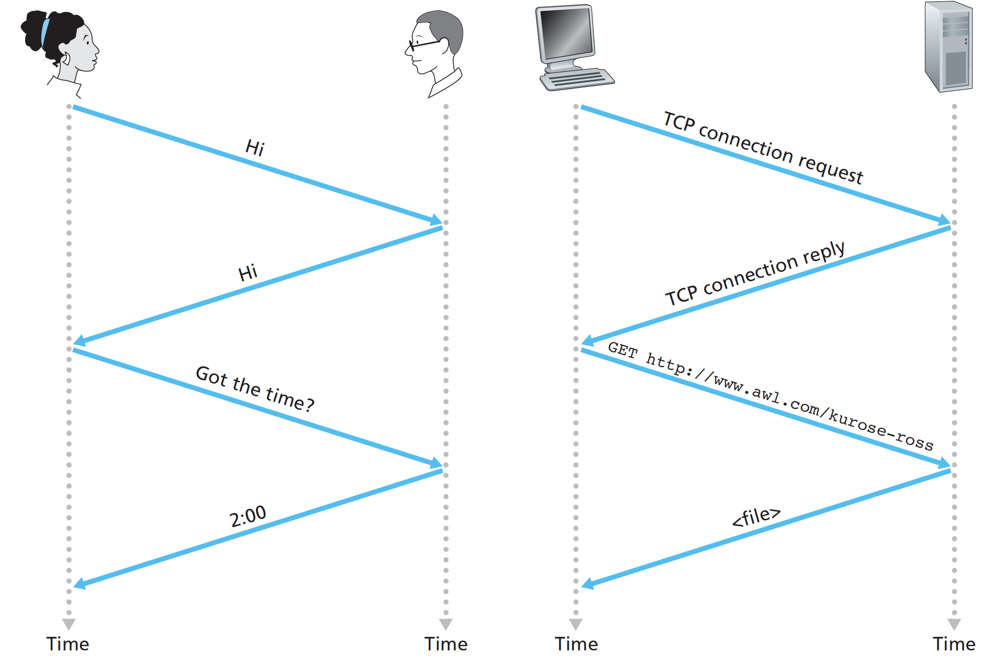

# 1. Introduction

## What's Internet?

### A Nuts-and-Bolts Description

Devices that are being hooked up to the Internet are called **hosts** or **end systems**. End systems are connected together by a network of **communication links** and **packet switches**.

Communication links are made up of different types of physical media, including coaxial cable, copper wire, optical fiber, and radio spectrum.

Package switches are **routers** and **link-layer switches**.

The Internet is all about connecting end systems to each other, end systems access the Internet through **Internet Service Providers** \(ISPs\).

The Internet’s principal **protocols** are collectively known as **TCP/IP**.

It’s important that everyone agree on what each and every protocol does. **Internet standards** are developed by the Internet Engineering Task Force \(IETF\) and those documents are called requests for comments \(**RFCs**\).

### A Services Description

We can also describe the Internet from an entirely different angle—namely, as an **infrastructure that provides services to applications**. The applications are said to be distributed applications, include  email, instant messaging, Voiceover-IP \(VoIP\), etc.

The Internet **API** is a set of rules that the sending program must follow so that the Internet can deliver the data to the destination program.

## What's protocol?

Human analogies: One first offer a greeting “**Hi**” to initiate communication with someone else. One then takes a cordial “Hi” response as an indication that one can proceed and ask for the time of day.

A protocol defines the format and the order of messages exchanged between two or more communicating entities, as well as the actions taken on the transmission and/or receipt of a message or other event.

## Network edge

End systems are also referred to as hosts because they host \(that is, run\) application programs Hosts are sometimes further divided into two categories: **clients** and **servers**. Applications and end systems are considered at the “edge of the network".

The **access network**—the network that physically connects an end system to the first router \(also known as the “**edge router**”\). 

Home Access: DSL, Cable, FTTH, Dial-Up, and Satellite. 

* A residence typically obtains digital subscriber line \(**DSL**\) Internet access from the same local telephone company \(telco\) that provides its wired local phone access. \(less than 5Mbps\)
* **Cable** Internet access makes use of the cable television company’s existing cable television infrastructure. Because both fiber cable\(光纤\) and coaxial cable\(同轴电缆\) are employed in this system, it is often referred to as hybrid fiber coax \(HFC\). \(13Mbps\)
* **FTTH**: fiber to the home, provide an optical fiber path from the Central Office\(CO\) directly to the home. \(greater than 20Mbps\)

Enterprise/University/Home access: Ethernet and WiFi.

A local area network \(**LAN**\) is used to connect an end system to the edge router. Ethernet users use twisted-pair copper wire\(双绞铜线\) to connect to an Ethernet switch, or a network of such interconnected switches, is then in turn connected into the larger Internet.

